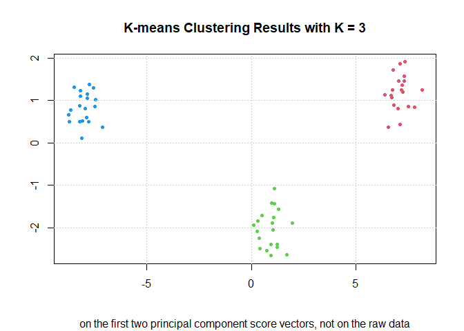

## Exercises 
#### Applied Q7 - Q11

### **Question 7**
In this chapter, we mentioned the use of correlation-based distance and Euclidean distance as dissimilarity measures for hierarchical clustering. It turns out that these two measures are almost equivalent: if **each observation has been centered to have mean zero and standard deviation one**, and if we let r_ij denote the correlation between the ith and jth observations, then the quantity 1-r_ij is proportional to **the squared Euclidean distance between the ith and jth observations**.

On the `USArrests` data, show that this proportionality holds.

```r
set.seed(2)
USArrests <- na.omit(USArrests)
dim(USArrests)
```

```
## [1] 50  4
```

```r
names(USArrests)
```

```
## [1] "Murder"   "Assault"  "UrbanPop" "Rape"
```

```r
apply(USArrests, 2, mean)
```

```
##   Murder  Assault UrbanPop     Rape 
##    7.788  170.760   65.540   21.232
```

```r
apply(USArrests, 2, sd)
```

```
##    Murder   Assault  UrbanPop      Rape 
##  4.355510 83.337661 14.474763  9.366385
```

```r
USArrests_scaled <- t(scale(t(USArrests))) 
# t(): Given a matrix or data.frame x, t returns the transpose of x. scale(): Scaling And Centering Of Matrix-Like Objects
# NOTE: scale each observation based on this question
apply(t(USArrests_scaled), 2, mean)
```

```
##        Alabama         Alaska        Arizona       Arkansas     California 
##   9.020562e-17  -2.775558e-17  -7.632783e-17  -6.938894e-17  -4.510281e-17 
##       Colorado    Connecticut       Delaware        Florida        Georgia 
##  -2.775558e-17  -2.775558e-17   4.163336e-17   1.387779e-17  -4.163336e-17 
##         Hawaii          Idaho       Illinois        Indiana           Iowa 
##  -6.938894e-18  -2.775558e-17   6.591949e-17   9.714451e-17   2.775558e-17 
##         Kansas       Kentucky      Louisiana          Maine       Maryland 
##   0.000000e+00   2.081668e-17   6.938894e-18  -4.163336e-17  -2.775558e-17 
##  Massachusetts       Michigan      Minnesota    Mississippi       Missouri 
##   2.775558e-17  -5.551115e-17   5.551115e-17   1.387779e-17   2.602085e-17 
##        Montana       Nebraska         Nevada  New Hampshire     New Jersey 
##  -4.857226e-17  -4.163336e-17   2.775558e-17   8.326673e-17   4.163336e-17 
##     New Mexico       New York North Carolina   North Dakota           Ohio 
##  -1.387779e-17   1.734723e-17  -2.775558e-17   5.551115e-17   4.163336e-17 
##       Oklahoma         Oregon   Pennsylvania   Rhode Island South Carolina 
##   3.469447e-18   1.214306e-17   4.163336e-17   4.857226e-17   6.938894e-17 
##   South Dakota      Tennessee          Texas           Utah        Vermont 
##   3.469447e-17  -8.326673e-17   3.718813e-17   2.775558e-17  -9.714451e-17 
##       Virginia     Washington  West Virginia      Wisconsin        Wyoming 
##   5.767956e-17   5.551115e-17   1.387779e-17   0.000000e+00  -1.301043e-17
```

```r
apply(t(USArrests_scaled), 2, sd)
```

```
##        Alabama         Alaska        Arizona       Arkansas     California 
##              1              1              1              1              1 
##       Colorado    Connecticut       Delaware        Florida        Georgia 
##              1              1              1              1              1 
##         Hawaii          Idaho       Illinois        Indiana           Iowa 
##              1              1              1              1              1 
##         Kansas       Kentucky      Louisiana          Maine       Maryland 
##              1              1              1              1              1 
##  Massachusetts       Michigan      Minnesota    Mississippi       Missouri 
##              1              1              1              1              1 
##        Montana       Nebraska         Nevada  New Hampshire     New Jersey 
##              1              1              1              1              1 
##     New Mexico       New York North Carolina   North Dakota           Ohio 
##              1              1              1              1              1 
##       Oklahoma         Oregon   Pennsylvania   Rhode Island South Carolina 
##              1              1              1              1              1 
##   South Dakota      Tennessee          Texas           Utah        Vermont 
##              1              1              1              1              1 
##       Virginia     Washington  West Virginia      Wisconsin        Wyoming 
##              1              1              1              1              1
```

```r
r_ij <- cor(t(USArrests_scaled)) 
# r_ij denote the correlation between the ith and jth observations 
One_minus_r_ij <- 1 - r_ij
X <- One_minus_r_ij[lower.tri(One_minus_r_ij)]

D <- as.matrix(dist(USArrests_scaled)^2) 
#the squared Euclidean distance between the ith and jth observations
Y <- D[lower.tri(D)]

plot(X,Y)
```

<!-- -->

```r
summary(X/Y)
```

```
##    Min. 1st Qu.  Median    Mean 3rd Qu.    Max. 
##  0.1667  0.1667  0.1667  0.1667  0.1667  0.1667
```

### **Question 8**
The PVE (the proportion of variance explained) can be obtained using the `sdev` output of the `prcom()` function.

On the `USArrests` data, calculate PVE in two ways:

(a) Using the `sdev` output of the `prcomp()` function.

```r
set.seed(2)
pr.out <- prcomp(USArrests, scale = TRUE)
pr.var <- pr.out$sdev^2
PVE.a <- pr.var / sum(pr.var)
PVE.a
```

```
## [1] 0.62006039 0.24744129 0.08914080 0.04335752
```

(b) By applying Equation directly.

```r
USArrests_scaled <- scale(USArrests) # scale each variable

denominator <- sum(apply(USArrests_scaled^2, 2, sum))

phi <- pr.out$rotation
USArrests_projected <- USArrests_scaled %*% phi # the same as pr.out$x 

numerator <- apply(USArrests_projected^2, 2, sum)
PVE.b <- numerator / denominator
PVE.b
```

```
##        PC1        PC2        PC3        PC4 
## 0.62006039 0.24744129 0.08914080 0.04335752
```

### **Question 9**
Consider the `USArrests` data. We will now perform hierarchical clustering on the states.

(a) Using hierarchical clustering with complete linkage and Euclidean distance, cluster the states.

```r
set.seed(5)
hc_complete <- hclust(dist(USArrests), method = "complete")
plot(hc_complete, xlab = "", sub = "", main = "Cluster Dendrogram - Complete Linkage", cex = 0.8)
```

<!-- -->

(b) Cut the dendrogram at a height that results in three distinct clusters. Which states belong to which cluster?

```r
cut <- cutree(hc_complete, k = 3)
for(k in 1:3){
  print(k)
  print(rownames(USArrests)[cut == k])
}
```

```
## [1] 1
##  [1] "Alabama"        "Alaska"         "Arizona"        "California"    
##  [5] "Delaware"       "Florida"        "Illinois"       "Louisiana"     
##  [9] "Maryland"       "Michigan"       "Mississippi"    "Nevada"        
## [13] "New Mexico"     "New York"       "North Carolina" "South Carolina"
## [1] 2
##  [1] "Arkansas"      "Colorado"      "Georgia"       "Massachusetts"
##  [5] "Missouri"      "New Jersey"    "Oklahoma"      "Oregon"       
##  [9] "Rhode Island"  "Tennessee"     "Texas"         "Virginia"     
## [13] "Washington"    "Wyoming"      
## [1] 3
##  [1] "Connecticut"   "Hawaii"        "Idaho"         "Indiana"      
##  [5] "Iowa"          "Kansas"        "Kentucky"      "Maine"        
##  [9] "Minnesota"     "Montana"       "Nebraska"      "New Hampshire"
## [13] "North Dakota"  "Ohio"          "Pennsylvania"  "South Dakota" 
## [17] "Utah"          "Vermont"       "West Virginia" "Wisconsin"
```

```r
table(cut)
```

```
## cut
##  1  2  3 
## 16 14 20
```

(c) Hierarchically cluster the states using complete linkage and Euclidean distance, after scaling the variables to have standard deviation one.

```r
set.seed(5)
USArrests_scaled <- scale(USArrests)

hc_complete_scale <- hclust(dist(USArrests_scaled), method = "complete")
plot(hc_complete_scale, xlab = "", sub = "Variables Scaled", main = "Cluster Dendrogram - Complete Linkage", cex = 0.8)
```

<!-- -->

(d) What effect does scaling the variables have on the hierarchical clustering obtained? In your opinion, should the variables be scaled before the inter-observation dissimilarities are computed? Provide a justification for your answer.

```r
cut_scale <- cutree(hc_complete_scale, k = 3)
for(k in 1:3){
  print(k)
  print(rownames(USArrests_scaled)[cut_scale == k])
}
```

```
## [1] 1
## [1] "Alabama"        "Alaska"         "Georgia"        "Louisiana"     
## [5] "Mississippi"    "North Carolina" "South Carolina" "Tennessee"     
## [1] 2
##  [1] "Arizona"    "California" "Colorado"   "Florida"    "Illinois"  
##  [6] "Maryland"   "Michigan"   "Nevada"     "New Mexico" "New York"  
## [11] "Texas"     
## [1] 3
##  [1] "Arkansas"      "Connecticut"   "Delaware"      "Hawaii"       
##  [5] "Idaho"         "Indiana"       "Iowa"          "Kansas"       
##  [9] "Kentucky"      "Maine"         "Massachusetts" "Minnesota"    
## [13] "Missouri"      "Montana"       "Nebraska"      "New Hampshire"
## [17] "New Jersey"    "North Dakota"  "Ohio"          "Oklahoma"     
## [21] "Oregon"        "Pennsylvania"  "Rhode Island"  "South Dakota" 
## [25] "Utah"          "Vermont"       "Virginia"      "Washington"   
## [29] "West Virginia" "Wisconsin"     "Wyoming"
```

```r
table(cut_scale)
```

```
## cut_scale
##  1  2  3 
##  8 11 31
```

```r
apply(USArrests, 2, mean)
```

```
##   Murder  Assault UrbanPop     Rape 
##    7.788  170.760   65.540   21.232
```

```r
apply(USArrests, 2, var)
```

```
##     Murder    Assault   UrbanPop       Rape 
##   18.97047 6945.16571  209.51878   87.72916
```

The height as measured on the vertical axis has been changed due to scaling the variables. 

We should scale the variables at the beginning for this data set since the variables are measured in different units: `Murder`, `Rape`, and `Assault` are recorded as the number of occurrences per 100,000 people, and `UrbanPop` is the percentage of the state's population that lives in an urban area.    

### **Question 10**
In this problem, you will generate simulated data, and then perform PCA and K-means clustering on the data.

(a) Generate a simulated data set with 20 observations in each of three classes(i.e. 60 observations total), and 50 variables.

```r
set.seed(22)
K <- 3
n <- 20
p <- 50

X1 <- matrix(rnorm(n * p), nrow = n, ncol = p)
for(i in 1:n){
  X1[i,] <- X1[i,] + rep(3, p)
}

X2 <- matrix(rnorm(n * p), nrow = n, ncol = p)
for(i in 1:n){
  X2[i,] <- X2[i,] + rep(-2, p)
}

X3 <- matrix(rnorm(n * p), nrow = n, ncol = p)
for(i in 1:n){
  X3[i,] <- X3[i,] + c(rep(1, p/2), rep(-1, p/2))
}

X <- rbind(X1, X2, X3)
```

(b) Perform PCA on the 60 observations and plot the first two principal component score vectors.

```r
labels = c(rep(1,n), rep(2,n), rep(3,n))
pr.out <- prcomp(X, scale = TRUE)
plot(pr.out$x[,1], pr.out$x[,2], col = labels, pch = 20, xlab = "", ylab = "", main = "PCA")
grid()
```

<!-- -->

(c) Perform K-means clustering of the observations with K = 3.

```r
kmean.out <- kmeans(X, centers = 3, nstart = 50)
table(kmean.out$cluster, labels)
```

```
##    labels
##      1  2  3
##   1 20  0  0
##   2  0 20  0
##   3  0  0 20
```

It is matched perfectly compare to the true class labels.

(d) Perform K-means clustering with K = 2.

```r
kmean.out <- kmeans(X, centers = 2, nstart = 50)
table(kmean.out$cluster, labels)
```

```
##    labels
##      1  2  3
##   1 20  0  0
##   2  0 20 20
```

Original class 2 and 3 are combined into one class.

(e) Now perform K-means clustering with K = 4.

```r
kmean.out <- kmeans(X, centers = 4, nstart = 50)
table(kmean.out$cluster, labels)
```

```
##    labels
##      1  2  3
##   1  0 20  0
##   2  0  0 20
##   3 10  0  0
##   4 10  0  0
```

Original class 3 split into two clusters.

(f) Now perform K-means clustering with K = 3 on the first two principal component score vectors, rather than on the raw data.

```r
pc2 <- pr.out$x[,c(1,2)]
kmean.out <- kmeans(pc2, centers = 3, nstart = 50)
table(kmean.out$cluster, labels)
```

```
##    labels
##      1  2  3
##   1  0 20  0
##   2  0  0 20
##   3 20  0  0
```

```r
plot(pc2, col = kmean.out$cluster+1, main = "K-means Clustering Results with K = 3", sub = "on the first two principal component score vectors, not on the raw data",xlab = "", ylab = "", pch = 20, cex = 1)
grid()
```

<!-- -->

It is matched perfectly compare to the true class labels.

(g) Using the `scale()` function, perform K-means clustering with K = 3 on the data after scaling each variable to have standard deviation one.

```r
X_scaled <- scale(X)
kmean.out <- kmeans(X_scaled, centers = 3, nstart = 50)
table(kmean.out$cluster, labels)
```

```
##    labels
##      1  2  3
##   1  0  0 20
##   2  0 20  0
##   3 20  0  0
```

```r
plot(pc2, col = kmean.out$cluster+1, main = "K-means Clustering Results with K = 3", sub = "Data Scaled",xlab = "", ylab = "", pch = 20, cex = 1)
grid()
```

<!-- -->

It is matched perfectly compare to the true class labels.

### **Question 11**
On the book website, [www.StatLearning.com](https://trevorhastie.github.io/ISLR/), there is a gene expression data set(`CH10Ex11.csv`) that consists of 40 tissue samples with measurements on 1,000 genes. The first 20 samples are from healthy patients, while the second 20 are from a diseased group.

(a) Load in the data using `read.csv()`. You will need to select `header = F`.

```r
df <- read.csv("Ch10Ex11.csv", header = FALSE)
df <- t(df) # we would like to have each row representing a sample.
dim(df)
```

```
## [1]   40 1000
```

(b) Apply hierarchical clustering to the samples using **correlation-based distance**, and plot the dendrogram. Do the genes separate the samples into the two groups? Do your results depend on the type of linkage used?

```r
cor_d <- as.dist(1 - cor(t(df)))

hclust_complete <- hclust(cor_d, method = "complete")
table(predicted = cutree(hclust_complete, k = 2), truth = c(rep(0, 20), rep(1, 20)))
```

```
##          truth
## predicted  0  1
##         1 10  0
##         2 10 20
```

```r
plot(hclust_complete, main = "Complete Linkage", xlab = "", ylab = "", sub = "", cex = 0.8)
```

<!-- -->

```r
hclust_average <- hclust(cor_d, method = "average")
table(predicted = cutree(hclust_average, k = 2), truth = c(rep(0, 20), rep(1, 20)))
```

```
##          truth
## predicted  0  1
##         1  9  0
##         2 11 20
```

```r
plot(hclust_complete, main = "Average Linkage", xlab = "", ylab = "", sub = "", cex = 0.8)
```

<!-- -->

```r
hclust_single <- hclust(cor_d, method = "single")
table(predicted = cutree(hclust_single, k = 2), truth = c(rep(0, 20), rep(1, 20)))
```

```
##          truth
## predicted  0  1
##         1 19 20
##         2  1  0
```

```r
plot(hclust_complete, main = "Single Linkage", xlab = "", ylab = "", sub = "", cex = 0.8)
```

<!-- -->

Based on what we have shown above, we find that complete linkage is better.

(c) Your collaborator wants to know which genes differ the most across the two groups. Suggest a way to answer this question, and apply it here.

```r
pred <- cutree(hclust_complete, k = 2)

group1_n <- apply(df[pred == 1,], 2, length)
group2_n <- apply(df[pred == 2,], 2, length)

group1_m <- apply(df[pred == 1,], 2, mean)
group2_m <- apply(df[pred == 2,], 2, mean)

group1_var <- apply(df[pred == 1,], 2, var)
group2_var <- apply(df[pred == 2,], 2, var)

pooled_var <- sqrt(group1_var/group1_n + group2_var/group2_n)

t_value <- (group1_m - group2_m)/pooled_var
plot(t_value, xlab = "Gene Index", ylab = "Unpaired t-value", main = "The Unparied t-test")
```

<!-- -->

An unpaired t-test is a statistical procedure that compares the averages of two independent or unrelated groups to determine if there is a significant difference between the two. We will use the unpaired t-test to see which genes differ the most across the two groups.

The null hypothesis (H0) states that there is no significant difference between the means of the two groups.

The alternative hypothesis (H1) states that there is a significant difference between the means of the two groups.

From the plot above, we notice that genes that between 500 and 600 differ the most across the two groups.


