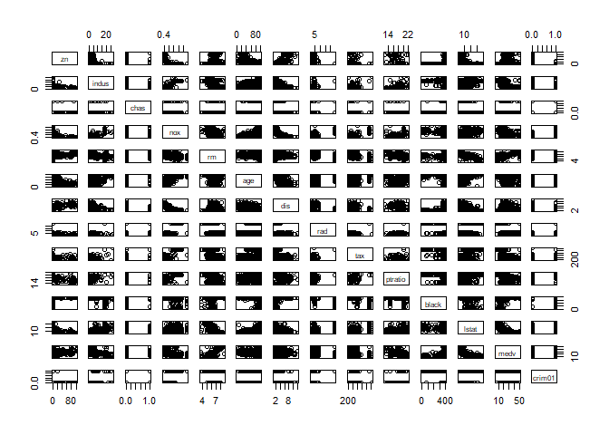

## Exercises 
#### Applied Q10 - Q13

### **Question 10**

(a) Produce some numerical and graphical summaries of the **Weekly** data.

```r
glimpse(Weekly)
```

```
## Rows: 1,089
## Columns: 9
## $ Year      <dbl> 1990, 1990, 1990, 1990, 1990, 1990, 1990, 1990, 1990, 199...
## $ Lag1      <dbl> 0.816, -0.270, -2.576, 3.514, 0.712, 1.178, -1.372, 0.807...
## $ Lag2      <dbl> 1.572, 0.816, -0.270, -2.576, 3.514, 0.712, 1.178, -1.372...
## $ Lag3      <dbl> -3.936, 1.572, 0.816, -0.270, -2.576, 3.514, 0.712, 1.178...
## $ Lag4      <dbl> -0.229, -3.936, 1.572, 0.816, -0.270, -2.576, 3.514, 0.71...
## $ Lag5      <dbl> -3.484, -0.229, -3.936, 1.572, 0.816, -0.270, -2.576, 3.5...
## $ Volume    <dbl> 0.1549760, 0.1485740, 0.1598375, 0.1616300, 0.1537280, 0....
## $ Today     <dbl> -0.270, -2.576, 3.514, 0.712, 1.178, -1.372, 0.807, 0.041...
## $ Direction <fct> Down, Down, Up, Up, Up, Down, Up, Up, Up, Down, Down, Up,...
```


```r
Direction <- Weekly$Direction
Weekly$Direction <- NULL 
Weekly$Numeric_Direction <- as.numeric(Direction) 
head(Weekly$Numeric_Direction) # Down = 1, Up = 2
```

```
## [1] 1 1 2 2 2 1
```

```r
Weekly$Numeric_Direction[Weekly$Numeric_Direction == 1] <- -1 
Weekly$Numeric_Direction[Weekly$Numeric_Direction == 2] <- +1
head(Weekly$Numeric_Direction) # Down = -1, Up = 1
```

```
## [1] -1 -1  1  1  1 -1
```

```r
ggpairs(Weekly)
```

1-1.png)

As we would expect, the correlations between the lag variables and today's returns are close to zero. The only substantial correlation is between **Year** and **Volume**. 


```r
ggplot(Weekly) +
  geom_jitter(aes(x = Year, y = Volume)) +
  labs(title = "Average Number of Daily Shares Traded in Billions", y = "Volume of Shares Traded")
```

2-1.png)

Look at the Fig 2, we notice that **Volume** is increasing over time. In other words, the average number of daily shares traded in billions increased from 1990 to 2010.


(b) Use the full data set to perform a logistic regression with **Direction** as the response and the five lag variables plus **Volume** as predictors. 


```r
Weekly$Numeric_Direction = NULL 
Weekly$Direction = Direction # back to levels Down and Up
head(Weekly$Direction)
```

```
## [1] Down Down Up   Up   Up   Down
## Levels: Down Up
```

```r
glm.fit10 <- glm(Direction ~ Lag1 + Lag2 + Lag3 + Lag4 + Lag5 + Volume, data = Weekly, family = binomial)
summary(glm.fit10)
```

```
## 
## Call:
## glm(formula = Direction ~ Lag1 + Lag2 + Lag3 + Lag4 + Lag5 + 
##     Volume, family = binomial, data = Weekly)
## 
## Deviance Residuals: 
##     Min       1Q   Median       3Q      Max  
## -1.6949  -1.2565   0.9913   1.0849   1.4579  
## 
## Coefficients:
##             Estimate Std. Error z value Pr(>|z|)   
## (Intercept)  0.26686    0.08593   3.106   0.0019 **
## Lag1        -0.04127    0.02641  -1.563   0.1181   
## Lag2         0.05844    0.02686   2.175   0.0296 * 
## Lag3        -0.01606    0.02666  -0.602   0.5469   
## Lag4        -0.02779    0.02646  -1.050   0.2937   
## Lag5        -0.01447    0.02638  -0.549   0.5833   
## Volume      -0.02274    0.03690  -0.616   0.5377   
## ---
## Signif. codes:  0 '***' 0.001 '**' 0.01 '*' 0.05 '.' 0.1 ' ' 1
## 
## (Dispersion parameter for binomial family taken to be 1)
## 
##     Null deviance: 1496.2  on 1088  degrees of freedom
## Residual deviance: 1486.4  on 1082  degrees of freedom
## AIC: 1500.4
## 
## Number of Fisher Scoring iterations: 4
```

```r
contrasts(Weekly$Direction) 
```

```
##      Up
## Down  0
## Up    1
```

The smallest p-value is associated with Lag2. At a value of 0.0296, the p-value is smaller than 0.05 ( the 5% significance level), and so there is clear evidence of a real association between Lag2 and Direction. The positive coefficient for this predictor (Lag2) suggests that if the market had a positive return two weeks ago, then it is likely to go up today. 

(c) Compute the confusion matrix and overall fraction of correct predictions.

```r
glm.probs <- predict(glm.fit10, type = "response")
glm.pred <- rep("Down", 1089)
glm.pred[glm.probs > 0.5] <- "Up"
table(predicted = glm.pred, truth = Direction)
```

```
##          truth
## predicted Down  Up
##      Down   54  48
##      Up    430 557
```

The `predict()` function is used to predict the probability that the market will go up, given values of the predictors. (These values correspond to the probability of the market going up because "Up" = 1.) We set the predicted probability of a market increase exceeds 0.5 to _Up_ group. Given these predictions, we produce a confusion matrix  to determine how many observations were correctly classified by using `table()` function.


```r
(54 + 557)/1089
```

```
## [1] 0.5610652
```

```r
mean(glm.pred == Direction)
```

```
## [1] 0.5610652
```

Our model correctly predicted that the market would go up on 557 weeks and that it would go down on 54 weeks, for a total of 611 correct predictions. 

The `mean()` function is used to compute the fraction of weeks for which the prediction was correct. In this case, logistic regression correctly predicted the movement of the market 56% of the time.

In this case, the result is misleading because we trained and tested the model on the same set of 1089 observations. The training error rate is 100 - 56 = 44%. 

The training error rate is often overly optimistic. In other words, it tends to underestimate the test error rate. Therefore, we'd better to fit the model using part of the data, and then examine how well it predicts the _held out_ data.

(d) Now fit the logistic regression model using a training data period from 1990 to 2008, with Lag2 as the only predictor.


```r
train <- Weekly %>%
  filter(Year < 2009)

test <- Weekly %>%
  filter(Year >= 2009)

glm_lag2 <- glm(Direction ~ Lag2, data = train, family = binomial)

probs_hat <- predict(glm_lag2, test, type = "response")

y_hat <- rep("Down", length(probs_hat))
y_hat[probs_hat > 0.5] <- "Up"

Direction.test <- test$Direction
CM <- table(predicted = y_hat, truth = Direction.test)
CM
```

```
##          truth
## predicted Down Up
##      Down    9  5
##      Up     34 56
```

```r
mean(y_hat == Direction.test)
```

```
## [1] 0.625
```

```r
mean(y_hat != Direction.test) # the test error rate
```

```
## [1] 0.375
```

```r
(56)/(56 + 34)
```

```
## [1] 0.6222222
```

The logistic regression correctly predicted the movement of the market 62.5% of the time, which is better than the result from the model in part(c).

(e) Using LDA

```r
lda.fit10 <- lda(Direction ~ Lag2, data = train)
lda.pred <- predict(lda.fit10, test)
names(lda.pred)
```

```
## [1] "class"     "posterior" "x"
```

```r
lda.class <- lda.pred$class
table(lda.class,Direction.test)
```

```
##          Direction.test
## lda.class Down Up
##      Down    9  5
##      Up     34 56
```

```r
mean(lda.class == Direction.test)
```

```
## [1] 0.625
```

(f) Using QDA

```r
qda.fit10 <- qda(Direction ~ Lag2, data = train)
qda.class <- predict(qda.fit10, test)$class
table(predicted = qda.class, truth = Direction.test)
```

```
##          truth
## predicted Down Up
##      Down    0  0
##      Up     43 61
```

```r
mean(qda.class == Direction.test)
```

```
## [1] 0.5865385
```


(g) Using KNN with K = 1

```r
train1 <- subset(train, select = Lag2)
test1 <- subset(test, select = Lag2)

Direction.train <- train$Direction

set.seed(1)
knn.pred <- knn(train1, test1, Direction.train, k = 1)
table(predicted = knn.pred, truth = Direction.test)
```

```
##          truth
## predicted Down Up
##      Down   21 30
##      Up     22 31
```

```r
mean(knn.pred == Direction.test) 
```

```
## [1] 0.5
```

(h) Which of the methods appears to provide the best results on this data?

Logistic regression and LDA are the best since they provide the same test error rates of 37.5%.

(i)

```r
set.seed(1)
knn.pred <- knn(train1, test1, Direction.train, k = 3)
table(predicted = knn.pred, truth = Direction.test)
```

```
##          truth
## predicted Down Up
##      Down   16 20
##      Up     27 41
```

```r
mean(knn.pred == Direction.test) 
```

```
## [1] 0.5480769
```

```r
knn.pred <- knn(train1, test1, Direction.train, k = 5)
table(predicted = knn.pred, truth = Direction.test)
```

```
##          truth
## predicted Down Up
##      Down   15 20
##      Up     28 41
```

```r
mean(knn.pred == Direction.test)
```

```
## [1] 0.5384615
```

The results have improved slightly compared to (h). However, increasing K further turns out to provide no further improvements.

Therefore, logistic regression and LDA provide the best results what we have examined so far.

### **Question 11**

(a)

```r
glimpse(Auto)
```

```
## Rows: 392
## Columns: 9
## $ mpg          <dbl> 18, 15, 18, 16, 17, 15, 14, 14, 14, 15, 15, 14, 15, 14...
## $ cylinders    <dbl> 8, 8, 8, 8, 8, 8, 8, 8, 8, 8, 8, 8, 8, 8, 4, 6, 6, 6, ...
## $ displacement <dbl> 307, 350, 318, 304, 302, 429, 454, 440, 455, 390, 383,...
## $ horsepower   <dbl> 130, 165, 150, 150, 140, 198, 220, 215, 225, 190, 170,...
## $ weight       <dbl> 3504, 3693, 3436, 3433, 3449, 4341, 4354, 4312, 4425, ...
## $ acceleration <dbl> 12.0, 11.5, 11.0, 12.0, 10.5, 10.0, 9.0, 8.5, 10.0, 8....
## $ year         <dbl> 70, 70, 70, 70, 70, 70, 70, 70, 70, 70, 70, 70, 70, 70...
## $ origin       <dbl> 1, 1, 1, 1, 1, 1, 1, 1, 1, 1, 1, 1, 1, 1, 3, 1, 1, 1, ...
## $ name         <fct> chevrolet chevelle malibu, buick skylark 320, plymouth...
```

```r
m <- median(Auto$mpg)

mpg01 <- rep(0, 392)
mpg01[Auto$mpg > m] <- 1
Auto <- data.frame(Auto, mpg01)

Auto$mpg01 <- mpg01
Auto$mpg <- NULL # only keep mpg01 in the data set
```

(b)

```r
ggpairs(Auto[, -8])
```

-1.png)

(c)

```r
Auto$mpg01 <- as.factor(Auto$mpg01)
glimpse(Auto)
```

```
## Rows: 392
## Columns: 9
## $ cylinders    <dbl> 8, 8, 8, 8, 8, 8, 8, 8, 8, 8, 8, 8, 8, 8, 4, 6, 6, 6, ...
## $ displacement <dbl> 307, 350, 318, 304, 302, 429, 454, 440, 455, 390, 383,...
## $ horsepower   <dbl> 130, 165, 150, 150, 140, 198, 220, 215, 225, 190, 170,...
## $ weight       <dbl> 3504, 3693, 3436, 3433, 3449, 4341, 4354, 4312, 4425, ...
## $ acceleration <dbl> 12.0, 11.5, 11.0, 12.0, 10.5, 10.0, 9.0, 8.5, 10.0, 8....
## $ year         <dbl> 70, 70, 70, 70, 70, 70, 70, 70, 70, 70, 70, 70, 70, 70...
## $ origin       <dbl> 1, 1, 1, 1, 1, 1, 1, 1, 1, 1, 1, 1, 1, 1, 3, 1, 1, 1, ...
## $ name         <fct> chevrolet chevelle malibu, buick skylark 320, plymouth...
## $ mpg01        <fct> 0, 0, 0, 0, 0, 0, 0, 0, 0, 0, 0, 0, 0, 0, 1, 0, 0, 0, ...
```

```r
set.seed(1)
n <- dim(Auto)[1]
train.pre <- sample(1:n, 0.75*n)
test.pre <- (1:n)[-train.pre]

train <- Auto[train.pre,]
test <- Auto[test.pre,]
```

(d) Using LDA

The variables that are most correlated with mpg01 are **cylinders**, **displacement**, and **weight** because their corresponding correlations are 0.759, 0.753 and 0.753, respectively.


```r
lda.fit11 <- lda(mpg01 ~ cylinders + displacement + weight, data = train)
lda.pred <- predict(lda.fit11, test)
CM <- table(predicted = lda.pred$class, truth = test$mpg01)
CM
```

```
##          truth
## predicted  0  1
##         0 43  2
##         1 10 43
```

```r
mean(lda.pred$class != test$mpg01) # test error rate
```

```
## [1] 0.122449
```

The test error rate of the model is 12.2% using LDA method.

(e) Using QDA

```r
qda.fit11 <- qda(mpg01 ~ cylinders + displacement + weight, data = train)
qda.pred <- predict(qda.fit11, test)
CM <- table(predicted = qda.pred$class, truth = test$mpg01)
CM
```

```
##          truth
## predicted  0  1
##         0 46  4
##         1  7 41
```

```r
mean(qda.pred$class != test$mpg01)
```

```
## [1] 0.1122449
```

The test error rate of the model is 11.2% using QDA method.

(f) Using logistic regression

```r
glm.fit11 <- glm(mpg01 ~ cylinders + displacement + weight, data = train, family = binomial)
glm.probs <- predict(glm.fit11, test, type = "response")
glm.pred <- rep(0, 98)
glm.pred[glm.probs > 0.5] <- 1
CM <- table(predicted = glm.pred, truth = test$mpg01)
CM
```

```
##          truth
## predicted  0  1
##         0 43  3
##         1 10 42
```

```r
mean(glm.pred != test$mpg01)
```

```
## [1] 0.1326531
```

The test error rate of the model is 13.3% using the logistic regression method.

(g)

```r
train1 <- subset(train, select = c(cylinders, displacement, weight))
test1 <- subset(test, select = c(cylinders, displacement, weight))
set.seed(1)
knn.pred <- knn(train1, test1, train$mpg01, k = 1)
mean(knn.pred != test$mpg01) # test error rate
```

```
## [1] 0.1428571
```

```r
knn.pred <- knn(train1, test1, train$mpg01, k = 2)
mean(knn.pred != test$mpg01)
```

```
## [1] 0.1734694
```

```r
knn.pred <- knn(train1, test1, train$mpg01, k = 3)
mean(knn.pred != test$mpg01)
```

```
## [1] 0.1326531
```

```r
knn.pred <- knn(train1, test1, train$mpg01, k = 4)
mean(knn.pred != test$mpg01)
```

```
## [1] 0.122449
```

```r
knn.pred <- knn(train1, test1, train$mpg01, k = 5)
mean(knn.pred != test$mpg01)
```

```
## [1] 0.1428571
```

```r
knn.pred <- knn(train1, test1, train$mpg01, k = 10)
mean(knn.pred != test$mpg01)
```

```
## [1] 0.1428571
```

Then, K = 4 seems to perform the best on the data set since the associated test error rate is the smallest comparted to the rate from other K values.

### **Question 12**
#### This problem involves writing functions.

(a) Write a function, `Power()`, that prints out the result of raising 2 to the 3rd power.

```r
Power <- function(){2 ^ 3}
Power()
```

```
## [1] 8
```

(b) Create a new function, `Power2()`, that allows you to pass any two numbers, x and a, and prints out the value of x^a.

```r
Power2 <- function(x, a){x ^ a}
Power2(3, 8)
```

```
## [1] 6561
```

(c) Using the `Power2()` function that you just wrote, compute  and .


```r
Power2(10, 3)
```

```
## [1] 1000
```

```r
Power2(8, 17)
```

```
## [1] 2.2518e+15
```

```r
Power2(131, 3)
```

```
## [1] 2248091
```

(d) Now create a new function, `Power3()`, that actually returns the result x^a as an R object, rather than simply printing it to the screen.

```r
Power3 <- function(x, a){ 
  result <- x ^ a 
  return(result)
}

Power3(10, 3)
```

```
## [1] 1000
```

(e) Now using `Power3()` function, create a plot of .


```r
df <- data.frame(x = 1:10, y = Power3(1:10, 2))
ggplot(data = df) +
  geom_point(aes(x = x, y = log(y))) +
  geom_line(aes(x = x, y = log(y))) +
  labs(title = "A plot of x against log(x^2)")
```

-1.png)

(f) Create a function, `PlotPower()`, that allows you to create a plot of x against x^a for a fixed a and for a range of values of x.

```r
PlotPower <- function(p, q, a){
  df <- data.frame(x = p:q, y = Power3(p:q, a))
ggplot(data = df) +
  geom_point(aes(x = x, y = y)) +
  geom_line(aes(x = x, y = y)) +
  labs(title = "A plot of x against x^a")
}

PlotPower(1, 10, 3)
```

-1.png)

### **Question 13**
Using the **Boston** data set, fit classification models in order to predict whether a given suburb has a crime rate above or below the median. Explore logistic regression, LDA, and KNN models using various subsets of the predictors. Describe your findings.


```r
glimpse(Boston)
```

```
## Rows: 506
## Columns: 14
## $ crim    <dbl> 0.00632, 0.02731, 0.02729, 0.03237, 0.06905, 0.02985, 0.088...
## $ zn      <dbl> 18.0, 0.0, 0.0, 0.0, 0.0, 0.0, 12.5, 12.5, 12.5, 12.5, 12.5...
## $ indus   <dbl> 2.31, 7.07, 7.07, 2.18, 2.18, 2.18, 7.87, 7.87, 7.87, 7.87,...
## $ chas    <int> 0, 0, 0, 0, 0, 0, 0, 0, 0, 0, 0, 0, 0, 0, 0, 0, 0, 0, 0, 0,...
## $ nox     <dbl> 0.538, 0.469, 0.469, 0.458, 0.458, 0.458, 0.524, 0.524, 0.5...
## $ rm      <dbl> 6.575, 6.421, 7.185, 6.998, 7.147, 6.430, 6.012, 6.172, 5.6...
## $ age     <dbl> 65.2, 78.9, 61.1, 45.8, 54.2, 58.7, 66.6, 96.1, 100.0, 85.9...
## $ dis     <dbl> 4.0900, 4.9671, 4.9671, 6.0622, 6.0622, 6.0622, 5.5605, 5.9...
## $ rad     <int> 1, 2, 2, 3, 3, 3, 5, 5, 5, 5, 5, 5, 5, 4, 4, 4, 4, 4, 4, 4,...
## $ tax     <dbl> 296, 242, 242, 222, 222, 222, 311, 311, 311, 311, 311, 311,...
## $ ptratio <dbl> 15.3, 17.8, 17.8, 18.7, 18.7, 18.7, 15.2, 15.2, 15.2, 15.2,...
## $ black   <dbl> 396.90, 396.90, 392.83, 394.63, 396.90, 394.12, 395.60, 396...
## $ lstat   <dbl> 4.98, 9.14, 4.03, 2.94, 5.33, 5.21, 12.43, 19.15, 29.93, 17...
## $ medv    <dbl> 24.0, 21.6, 34.7, 33.4, 36.2, 28.7, 22.9, 27.1, 16.5, 18.9,...
```

The `Boston` data (housing values in suburbs of Boston) has 506 rows and 14 columns.


```r
m <- median(Boston$crim)
crim01 <- rep(0, 506)
crim01[Boston$crim > m] <- 1
Boston <- data.frame(Boston, crim01)
Boston$crim01 <- crim01
Boston$crim <- NULL
```

Now, we have divided **crim** to two levels that **crim = 1** (crime rates are above the median) and **crim = 0** (crime rates are below the median). 

Now, let's look at the correlations plot.

```r
pairs(Boston)
```



```r
cor <- round(cor(Boston), 3)
cor[,'crim01']
```

```
##      zn   indus    chas     nox      rm     age     dis     rad     tax ptratio 
##  -0.436   0.603   0.070   0.723  -0.156   0.614  -0.616   0.620   0.609   0.254 
##   black   lstat    medv  crim01 
##  -0.351   0.453  -0.263   1.000
```

Based on the Fig 6 and the correlations results above, we notice that the variables that are most correlated with **crim01** are **nox**, **rad**, and **dis** because their corresponding correlations are 0.723, 0.620, and -0.616, respectively. Therefore, we will pick these 3 variables as predictors to fit models later. 


```r
set.seed(1)
n <- dim(Boston)[1]
train.pre <- sample(1:n, 0.75*n)
test.pre <- (1:n)[-train.pre]

train <- Boston[train.pre,]
test <- Boston[test.pre,]
```

Now, we have divided the data set into train (379 obs) and test (127 obs) data sets.

* Using logistic regression

```r
lr <- glm(crim01 ~ nox + rad + dis, data = train, family = binomial)
lr.probs <- predict(lr, test, type = "response")
lr.pred <- rep(0, 127)
lr.pred[lr.probs > 0.5] <- 1
CM <- table(predicted = lr.pred, truth = test$crim01)
CM
```

```
##          truth
## predicted  0  1
##         0 51 12
##         1 12 52
```

```r
mean(lr.pred != test$crim01)
```

```
## [1] 0.1889764
```

* Using LDA

```r
lda <- lda(crim01 ~ nox + rad + dis, data = train)
lda.pred <- predict(lda, test)
CM <- table(predicted = lda.pred$class, truth = test$crim01)
CM
```

```
##          truth
## predicted  0  1
##         0 60 15
##         1  3 49
```

```r
mean(lda.pred$class != test$crim01)
```

```
## [1] 0.1417323
```

* Using KNN 

```r
train.knn <- subset(train, select = c(nox, rad, dis))
test.knn <- subset(test, select = c(nox, rad, dis))

set.seed(1)
knn.pred <- knn(train.knn, test.knn, train$crim01, k = 1)
CM <- table(predicted = knn.pred, truth = test$crim01)
CM
```

```
##          truth
## predicted  0  1
##         0 60  2
##         1  3 62
```

```r
mean(knn.pred != test$crim01)
```

```
## [1] 0.03937008
```

```r
knn.pred <- knn(train.knn, test.knn, train$crim01, k = 2)
CM <- table(predicted = knn.pred, truth = test$crim01)
CM
```

```
##          truth
## predicted  0  1
##         0 59  2
##         1  4 62
```

```r
mean(knn.pred != test$crim01)
```

```
## [1] 0.04724409
```

```r
knn.pred <- knn(train.knn, test.knn, train$crim01, k = 3)
CM <- table(predicted = knn.pred, truth = test$crim01)
CM
```

```
##          truth
## predicted  0  1
##         0 59  2
##         1  4 62
```

```r
mean(knn.pred != test$crim01)
```

```
## [1] 0.04724409
```

We find that KNN with K = 1 performs the best in this data set based on the above results.


