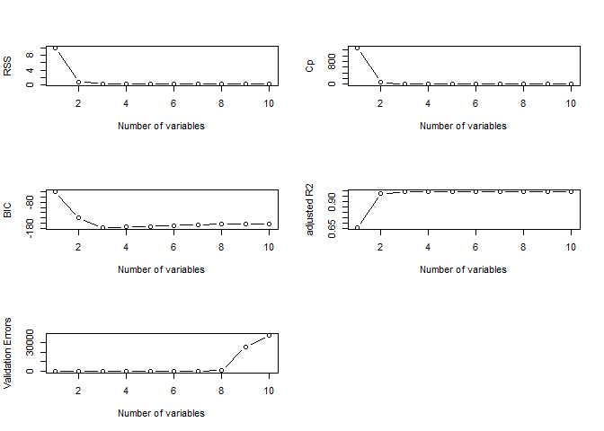
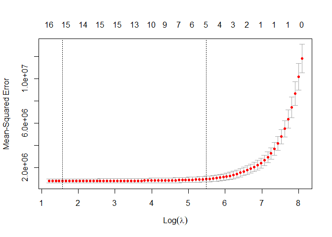
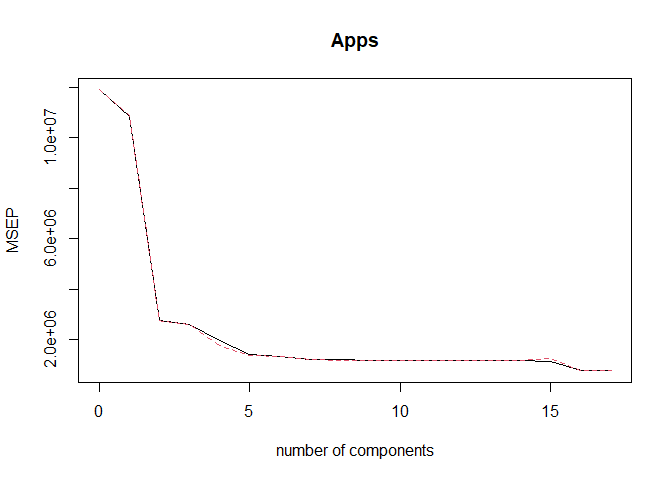

## Exercises 
#### Applied Q8 - Q11

### **Question 8**
In this exercise, we will generate simulated data, and will then use this data to perform best subset selection.

(a) Use the `rnorm()` function to generate a predictor X of length n = 100, as well as a noise vector  of length n = 100.


```r
set.seed(12)
n <- 100
x <- rnorm(n)
error <- 0.1 * rnorm(n)
```

(b) Generate a response vector Y of length n = 100 according to the model , where the all coefficients are constants of your choice.


```r
beta_0 <- 0.5
beta_1 <- -1.0
beta_2 <- 0.25
beta_3 <- 0.75

y <- beta_0 + beta_1 * x + beta_2 * x^2 + beta_3 * x^3 + error
```

(c) Use the `regsubsets()` function to perform best subset selection in order to choose the best model containing the predictors .

In order to use the validation set approach, we begin by splitting the observations into a training set and a test set.


```r
set.seed(12)
df <- data.frame(Y = y, X = x, X2 = x^2, X3 = x^3, X4 = x^4, X5 = x^5, X6 = x^6, X7 = x^7, X8 = x^8, X9 = x^9, X10 = x^10)
train <- sample(c(TRUE, FALSE), n, rep = TRUE) #create a random vector which TRUE if the corresponding obs is in the training set.
test <- !train
```

Now, we apply `regsubsets()` to the training set in order to perform best subset selection.

```r
regfit.best <- regsubsets(Y ~., data = df[train,], nvmax = 10)
reg.summary <- summary(regfit.best)
reg.summary
```

```
## Subset selection object
## Call: regsubsets.formula(Y ~ ., data = df[train, ], nvmax = 10)
## 10 Variables  (and intercept)
##     Forced in Forced out
## X       FALSE      FALSE
## X2      FALSE      FALSE
## X3      FALSE      FALSE
## X4      FALSE      FALSE
## X5      FALSE      FALSE
## X6      FALSE      FALSE
## X7      FALSE      FALSE
## X8      FALSE      FALSE
## X9      FALSE      FALSE
## X10     FALSE      FALSE
## 1 subsets of each size up to 10
## Selection Algorithm: exhaustive
##           X   X2  X3  X4  X5  X6  X7  X8  X9  X10
## 1  ( 1 )  " " " " " " " " " " "*" " " " " " " " "
## 2  ( 1 )  "*" " " "*" " " " " " " " " " " " " " "
## 3  ( 1 )  "*" "*" "*" " " " " " " " " " " " " " "
## 4  ( 1 )  "*" "*" "*" " " " " " " " " " " " " "*"
## 5  ( 1 )  "*" "*" "*" " " "*" " " " " "*" " " " "
## 6  ( 1 )  "*" "*" "*" " " "*" " " "*" " " "*" " "
## 7  ( 1 )  "*" "*" "*" " " " " "*" "*" " " "*" "*"
## 8  ( 1 )  "*" "*" " " "*" " " "*" "*" "*" "*" "*"
## 9  ( 1 )  "*" "*" "*" "*" "*" "*" "*" " " "*" "*"
## 10  ( 1 ) "*" "*" "*" "*" "*" "*" "*" "*" "*" "*"
```

Note: An asterisk indicates that a given variable is included in the corresponding model.

Now, We compute the validation set error for the best model of each model size.

```r
test.mat <- model.matrix(Y ~., data = df[test,])

val.errors <- rep(NA, 10)
for(i in 1:10){
  coefi <- coef(regfit.best, id = i)
  pred <-test.mat[, names(coefi)]%*%coefi
  val.errors[i] <- mean((df$Y[test] - pred)^2)
}
round(val.errors, 4) 
```

```
##  [1]     4.5498     0.2610     0.0119     0.0169     0.2952     0.0152
##  [7]   520.3677  9142.0711 25311.0864 36994.8065
```

```r
which.min(val.errors)
```

```
## [1] 3
```

```r
coef(regfit.best, 3)
```

```
## (Intercept)           X          X2          X3 
##   0.5001972  -0.9962100   0.2532706   0.7402730
```

We find that the best model is the one that contains 3 variables.


```r
par(mfrow = c(3,2))
plot(reg.summary$rss, xlab = "Number of variables", ylab = "RSS", type = 'b')
plot(reg.summary$cp, xlab = "Number of variables", ylab = "Cp", type = 'b')
plot(reg.summary$bic, xlab = "Number of variables", ylab = "BIC", type = 'b')
plot(reg.summary$adjr2, xlab = "Number of variables", ylab = "adjusted R2", type = 'b')
plot(val.errors, xlab = "Number of variables", ylab = "Validation Errors", type = 'b')
```


The procedure of validation and cross-validation has an advantage relative to AIC, BIC, Cp, and adjusted R2. It gives a direct estimate of the test error, and make fewer assumptions about the true underlying model. 

Based on the five plots above, we notice that the best model is with 3 variables.

(d) Repeat (c), using forward stepwise selection and also using backwards stepwise selection.

* Forward stepwise selection


```r
regfit.fwd <- regsubsets(Y ~., data = df[train,], nvmax = 10, method = "forward")
reg.summary_fwd <- summary(regfit.fwd)
reg.summary_fwd
```

```
## Subset selection object
## Call: regsubsets.formula(Y ~ ., data = df[train, ], nvmax = 10, method = "forward")
## 10 Variables  (and intercept)
##     Forced in Forced out
## X       FALSE      FALSE
## X2      FALSE      FALSE
## X3      FALSE      FALSE
## X4      FALSE      FALSE
## X5      FALSE      FALSE
## X6      FALSE      FALSE
## X7      FALSE      FALSE
## X8      FALSE      FALSE
## X9      FALSE      FALSE
## X10     FALSE      FALSE
## 1 subsets of each size up to 10
## Selection Algorithm: forward
##           X   X2  X3  X4  X5  X6  X7  X8  X9  X10
## 1  ( 1 )  " " " " " " " " " " "*" " " " " " " " "
## 2  ( 1 )  "*" " " " " " " " " "*" " " " " " " " "
## 3  ( 1 )  "*" " " " " " " "*" "*" " " " " " " " "
## 4  ( 1 )  "*" "*" " " " " "*" "*" " " " " " " " "
## 5  ( 1 )  "*" "*" "*" " " "*" "*" " " " " " " " "
## 6  ( 1 )  "*" "*" "*" "*" "*" "*" " " " " " " " "
## 7  ( 1 )  "*" "*" "*" "*" "*" "*" " " " " " " "*"
## 8  ( 1 )  "*" "*" "*" "*" "*" "*" " " " " "*" "*"
## 9  ( 1 )  "*" "*" "*" "*" "*" "*" "*" " " "*" "*"
## 10  ( 1 ) "*" "*" "*" "*" "*" "*" "*" "*" "*" "*"
```

Now, let's test models on the validation set.


```r
test.mat <- model.matrix(Y ~., data = df[test,])
val.errors <- rep(NA, 10)
for (i in 1:10){
  coefi <- coef(regfit.fwd, id = i)
  pred <- test.mat[, names(coefi)]%*%coefi
  val.errors[i] <- mean((df$Y[test] - pred)^2)
}
val.errors
```

```
##  [1]     4.549833     6.016508    21.614786    19.963172     1.321624
##  [6]     1.509487     2.888621    48.626199 25311.086372 36994.806467
```

```r
which.min(val.errors)
```

```
## [1] 5
```

```r
coef(regfit.fwd, 5)
```

```
## (Intercept)           X          X2          X3          X5          X6 
##  0.51115688 -0.95918487  0.20252234  0.59733398  0.09894698  0.03510718
```


```r
par(mfrow = c(3,2))
plot(reg.summary_fwd$rss, xlab = "Number of variables", ylab = "RSS", type = 'b')
plot(reg.summary_fwd$cp, xlab = "Number of variables", ylab = "Cp", type = 'b')
plot(reg.summary_fwd$bic, xlab = "Number of variables", ylab = "BIC", type = 'b')
plot(reg.summary_fwd$adjr2, xlab = "Number of variables", ylab = "adjusted R2", type = 'b')
plot(val.errors, xlab = "Number of variables", ylab = "Validation Errors", type = 'b')
```


Using the forward stepwise selection, the best model is the one with 5 variables.

* Backward stepwise selection

```r
regfit.bwd <- regsubsets(Y ~., data = df[train,], nvmax = 10, method = "backward")
reg.summary_bwd <- summary(regfit.bwd)
reg.summary_bwd
```

```
## Subset selection object
## Call: regsubsets.formula(Y ~ ., data = df[train, ], nvmax = 10, method = "backward")
## 10 Variables  (and intercept)
##     Forced in Forced out
## X       FALSE      FALSE
## X2      FALSE      FALSE
## X3      FALSE      FALSE
## X4      FALSE      FALSE
## X5      FALSE      FALSE
## X6      FALSE      FALSE
## X7      FALSE      FALSE
## X8      FALSE      FALSE
## X9      FALSE      FALSE
## X10     FALSE      FALSE
## 1 subsets of each size up to 10
## Selection Algorithm: backward
##           X   X2  X3  X4  X5  X6  X7  X8  X9  X10
## 1  ( 1 )  " " " " "*" " " " " " " " " " " " " " "
## 2  ( 1 )  "*" " " "*" " " " " " " " " " " " " " "
## 3  ( 1 )  "*" "*" "*" " " " " " " " " " " " " " "
## 4  ( 1 )  "*" "*" "*" " " " " " " " " " " "*" " "
## 5  ( 1 )  "*" "*" "*" " " " " " " "*" " " "*" " "
## 6  ( 1 )  "*" "*" "*" " " " " "*" "*" " " "*" " "
## 7  ( 1 )  "*" "*" "*" " " " " "*" "*" " " "*" "*"
## 8  ( 1 )  "*" "*" "*" " " "*" "*" "*" " " "*" "*"
## 9  ( 1 )  "*" "*" "*" "*" "*" "*" "*" " " "*" "*"
## 10  ( 1 ) "*" "*" "*" "*" "*" "*" "*" "*" "*" "*"
```

Now, let's test models on the validation set.

```r
test.mat <- model.matrix(Y ~., data = df[test,])
val.errors <- rep(NA, 10)
for (i in 1:10){
  coefi <- coef(regfit.bwd, id = i)
  pred <- test.mat[, names(coefi)]%*%coefi
  val.errors[i] <- mean((df$Y[test] - pred)^2)
}
val.errors
```

```
##  [1] 5.475446e-01 2.609971e-01 1.185792e-02 1.207159e-02 1.249731e-02
##  [6] 3.372287e-01 5.203677e+02 1.170876e+03 2.531109e+04 3.699481e+04
```

```r
which.min(val.errors)
```

```
## [1] 3
```

```r
coef(regfit.bwd, 3)
```

```
## (Intercept)           X          X2          X3 
##   0.5001972  -0.9962100   0.2532706   0.7402730
```


```r
par(mfrow = c(3,2))
plot(reg.summary_bwd$rss, xlab = "Number of variables", ylab = "RSS", type = 'b')
plot(reg.summary_bwd$cp, xlab = "Number of variables", ylab = "Cp", type = 'b')
plot(reg.summary_bwd$bic, xlab = "Number of variables", ylab = "BIC", type = 'b')
plot(reg.summary_bwd$adjr2, xlab = "Number of variables", ylab = "adjusted R2", type = 'b')
plot(val.errors, xlab = "Number of variables", ylab = "Validation Errors", type = 'b')
```



Using the backward stepwise selection, the best model is the one with 3 variables.

(e) Now, fit a lasso model to the simulated data, again using  as predictors. Use cross-validation error as a function of .


```r
grid <- 10^seq(10, -2, length = 100) # a grid of lambda values ranging from 10^10 to 10^(-2)
Y <- df$Y
MM <- model.matrix(Y ~., data = df)
lasso.mod <- glmnet(MM[train,], Y[train], alpha = 1, lambda = grid)
plot(lasso.mod)
```

```
## Warning in regularize.values(x, y, ties, missing(ties), na.rm = na.rm):
## collapsing to unique 'x' values
```


Some of the coefficients will be exactly equal to zero depending on the choice of tuning parameter from the coefficient plot above.

Next, we perform cross-validation and the associated test error.


```r
set.seed(12)
cv.out <- cv.glmnet(MM[train,], Y[train], alpha = 1)
bestlam <- cv.out$lambda.1se
bestlam # lasso CV best value of lambda (one standard error)
```

```
## [1] 0.003472785
```

```r
plot(cv.out)
```


```r
lasso.coef <- predict(lasso.mod, type = "coefficients", s = bestlam)
lasso.coef
```

```
## 12 x 1 sparse Matrix of class "dgCMatrix"
##                       1
## (Intercept)  0.55361259
## (Intercept)  .         
## X           -0.79087186
## X2           0.13666962
## X3           0.50983047
## X4           .         
## X5           0.02924979
## X6           .         
## X7           .         
## X8           .         
## X9           .         
## X10          .
```

```r
lasso.pred <- predict(lasso.mod, s = bestlam, alpha = 1, newx = MM[test,])
mean((lasso.pred - Y[test])^2) # test error
```

```
## [1] 0.08391013
```

Note: The vertical lines show the locations of λmin and λ1se. The numbers across the top are the number of nonzero coefficient estimates.

The best value of λ is 0.0035. Then, using the best λ to re-fit the full data and we find that the coefficients for X4, X6, X7, X8, X9 and X10 have been shrunk to zero.

(f) Now generate a response vector Y according to the model , and perform best subset selection and the lasso.

```r
set.seed(15)
x <- rnorm(n)
error <- 0.1 * rnorm(n)

beta_0 <- 1.0
beta_7 <- 2.0
y <- beta_0 + beta_7 * x^7 + error
DF <- data.frame(Y = y, X = x, X2 = x^2, X3 = x^3, X4 = x^4, X5 = x^5, X6 = x^6, X7 = x^7, X8 = x^8, X9 = x^9, X10 = x^10 )

train <- sample(c(TRUE, FALSE), n, rep = TRUE)
test <- (!train)

regfit.full <- regsubsets(Y ~., data = DF[train,], nvmax = 10) # test best subset models on the validation set
summary(regfit.full)
```

```
## Subset selection object
## Call: regsubsets.formula(Y ~ ., data = DF[train, ], nvmax = 10)
## 10 Variables  (and intercept)
##     Forced in Forced out
## X       FALSE      FALSE
## X2      FALSE      FALSE
## X3      FALSE      FALSE
## X4      FALSE      FALSE
## X5      FALSE      FALSE
## X6      FALSE      FALSE
## X7      FALSE      FALSE
## X8      FALSE      FALSE
## X9      FALSE      FALSE
## X10     FALSE      FALSE
## 1 subsets of each size up to 10
## Selection Algorithm: exhaustive
##           X   X2  X3  X4  X5  X6  X7  X8  X9  X10
## 1  ( 1 )  " " " " " " " " " " " " "*" " " " " " "
## 2  ( 1 )  " " "*" " " " " " " " " "*" " " " " " "
## 3  ( 1 )  " " " " " " "*" " " "*" "*" " " " " " "
## 4  ( 1 )  " " " " " " "*" " " " " "*" "*" " " "*"
## 5  ( 1 )  " " "*" " " "*" " " "*" "*" "*" " " " "
## 6  ( 1 )  " " "*" " " "*" " " "*" "*" "*" " " "*"
## 7  ( 1 )  "*" "*" " " "*" " " "*" "*" "*" " " "*"
## 8  ( 1 )  "*" "*" "*" "*" " " "*" "*" "*" " " "*"
## 9  ( 1 )  "*" "*" "*" "*" "*" "*" "*" " " "*" "*"
## 10  ( 1 ) "*" "*" "*" "*" "*" "*" "*" "*" "*" "*"
```

```r
test.mat <- model.matrix(Y ~., data = DF[test,])
val.errors <- rep(NA, 10)
for(i in 1:10){
  coefi <- coef(regfit.full, id = i)
  pred <- test.mat[, names(coefi)]%*%coefi
  val.errors[i] <- mean((DF$Y[test] - pred)^2)
}
val.errors
```

```
##  [1] 3.803752e-02 1.955034e-02 2.662779e-01 1.654823e+00 1.323708e+00
##  [6] 2.447253e+00 2.746252e+00 2.296675e+00 1.413693e+03 1.907318e+03
```

```r
which.min(val.errors) # the best model is the one with 2 variables.
```

```
## [1] 2
```

```r
coef(regfit.full, 2)
```

```
## (Intercept)          X2          X7 
##  0.95725463  0.04115877  2.00010972
```

```r
val.errors[2]
```

```
## [1] 0.01955034
```

```r
# next, using the Lasso
MM <- model.matrix(Y ~., data = DF)
grid <- 10^seq(10, -2, length = 100) # a grid of lambda values ranging from 10^10 to 10^(-2)
Y <- DF$Y
lasso.mod <- glmnet(MM[train,], Y[train], alpha = 1, lambda = grid)

cv.out <- cv.glmnet(MM[train,], Y[train], alpha = 1)
bestlam <- cv.out$lambda.1se
bestlam # lasso CV best value of lambda (one standard error)
```

```
## [1] 1.742972
```

```r
plot(cv.out)
```


```r
lasso.coef <- predict(lasso.mod, type = "coefficients", s = bestlam)
lasso.coef
```

```
## 12 x 1 sparse Matrix of class "dgCMatrix"
##                    1
## (Intercept) 1.338576
## (Intercept) .       
## X           .       
## X2          .       
## X3          .       
## X4          .       
## X5          .       
## X6          .       
## X7          1.924000
## X8          .       
## X9          .       
## X10         .
```

```r
lasso.pred <- predict(lasso.mod, s = bestlam, alpha = 1, newx = MM[test,])
mean((lasso.pred - Y[test])^2) # test error
```

```
## [1] 96.22071
```

The best subset selection selects the two-variable model with X2 and X7. However, the Lasso picks the one-variable model with X7 as the single predictor, and its coefficient estimates (1.33, 1.92) are close to the true coefficients (1.0, 2.0). 

### **Question 9**
In this exercise, we will predict the number of application received using the other variables in the `College` data set.

(a) Split the data set into a training set and a test set.

```r
set.seed(12)
n <- dim(College)[1]
p <- dim(College)[2]

train <- sample(c(TRUE, FALSE), n, rep = TRUE)
test <- (!train)
```

(b) Fit **a linear model using least squares** on the training set, and report the test error obtained.

```r
glimpse(College)
```

```
## Rows: 777
## Columns: 18
## $ Private     <fct> Yes, Yes, Yes, Yes, Yes, Yes, Yes, Yes, Yes, Yes, Yes, ...
## $ Apps        <dbl> 1660, 2186, 1428, 417, 193, 587, 353, 1899, 1038, 582, ...
## $ Accept      <dbl> 1232, 1924, 1097, 349, 146, 479, 340, 1720, 839, 498, 1...
## $ Enroll      <dbl> 721, 512, 336, 137, 55, 158, 103, 489, 227, 172, 472, 4...
## $ Top10perc   <dbl> 23, 16, 22, 60, 16, 38, 17, 37, 30, 21, 37, 44, 38, 44,...
## $ Top25perc   <dbl> 52, 29, 50, 89, 44, 62, 45, 68, 63, 44, 75, 77, 64, 73,...
## $ F.Undergrad <dbl> 2885, 2683, 1036, 510, 249, 678, 416, 1594, 973, 799, 1...
## $ P.Undergrad <dbl> 537, 1227, 99, 63, 869, 41, 230, 32, 306, 78, 110, 44, ...
## $ Outstate    <dbl> 7440, 12280, 11250, 12960, 7560, 13500, 13290, 13868, 1...
## $ Room.Board  <dbl> 3300, 6450, 3750, 5450, 4120, 3335, 5720, 4826, 4400, 3...
## $ Books       <dbl> 450, 750, 400, 450, 800, 500, 500, 450, 300, 660, 500, ...
## $ Personal    <dbl> 2200, 1500, 1165, 875, 1500, 675, 1500, 850, 500, 1800,...
## $ PhD         <dbl> 70, 29, 53, 92, 76, 67, 90, 89, 79, 40, 82, 73, 60, 79,...
## $ Terminal    <dbl> 78, 30, 66, 97, 72, 73, 93, 100, 84, 41, 88, 91, 84, 87...
## $ S.F.Ratio   <dbl> 18.1, 12.2, 12.9, 7.7, 11.9, 9.4, 11.5, 13.7, 11.3, 11....
## $ perc.alumni <dbl> 12, 16, 30, 37, 2, 11, 26, 37, 23, 15, 31, 41, 21, 32, ...
## $ Expend      <dbl> 7041, 10527, 8735, 19016, 10922, 9727, 8861, 11487, 116...
## $ Grad.Rate   <dbl> 60, 56, 54, 59, 15, 55, 63, 73, 80, 52, 73, 76, 74, 68,...
```

```r
m <- lm(Apps ~ ., data = College[train,])
y_hat <- predict(m, newdata = College[test,])
MSE <- mean((College[test,]$Apps - y_hat)^2)
MSE
```

```
## [1] 1741781
```

```r
MAPE(y_hat, College[test,]$Apps)
```

```
## [1] 0.3716816
```

The MSE of the linear model using least squares is 1741781.

(c) Fit **a ridge regression model** on the training set, with λ chosen by cross-validation. Report the test error obtained.

```r
set.seed(15)
MM <- model.matrix(Apps ~ ., data = College[train,])
cv.out <- cv.glmnet(MM, College[train,]$Apps, alpha = 0)
plot(cv.out)
```


```r
bestlam <- cv.out$lambda.1se
bestlam
```

```
## [1] 751.7081
```

```r
ridge.mod <- glmnet(MM, College[train,]$Apps, alpha = 0)
y_hat <- predict(ridge.mod, s = bestlam, newx = model.matrix(Apps ~ ., data = College[test,]))
MSE <- mean((College[test,]$Apps - y_hat)^2)
MSE
```

```
## [1] 3126327
```

```r
MAPE(y_hat, College[test,]$Apps)
```

```
## [1] 0.4568679
```

The MSE of the ridge regression model is 3126327, which is higher than the linear model in (b).

(d) Fit **a lasso model** on the training set, with λ chosen by cross-validation. Report the test error obtained, along with the number of non-zero coefficient estimates.

```r
set.seed(15)
MM <- model.matrix(Apps ~ ., data = College[train,])
cv.out <- cv.glmnet(MM, College[train,]$Apps, alpha = 1)
plot(cv.out)
```



```r
bestlam <- cv.out$lambda.1se
bestlam
```

```
## [1] 240.4915
```

```r
ridge.mod <- glmnet(MM, College[train,]$Apps, alpha = 1)
y_hat <- predict(ridge.mod, s = bestlam, newx = model.matrix(Apps ~ ., data = College[test,]))
MSE <- mean((College[test,]$Apps - y_hat)^2)
MSE
```

```
## [1] 2089637
```

```r
MAPE(y_hat, College[test,]$Apps)
```

```
## [1] 0.3587605
```

The MSE of the Lasso model is 2089637, which is less than the ridge regression model (3126327), slightly higher than the linear least squares model (1741781), and with fewer variables (5 variables). 

(e) Fit **a PCR model** on the training set, with M chosen by cross-validation. Report the test error obtained, along with the value of M selected by cross-validation.

```r
set.seed(20)
pcr.mod <- pcr(Apps ~ ., data = College[train,], scale = TRUE, validation = "CV")
summary(pcr.mod)
```

```
## Data: 	X dimension: 404 17 
## 	Y dimension: 404 1
## Fit method: svdpc
## Number of components considered: 17
## 
## VALIDATION: RMSEP
## Cross-validated using 10 random segments.
##        (Intercept)  1 comps  2 comps  3 comps  4 comps  5 comps  6 comps
## CV            3448     3292     1663     1617     1408     1197     1165
## adjCV         3448     3298     1661     1614     1335     1169     1159
##        7 comps  8 comps  9 comps  10 comps  11 comps  12 comps  13 comps
## CV        1107     1098     1087      1081      1088      1090      1093
## adjCV     1099     1095     1085      1079      1086      1088      1090
##        14 comps  15 comps  16 comps  17 comps
## CV         1095      1064     892.0     884.1
## adjCV      1092      1123     888.4     880.5
## 
## TRAINING: % variance explained
##       1 comps  2 comps  3 comps  4 comps  5 comps  6 comps  7 comps  8 comps
## X       30.14    56.61    63.61    69.33    74.90    80.04    83.80    87.26
## Apps     9.68    77.31    78.57    87.11    89.35    89.37    90.44    90.46
##       9 comps  10 comps  11 comps  12 comps  13 comps  14 comps  15 comps
## X       90.47     92.97     95.04     96.87     97.98     98.87     99.38
## Apps    90.63     90.78     90.78     90.87     90.89     90.91     90.95
##       16 comps  17 comps
## X        99.86    100.00
## Apps     94.22     94.35
```

```r
validationplot(pcr.mod, val.type = "MSEP")
```



We see that the smallest cross-validation error occurs when M = 17 components are used. In other words, we should use **all** predictors.


```r
y_hat <- predict(pcr.mod, College[test,], ncomp = 17)
MSE <- mean((College[test,]$Apps - y_hat)^2)
MSE
```

```
## [1] 1741781
```

```r
MAPE(y_hat, College[test,]$Apps)
```

```
## [1] 0.3716816
```

The MSE of the PCR model is 1741781, which is exactly the same as that the linear least squares model since there is no dimension reduction occurs (using all predictors).

(f) Fit **a PLS model** on the training set, with M chosen by cross-validation. Report the test error obtained, along with the value of M selected by cross-validation.

```r
set.seed(20)
pls.mod <- plsr(Apps ~ ., data = College[train,], scale = TRUE, validation = "CV")
validationplot(pls.mod, val.type = "MSEP")
```


In the figure 10, we notice that the best is to use all predictors but there is not much difference between 5 and 17 so that we will pick 10 components.


```r
y_hat <- predict(pls.mod, College[test,], ncomp = 10)
MSE <- mean((College[test,]$Apps - y_hat)^2)
MSE
```

```
## [1] 1763153
```

```r
MAPE(y_hat, College[test,]$Apps)
```

```
## [1] 0.3686802
```
 
The MSE of the PLS model is 1763153, which is close to that of the linear least squares model.

(g) Comment on the results obtained. How accurately can we predict the number of college applications received? Is there much difference among the test errors resulting from there five approaches?

MSE and MAPE of Linear least square: 1741781, 0.3717

MSE and MAPE of ridge regression: 3126327, 0.4569 

MSE and MAPE of lasso: 2089637, 0.3588

MSE and MAPE of PCR: 1741781, 0.3717

MSE and MAPE of PLS: 1763153, 0.3687


The smaller the MAPE the better the forecast, so the Lasso model is the most accurate predictive model among the five approaches. The test error in ridge regression model is much higher than that other four approaches.

### **Question 10**
We have seen that as the number of features used in a model increases, the training error will necessarily decrease, but the test error may not. We will now explore this in a simulated data set.

(a) Generate a data set with p = 20 features, n = 1000 observations, and an associated quantitative response vector generated according to the model , where  has some elements that are equal to zero.

```r
set.seed(20)
n <- 1000
p <- 20

beta_real <- rnorm(p + 1) # one for beta_0
zeros <- c(2,3, 4, 7, 11, 13, 14, 17, 19, 20)
beta_real[zeros] <- 0
beta_real
```

```
##  [1]  1.16268529  0.00000000  0.00000000  0.00000000 -0.44656677  0.56960612
##  [7]  0.00000000 -0.86901834 -0.46170268 -0.55554091  0.00000000 -0.15038222
## [13]  0.00000000  0.00000000 -1.52135057 -0.43742787  0.00000000  0.02822264
## [19]  0.00000000  0.00000000  0.23668737
```

```r
x <- c(rep(1,n), rnorm(n * p))
x <- matrix(x, nrow = n, ncol = p + 1, byrow = FALSE)
y <- x %*% beta_real + rnorm(n)
df <- data.frame(y, x[, -1])
```

(b) Split your data set into a training set containing 100 observations and a test set containing 900 observations.

```r
set.seed(20)
train <- sample(1:n, 100)
test <- (1:n)[-train]

train_df <- df[train,]
test_df <- df[test,]
```

(c) Perform best subset selection on the training set, and plot the training set MSE associated with the best model of each size.

```r
regfit.full <- regsubsets(y ~ ., data = train_df, nvmax = 20)
reg.summary <- summary(regfit.full)
reg.summary
```

```
## Subset selection object
## Call: regsubsets.formula(y ~ ., data = train_df, nvmax = 20)
## 20 Variables  (and intercept)
##     Forced in Forced out
## X1      FALSE      FALSE
## X2      FALSE      FALSE
## X3      FALSE      FALSE
## X4      FALSE      FALSE
## X5      FALSE      FALSE
## X6      FALSE      FALSE
## X7      FALSE      FALSE
## X8      FALSE      FALSE
## X9      FALSE      FALSE
## X10     FALSE      FALSE
## X11     FALSE      FALSE
## X12     FALSE      FALSE
## X13     FALSE      FALSE
## X14     FALSE      FALSE
## X15     FALSE      FALSE
## X16     FALSE      FALSE
## X17     FALSE      FALSE
## X18     FALSE      FALSE
## X19     FALSE      FALSE
## X20     FALSE      FALSE
## 1 subsets of each size up to 20
## Selection Algorithm: exhaustive
##           X1  X2  X3  X4  X5  X6  X7  X8  X9  X10 X11 X12 X13 X14 X15 X16 X17
## 1  ( 1 )  " " " " " " " " " " " " " " " " " " " " " " " " " " "*" " " " " " "
## 2  ( 1 )  " " " " " " " " " " " " "*" " " " " " " " " " " " " "*" " " " " " "
## 3  ( 1 )  " " " " " " "*" " " " " "*" " " " " " " " " " " " " "*" " " " " " "
## 4  ( 1 )  " " " " " " "*" "*" " " "*" " " " " " " " " " " " " "*" " " " " " "
## 5  ( 1 )  " " " " " " "*" "*" " " "*" "*" " " " " " " " " " " "*" " " " " " "
## 6  ( 1 )  " " " " " " "*" "*" " " "*" "*" "*" " " " " " " " " "*" " " " " " "
## 7  ( 1 )  " " " " " " "*" "*" " " "*" "*" "*" " " " " " " " " "*" "*" " " " "
## 8  ( 1 )  " " " " " " "*" "*" " " "*" "*" "*" " " "*" " " " " "*" "*" " " " "
## 9  ( 1 )  " " " " " " "*" "*" " " "*" "*" "*" " " "*" " " " " "*" "*" " " " "
## 10  ( 1 ) "*" " " " " "*" "*" " " "*" "*" "*" " " "*" " " " " "*" "*" " " " "
## 11  ( 1 ) "*" "*" " " "*" "*" " " "*" "*" "*" " " "*" " " " " "*" "*" " " " "
## 12  ( 1 ) "*" "*" " " "*" "*" " " "*" "*" "*" " " "*" " " " " "*" "*" " " " "
## 13  ( 1 ) "*" "*" " " "*" "*" " " "*" "*" "*" " " "*" " " " " "*" "*" "*" " "
## 14  ( 1 ) "*" "*" " " "*" "*" " " "*" "*" "*" " " "*" " " " " "*" "*" "*" "*"
## 15  ( 1 ) "*" "*" "*" "*" "*" " " "*" "*" "*" " " "*" " " " " "*" "*" "*" "*"
## 16  ( 1 ) "*" "*" "*" "*" "*" " " "*" "*" "*" " " "*" "*" " " "*" "*" "*" "*"
## 17  ( 1 ) "*" "*" "*" "*" "*" " " "*" "*" "*" " " "*" "*" " " "*" "*" "*" "*"
## 18  ( 1 ) "*" "*" "*" "*" "*" "*" "*" "*" "*" " " "*" "*" " " "*" "*" "*" "*"
## 19  ( 1 ) "*" "*" "*" "*" "*" "*" "*" "*" "*" " " "*" "*" "*" "*" "*" "*" "*"
## 20  ( 1 ) "*" "*" "*" "*" "*" "*" "*" "*" "*" "*" "*" "*" "*" "*" "*" "*" "*"
##           X18 X19 X20
## 1  ( 1 )  " " " " " "
## 2  ( 1 )  " " " " " "
## 3  ( 1 )  " " " " " "
## 4  ( 1 )  " " " " " "
## 5  ( 1 )  " " " " " "
## 6  ( 1 )  " " " " " "
## 7  ( 1 )  " " " " " "
## 8  ( 1 )  " " " " " "
## 9  ( 1 )  " " " " "*"
## 10  ( 1 ) " " " " "*"
## 11  ( 1 ) " " " " "*"
## 12  ( 1 ) "*" " " "*"
## 13  ( 1 ) "*" " " "*"
## 14  ( 1 ) "*" " " "*"
## 15  ( 1 ) "*" " " "*"
## 16  ( 1 ) "*" " " "*"
## 17  ( 1 ) "*" "*" "*"
## 18  ( 1 ) "*" "*" "*"
## 19  ( 1 ) "*" "*" "*"
## 20  ( 1 ) "*" "*" "*"
```

```r
train.mat <- model.matrix(y ~ ., data = train_df)
train.errors <- rep(NA, 20)
for(i in 1:20){
  coefi <- coef(regfit.full, id = i)
  pred <- train.mat[, names(coefi)]%*%coefi
  train.errors[i] <- mean((train_df$y - pred)^2)
}
train.errors
```

```
##  [1] 3.581071 2.436149 2.033894 1.607384 1.453572 1.328780 1.240667 1.174476
##  [9] 1.136558 1.123219 1.113851 1.101290 1.096513 1.094869 1.093691 1.093292
## [17] 1.092558 1.092366 1.092211 1.092194
```

(d) Plot the test set MSE associated with the best model of each size.

```r
test.mat <- model.matrix(y ~ ., data = test_df)
val.errors <- rep(NA, 20)
for(i in 1:20){
  coefi <- coef(regfit.full, id = i)
  pred <- test.mat[, names(coefi)]%*%coefi
  val.errors[i] <- mean((test_df$y - pred)^2)
}
val.errors
```

```
##  [1] 3.234428 2.477580 2.305627 1.972621 1.761303 1.415106 1.224676 1.266709
##  [9] 1.155462 1.161888 1.151549 1.170542 1.185082 1.183775 1.188875 1.187195
## [17] 1.187048 1.184107 1.184297 1.184215
```

```r
which.min(val.errors)
```

```
## [1] 11
```

```r
coef(regfit.full, 11)
```

```
## (Intercept)          X1          X2          X4          X5          X7 
##   1.3595527   0.1121120  -0.0979435  -0.6020874   0.5742590  -0.9656452 
##          X8          X9         X11         X14         X15         X20 
##  -0.4103237  -0.4226229  -0.2116853  -1.4769110  -0.2577754   0.2059070
```

```r
par(mfrow = c(1,2))
plot(1:20, train.errors, xlab = "number of predictors", ylab = "training MSE", type = "o", col = "blue", ylim = c(0, 8))
plot(1:20, val.errors, xlab = "number of predictors", ylab = "testing MSE", type = "o", col = "red", ylim = c(0, 8))
```


(e) For which model size does the test set MSE take on its minimum value? Comment on your results. If it takes on its minimum value for a model containing only an intercept or a model containing all of the features, then play around with the way that you are generating the data in (a) until you come up with a scenario in which the test set MSE is minimized for an intermediate model size.

The test MSE is minimized for the 11-variable model.

(f) How does the model at which the test set MSE is minimized compare to the true model used to generate the data? Comment on the coefficient values.

```r
beta_real
```

```
##  [1]  1.16268529  0.00000000  0.00000000  0.00000000 -0.44656677  0.56960612
##  [7]  0.00000000 -0.86901834 -0.46170268 -0.55554091  0.00000000 -0.15038222
## [13]  0.00000000  0.00000000 -1.52135057 -0.43742787  0.00000000  0.02822264
## [19]  0.00000000  0.00000000  0.23668737
```

```r
coef(regfit.full, 11)
```

```
## (Intercept)          X1          X2          X4          X5          X7 
##   1.3595527   0.1121120  -0.0979435  -0.6020874   0.5742590  -0.9656452 
##          X8          X9         X11         X14         X15         X20 
##  -0.4103237  -0.4226229  -0.2116853  -1.4769110  -0.2577754   0.2059070
```

The true beta zero values are .

The estimated beta zero values are .

The two models are slightly different. In other words, the best subset selection model estimates the true parameters reasonably good.

(g) Create a plot displaying  for a range of values of r, where  is the jth coefficient estimate for the best model containing r coefficients. Comment on what you observe. How does this compare to the test MSE plot from (d)?

```r
num <- colnames(df)
num[1] <- "(Intercept)"
names(beta_real) <- num

norm.beta.diff <- rep(NA, 20)
for(i in 1:20){
  coefi <- coef(regfit.full, id = i)
  norm.beta.diff[i] <- sqrt(sum(beta_real[names(coefi)] - coefi)^2)
}
norm.beta.diff
```

```
##  [1] 0.41085432 0.21888988 0.05265289 0.02030090 0.02670673 0.19735071
##  [7] 0.49700547 0.36901271 0.34557343 0.44209721 0.27984697 0.39938055
## [13] 0.35619514 0.34452506 0.30714500 0.32520257 0.34780507 0.35997244
## [19] 0.36492548 0.36342957
```

```r
plot(1:20, norm.beta.diff, xlab = "number of predictors", ylab = "||beta_real - beta^r||", type = "o", col = "purple")
```


Based on how close the true and estimated parameters, we should pick the 4-variable model from figure 12. However, the best subset selection suggests that we take the 11-variable model with the smallest MSE. Therefore, we notice that the model selection based on the closest distance between the true and estimated parameters may not have a lowest test MSE.

### **Question 11**
We will now try to predict per capita crime rate in the `Boston` data set

(a) Try out some of the regression methods explored in this chapter, such as best subset selection, the lasso, ridge regression, and PCR. Present and discuss results for the approaches that you consider.

First, let's us split the data set into a training set and a test set.

```r
set.seed(5)
n <- dim(Boston)[1]
p <- dim(Boston)[2]

glimpse(Boston)
```

```
## Rows: 506
## Columns: 14
## $ crim    <dbl> 0.00632, 0.02731, 0.02729, 0.03237, 0.06905, 0.02985, 0.088...
## $ zn      <dbl> 18.0, 0.0, 0.0, 0.0, 0.0, 0.0, 12.5, 12.5, 12.5, 12.5, 12.5...
## $ indus   <dbl> 2.31, 7.07, 7.07, 2.18, 2.18, 2.18, 7.87, 7.87, 7.87, 7.87,...
## $ chas    <int> 0, 0, 0, 0, 0, 0, 0, 0, 0, 0, 0, 0, 0, 0, 0, 0, 0, 0, 0, 0,...
## $ nox     <dbl> 0.538, 0.469, 0.469, 0.458, 0.458, 0.458, 0.524, 0.524, 0.5...
## $ rm      <dbl> 6.575, 6.421, 7.185, 6.998, 7.147, 6.430, 6.012, 6.172, 5.6...
## $ age     <dbl> 65.2, 78.9, 61.1, 45.8, 54.2, 58.7, 66.6, 96.1, 100.0, 85.9...
## $ dis     <dbl> 4.0900, 4.9671, 4.9671, 6.0622, 6.0622, 6.0622, 5.5605, 5.9...
## $ rad     <int> 1, 2, 2, 3, 3, 3, 5, 5, 5, 5, 5, 5, 5, 4, 4, 4, 4, 4, 4, 4,...
## $ tax     <dbl> 296, 242, 242, 222, 222, 222, 311, 311, 311, 311, 311, 311,...
## $ ptratio <dbl> 15.3, 17.8, 17.8, 18.7, 18.7, 18.7, 15.2, 15.2, 15.2, 15.2,...
## $ black   <dbl> 396.90, 396.90, 392.83, 394.63, 396.90, 394.12, 395.60, 396...
## $ lstat   <dbl> 4.98, 9.14, 4.03, 2.94, 5.33, 5.21, 12.43, 19.15, 29.93, 17...
## $ medv    <dbl> 24.0, 21.6, 34.7, 33.4, 36.2, 28.7, 22.9, 27.1, 16.5, 18.9,...
```

```r
train.I <- sample(c(TRUE, FALSE), n, rep = TRUE)
test.I <- (!train.I)

train <- Boston[train.I,]
test <- Boston[test.I,]
```

Next, We will use the full linear model, best subset selection, the lasso, ridge regression, PCR and PLS methods to predict the crime rate. 

* **The full linear model**

```r
m <- lm(crim ~ ., data = train)
y_hat <- predict(m, newdata = test)
MSE <- mean((test$crim - y_hat)^2)
MSE
```

```
## [1] 38.39046
```

* **Best subset selection**


```r
regfit.best <- regsubsets(crim ~ ., data = train, nvmax = 13)
reg.summary <- summary(regfit.best)
test.mat <- model.matrix(crim ~ ., data = test)
val.errors <- rep(NA, 13)
for(i in 1:13){
  coefi <- coef(regfit.best, id = i)
  pred <- test.mat[, names(coefi)]%*%coefi
  val.errors[i] <- mean((test$crim - pred)^2)
}
val.errors
```

```
##  [1] 39.50546 38.58063 39.31369 38.33695 37.16650 37.99561 37.55832 37.70409
##  [9] 38.77182 38.83983 38.84587 38.78413 38.39046
```

```r
which.min(val.errors)
```

```
## [1] 5
```

```r
val.errors[5]
```

```
## [1] 37.1665
```

```r
plot(1:13, val.errors, xlab = "number of predictors", ylab = "testing MSE", type = "o", col = "orange")
```


* **Ridge regression**

```r
set.seed(5)
MM <- model.matrix(crim ~ ., data = train)
cv.out <- cv.glmnet(MM, train$crim, alpha = 0)
plot(cv.out)
```


```r
bestlam <- cv.out$lambda.1se
ridge.mod <- glmnet(MM, train$crim, alpha = 0)
y_hat <- predict(ridge.mod, s = bestlam, newx = model.matrix(crim ~., data = test))
MSE <- mean((test$crim - y_hat)^2)
MSE
```

```
## [1] 54.14368
```

* **The Lasso**

```r
set.seed(5)
cv.out <- cv.glmnet(MM, train$crim, alpha = 1)
plot(cv.out)
```


```r
bestlam <- cv.out$lambda.1se
lasso.mod <- glmnet(MM, train$crim, alpha = 1)
y_hat <- predict(lasso.mod, s = bestlam, newx = model.matrix(crim ~ ., data = test))
MSE <- mean((test$crim - y_hat)^2)
MSE
```

```
## [1] 53.61409
```

* **Principle component regression (PCR)**

```r
pcr.mod <- pcr(crim ~ ., data = train, scale = TRUE, validation = "CV")
validationplot(pcr.mod, val.type = "MSEP") # CV suggests we should use 13 components.
```


```r
y_hat <- predict(pcr.mod, test, ncomp = 13)
MSE <- mean((test$crim - y_hat)^2)
MSE
```

```
## [1] 38.39046
```

* **Partial least squares (PLS)**

```r
pls.mod <- plsr(crim ~ ., data = train, scale = TRUE, validation = "CV")
validationplot(pls.mod, val.type = "MSEP") # CV suggests we should use 5 components.
```


```r
y_hat <- predict(pls.mod, test, ncomp = 5)
MSE <- mean((test$crim - y_hat)^2)
MSE
```

```
## [1] 38.49098
```

MSE of the full linear model: 38.39046

MSE of best subset selection: 37.1665

MSE of ridge regression: 54.14368

MSE of the Lasso: 53.61409

MSE of PCR: 38.39046

MSE of PLS: 38.49098

Therefore, we would like to use the best subset selection method to predict crime rate since we wish to pick a model with a low test error.

(b) Propose a model(or set of models) that seem to perform well on this data set, and justify your answer. Make sure that you are evaluating model performance using validation set error, cross-validation, or some other reasonable alternative, as opposed to using training error.

```r
reg.summary
```

```
## Subset selection object
## Call: regsubsets.formula(crim ~ ., data = train, nvmax = 13)
## 13 Variables  (and intercept)
##         Forced in Forced out
## zn          FALSE      FALSE
## indus       FALSE      FALSE
## chas        FALSE      FALSE
## nox         FALSE      FALSE
## rm          FALSE      FALSE
## age         FALSE      FALSE
## dis         FALSE      FALSE
## rad         FALSE      FALSE
## tax         FALSE      FALSE
## ptratio     FALSE      FALSE
## black       FALSE      FALSE
## lstat       FALSE      FALSE
## medv        FALSE      FALSE
## 1 subsets of each size up to 13
## Selection Algorithm: exhaustive
##           zn  indus chas nox rm  age dis rad tax ptratio black lstat medv
## 1  ( 1 )  " " " "   " "  " " " " " " " " "*" " " " "     " "   " "   " " 
## 2  ( 1 )  " " " "   " "  " " " " " " " " "*" " " " "     " "   " "   "*" 
## 3  ( 1 )  " " " "   " "  " " "*" " " " " "*" " " " "     " "   " "   "*" 
## 4  ( 1 )  " " " "   " "  " " "*" " " " " "*" " " " "     " "   "*"   "*" 
## 5  ( 1 )  "*" "*"   " "  " " " " " " "*" "*" " " " "     " "   " "   "*" 
## 6  ( 1 )  "*" "*"   " "  " " "*" " " "*" "*" " " " "     " "   " "   "*" 
## 7  ( 1 )  "*" "*"   " "  " " "*" " " "*" "*" " " " "     " "   "*"   "*" 
## 8  ( 1 )  "*" "*"   " "  " " "*" "*" "*" "*" " " " "     " "   "*"   "*" 
## 9  ( 1 )  "*" "*"   " "  " " "*" "*" "*" "*" " " " "     "*"   "*"   "*" 
## 10  ( 1 ) "*" "*"   " "  " " "*" "*" "*" "*" " " "*"     "*"   "*"   "*" 
## 11  ( 1 ) "*" "*"   "*"  " " "*" "*" "*" "*" " " "*"     "*"   "*"   "*" 
## 12  ( 1 ) "*" "*"   "*"  " " "*" "*" "*" "*" "*" "*"     "*"   "*"   "*" 
## 13  ( 1 ) "*" "*"   "*"  "*" "*" "*" "*" "*" "*" "*"     "*"   "*"   "*"
```

```r
coef(regfit.best, 5)
```

```
## (Intercept)          zn       indus         dis         rad        medv 
##  9.03299769  0.04741663 -0.19633483 -0.93211541  0.60866143 -0.25399668
```

The model is:, where 

crim: per capita crime rate by town (dependent variable).

: an independent variable that proportion of residential land zoned for lots over 25,000 sq.ft.

: an independent variable that proportion of non-retail business acres per town.

: an independent variable that weighted mean of distances to five Boston employment centres.

: an independent variable that index of accessibility to radial highway.

: an independent variable that median value of owner-occupied homes in $1000s.

: regression coefficients

: a random error

(c) Does your chosen model involve all of the features in the data set? Why or why not?

We choose the best subset selection method with 5-variable model since we believe a subset of the 5 predictors is the most related to the response (`crim`) and the model has the lowest testing MSE. The fitting procedure could yield better prediction accuracy. 


