## Exercises 
#### Applied Q6 - Q12

### **Question 6**
In this exercise, you will further analyze the `Wage` data set considered throughout this chapter.

(a) Perform **polynomial regression** to predict `wage` using `age`. Use cross-validation to select the optimal degree d for the polynomial. What degree was chose, and how does this compare to the results of hypothesis testing using ANOVA? Make a plot of the resulting polynomial fit to the data.

Let's plot the data to see what is looks like between age and wage.

```r
ggplot(Wage, aes(age, wage)) +
  geom_point()
```

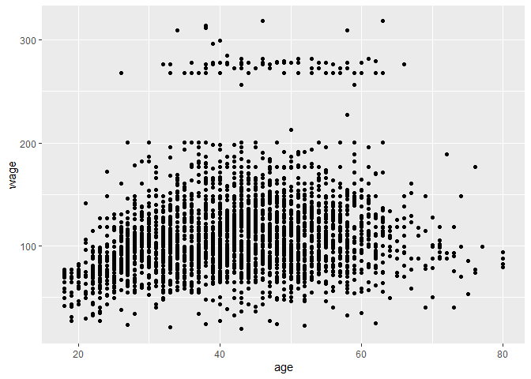

Now, we will use cross-validation to select the optimal degree d for the polynomial. 

```r
dim(Wage)
```

```
## [1] 3000   11
```

```r
set.seed(30)
cv.errors <- rep(NA, 10)
for(i in 1:10){
  glm.fit <- glm(wage ~ poly(age, i), data = Wage)
  cv.errors[i] <- cv.glm(Wage, glm.fit, K = 10)$delta[1]
}
which.min(cv.errors)
```

```
## [1] 6
```

```r
plot(1:10, cv.errors, pch = 19, type = "b", xlab = "number of polynomial", ylab = "CV estimate of the prediction error")
```

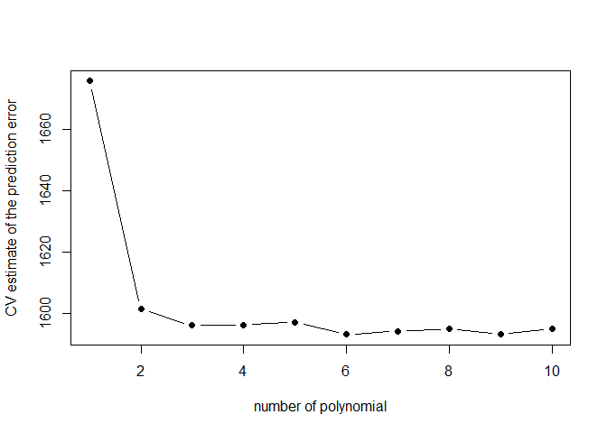

From the plot, 6 is the point where CV is the minimum, so we will consider polynomials of 6 degree.

Next, Use ANOVA to find the optimal degree d for the polynomial. 

```r
m1 <- lm(wage ~ age, data = Wage)
m2 <- lm(wage ~ poly(age,2), data = Wage)
m3 <- lm(wage ~ poly(age,3), data = Wage)
m4 <- lm(wage ~ poly(age,4), data = Wage)
m5 <- lm(wage ~ poly(age,5), data = Wage)
m6 <- lm(wage ~ poly(age,6), data = Wage)
m7 <- lm(wage ~ poly(age,7), data = Wage)
m8 <- lm(wage ~ poly(age,8), data = Wage)
m9 <- lm(wage ~ poly(age,9), data = Wage)
m10 <- lm(wage ~ poly(age,10), data = Wage)
anova(m1, m2, m3, m4,m5,m6,m7,m8,m9,m10)
```

```
## Analysis of Variance Table
## 
## Model  1: wage ~ age
## Model  2: wage ~ poly(age, 2)
## Model  3: wage ~ poly(age, 3)
## Model  4: wage ~ poly(age, 4)
## Model  5: wage ~ poly(age, 5)
## Model  6: wage ~ poly(age, 6)
## Model  7: wage ~ poly(age, 7)
## Model  8: wage ~ poly(age, 8)
## Model  9: wage ~ poly(age, 9)
## Model 10: wage ~ poly(age, 10)
##    Res.Df     RSS Df Sum of Sq        F    Pr(>F)    
## 1    2998 5022216                                    
## 2    2997 4793430  1    228786 143.7638 < 2.2e-16 ***
## 3    2996 4777674  1     15756   9.9005  0.001669 ** 
## 4    2995 4771604  1      6070   3.8143  0.050909 .  
## 5    2994 4770322  1      1283   0.8059  0.369398    
## 6    2993 4766389  1      3932   2.4709  0.116074    
## 7    2992 4763834  1      2555   1.6057  0.205199    
## 8    2991 4763707  1       127   0.0796  0.777865    
## 9    2990 4756703  1      7004   4.4014  0.035994 *  
## 10   2989 4756701  1         3   0.0017  0.967529    
## ---
## Signif. codes:  0 '***' 0.001 '**' 0.01 '*' 0.05 '.' 0.1 ' ' 1
```

The p-value comparing the linear model 1 to the quadratic model 2 is close to zero, indicating that a linear fit is not sufficient. 

The p-value comparing the quadratic model 2 to the cubic model 3 is very low (0.0017), so the quadratic fit is also insufficient.

The p-value comparing the cubic and degree-4 polynomials is 0.05 while the degree-5 polynomial model 5 seems unnecessary because its p-value is 0.37.

Therefore, either a cubic or a quartic polynomial seem to provide a reasonable fit to the data.


```r
p1 <- ggplot(Wage, aes(x = age, y = wage)) + 
  geom_point() + 
  geom_smooth(method = "lm", formula = "y ~ poly(x, 4, raw = T)") + 
  labs(title = "Polynomial Regression (Wage)",
       subtitle = "a degree-4 polynomial of 'age'(ANOVA)")

p2 <- ggplot(Wage, aes(x = age, y = wage)) + 
  geom_point() + 
  geom_smooth(method = "lm", formula = "y ~ poly(x, 6, raw = T)") + 
  labs(title = "Polynomial Regression (Wage)",
       subtitle = "a degree-6 polynomial of 'age'(CV)")
ggarrange(p1, p2)
```

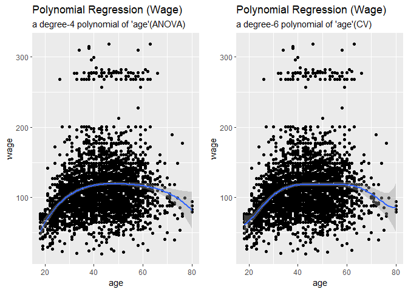

(b) Fit **a step function** to predict `wage` using `age`, and perform cross-validation to choose the optimal number of cuts. Make a plot of the fit obtained.

```r
cv.errors <- rep(NA, 10)
for(i in 2:15){
  Wage$age.cut <- cut(Wage$age, i)
  glm.fit <- glm(wage ~ age.cut, data = Wage)
  cv.errors[i] <- cv.glm(Wage, glm.fit, K = 10)$delta[1]
}
which.min(cv.errors)
```

```
## [1] 11
```

```r
plot(2:15, cv.errors[-1], pch = 19, type = "b", xlab = "number of bins", ylab = "CV estimate of the prediction error" )
```

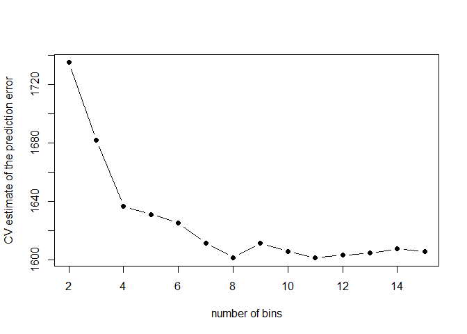

From the plot, we find that 8 bins will have the lowest prediction error. Next, we will make a plot of the fit obtained. 

```r
ggplot(Wage, aes(x = age, y = wage)) + 
  geom_point() + 
  geom_smooth(method = "lm", formula = "y ~ cut(x, 8)") + 
  labs(title = "Step Function (Wage)",
       subtitle = "a 8-bins step function of 'age'")
```

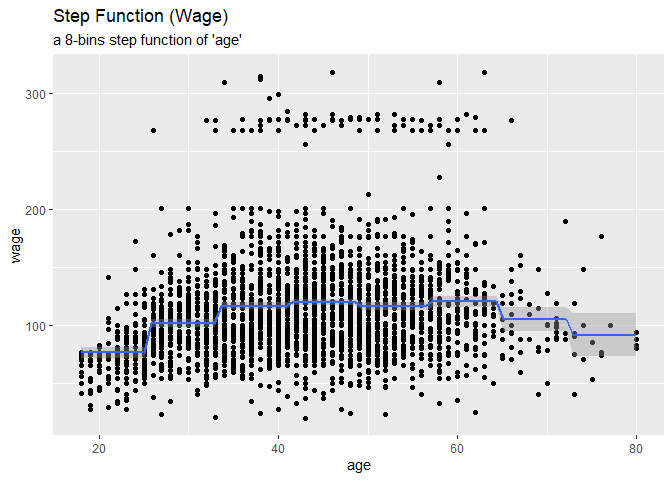

### **Question 7**
The `Wage` data set contains a number of other features not explored in this chapter, such as marital status (`maritl`), job class (`jobclass`), and others. Explore the relationships between some of these other predictions and `wage`, and use non-linear fitting techniques in order to fit flexible models to the data. Create plots of the results obtained, and write a summary of your findings.

```r
glimpse(Wage)
```

```
## Rows: 3,000
## Columns: 12
## $ year       <int> 2006, 2004, 2003, 2003, 2005, 2008, 2009, 2008, 2006, 20...
## $ age        <int> 18, 24, 45, 43, 50, 54, 44, 30, 41, 52, 45, 34, 35, 39, ...
## $ maritl     <fct> 1. Never Married, 1. Never Married, 2. Married, 2. Marri...
## $ race       <fct> 1. White, 1. White, 1. White, 3. Asian, 1. White, 1. Whi...
## $ education  <fct> 1. < HS Grad, 4. College Grad, 3. Some College, 4. Colle...
## $ region     <fct> 2. Middle Atlantic, 2. Middle Atlantic, 2. Middle Atlant...
## $ jobclass   <fct> 1. Industrial, 2. Information, 1. Industrial, 2. Informa...
## $ health     <fct> 1. <=Good, 2. >=Very Good, 1. <=Good, 2. >=Very Good, 1....
## $ health_ins <fct> 2. No, 2. No, 1. Yes, 1. Yes, 1. Yes, 1. Yes, 1. Yes, 1....
## $ logwage    <dbl> 4.318063, 4.255273, 4.875061, 5.041393, 4.318063, 4.8450...
## $ wage       <dbl> 75.04315, 70.47602, 130.98218, 154.68529, 75.04315, 127....
## $ age.cut    <fct> "(17.9,22.1]", "(22.1,26.3]", "(42.8,46.9]", "(42.8,46.9...
```

Let's explore the relationships between `wage` and other features.


```r
cor.test(Wage$year, Wage$wage, method = "pearson") # corr.coef btw wage and year is 0.07. 
```

```
## 
## 	Pearson's product-moment correlation
## 
## data:  Wage$year and Wage$wage
## t = 3.5965, df = 2998, p-value = 0.0003277
## alternative hypothesis: true correlation is not equal to 0
## 95 percent confidence interval:
##  0.02982774 0.10109365
## sample estimates:
##        cor 
## 0.06554428
```

```r
cor.test(Wage$age, Wage$wage, method = "pearson") # corr.coef btw wage and year is 0.20.
```

```
## 
## 	Pearson's product-moment correlation
## 
## data:  Wage$age and Wage$wage
## t = 10.923, df = 2998, p-value < 2.2e-16
## alternative hypothesis: true correlation is not equal to 0
## 95 percent confidence interval:
##  0.1609777 0.2298147
## sample estimates:
##       cor 
## 0.1956372
```

```r
table(Wage$maritl)
```

```
## 
## 1. Never Married       2. Married       3. Widowed      4. Divorced 
##              648             2074               19              204 
##     5. Separated 
##               55
```

```r
g1 <- ggplot(Wage, aes(x = maritl, y = wage)) +
  geom_boxplot() +
  coord_flip()

table(Wage$race)
```

```
## 
## 1. White 2. Black 3. Asian 4. Other 
##     2480      293      190       37
```

```r
g2 <- ggplot(Wage, aes(x = race, y = wage)) +
  geom_boxplot() +
  coord_flip()

table(Wage$education)
```

```
## 
##       1. < HS Grad         2. HS Grad    3. Some College    4. College Grad 
##                268                971                650                685 
## 5. Advanced Degree 
##                426
```

```r
g3 <- ggplot(Wage, aes(x = education, y = wage)) +
  geom_boxplot() +
  coord_flip()

table(Wage$region)
```

```
## 
##        1. New England    2. Middle Atlantic 3. East North Central 
##                     0                  3000                     0 
## 4. West North Central     5. South Atlantic 6. East South Central 
##                     0                     0                     0 
## 7. West South Central           8. Mountain            9. Pacific 
##                     0                     0                     0
```

```r
g4 <- ggplot(Wage, aes(x = region, y = wage)) +
  geom_boxplot()+
  coord_flip()

table(Wage$jobclass)
```

```
## 
##  1. Industrial 2. Information 
##           1544           1456
```

```r
g5<- ggplot(Wage, aes(x = jobclass, y = wage)) +
  geom_boxplot() +
  coord_flip()

table(Wage$health)
```

```
## 
##      1. <=Good 2. >=Very Good 
##            858           2142
```

```r
g6 <- ggplot(Wage, aes(x = health, y = wage)) +
  geom_boxplot() +
  coord_flip()

table(Wage$health_ins)
```

```
## 
## 1. Yes  2. No 
##   2083    917
```

```r
g7 <- ggplot(Wage, aes(x = health_ins, y = wage)) +
  geom_boxplot() +
  coord_flip()

ggarrange(g1, g2, g3, g5, g6, g7, nrow = 3, ncol = 2)
```

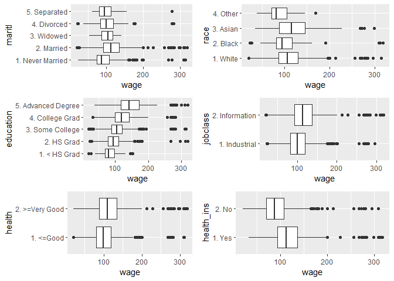

From the correlation tests and the box-plots, we notice that `year`, `age`, `maritl`, `race`, `education`, `jobclass`, `health`, and `health_ins` are somehow related to `wage`.


```r
m <- lm(wage ~ year + poly(age, 3) + maritl + race + education + jobclass + health + health_ins, data = Wage)

anova(m3, m)
```

```
## Analysis of Variance Table
## 
## Model 1: wage ~ poly(age, 3)
## Model 2: wage ~ year + poly(age, 3) + maritl + race + education + jobclass + 
##     health + health_ins
##   Res.Df     RSS Df Sum of Sq      F    Pr(>F)    
## 1   2996 4777674                                  
## 2   2981 3397370 15   1380304 80.743 < 2.2e-16 ***
## ---
## Signif. codes:  0 '***' 0.001 '**' 0.01 '*' 0.05 '.' 0.1 ' ' 1
```

We use ANOVA test to determine whether the model 3 which only contains a degree-3 polynomial of age is sufficient to explain the data or not.

The null hypothesis: a model only contains a degree-3 polynomial of age is sufficient to explain the data.

The alternative hypothesis: a more complex model m is better.

The result turns out that a more complex model m is better to explain the data.

### **Question 8**
Fit some of the non-linear models investigated in this chapter to the `Auto` data set. Is there evidence for non-linear relationship in this data set? Create some informative plots to justify your answer.

```r
Auto$brand <- sapply(strsplit(as.character(Auto$name), split = " "),
                     function(x) x[1])
Auto$brand <- factor(ifelse(Auto$brand %in% c("vw", "vokswagen"), "volkswagen", 
                     ifelse(Auto$brand == "toyouta", "toyota", 
                     ifelse(Auto$brand == "maxda", "mazda", 
                     ifelse(Auto$brand %in% c("chevroelt", "chevy"), "chevrolet", 
                            Auto$brand))))) 
glimpse(Auto)
```

```
## Rows: 392
## Columns: 10
## $ mpg          <dbl> 18, 15, 18, 16, 17, 15, 14, 14, 14, 15, 15, 14, 15, 14...
## $ cylinders    <dbl> 8, 8, 8, 8, 8, 8, 8, 8, 8, 8, 8, 8, 8, 8, 4, 6, 6, 6, ...
## $ displacement <dbl> 307, 350, 318, 304, 302, 429, 454, 440, 455, 390, 383,...
## $ horsepower   <dbl> 130, 165, 150, 150, 140, 198, 220, 215, 225, 190, 170,...
## $ weight       <dbl> 3504, 3693, 3436, 3433, 3449, 4341, 4354, 4312, 4425, ...
## $ acceleration <dbl> 12.0, 11.5, 11.0, 12.0, 10.5, 10.0, 9.0, 8.5, 10.0, 8....
## $ year         <dbl> 70, 70, 70, 70, 70, 70, 70, 70, 70, 70, 70, 70, 70, 70...
## $ origin       <dbl> 1, 1, 1, 1, 1, 1, 1, 1, 1, 1, 1, 1, 1, 1, 3, 1, 1, 1, ...
## $ name         <fct> chevrolet chevelle malibu, buick skylark 320, plymouth...
## $ brand        <fct> chevrolet, buick, plymouth, amc, ford, ford, chevrolet...
```

```r
qualitative_cols <- c(2, 8, 9, 10) # cylinders, origin, name and brand are qualitative variables.
pairs(Auto[,-qualitative_cols])
```

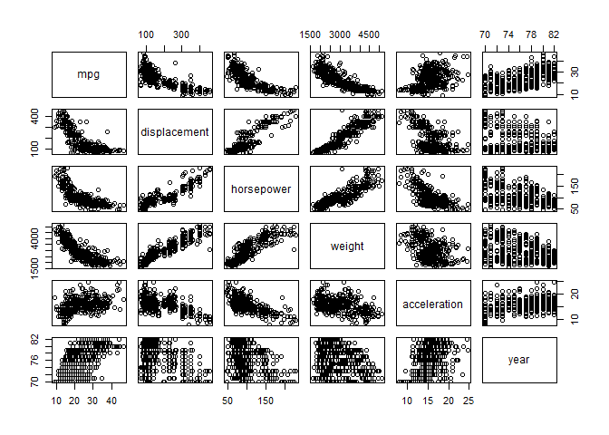

```r
g1 <- ggplot(Auto, aes(x = as.factor(cylinders), y = mpg)) +
  geom_boxplot() +
  labs(x = "Cylinders")

g2 <- ggplot(Auto, aes(x = as.factor(origin), y = mpg)) +
  geom_boxplot() +
  labs(x = "Origin")

g3 <- ggplot(Auto, aes(x = as.factor(name), y = mpg)) +
  geom_point() +
  labs(x = "Name")

g4 <- ggplot(Auto, aes(x = as.factor(brand), y = mpg)) +
  geom_boxplot() +
  labs(x = "Brand") +
  coord_flip()

ggarrange(g1, g2, g3, g4, nrow = 2, ncol = 2)
```

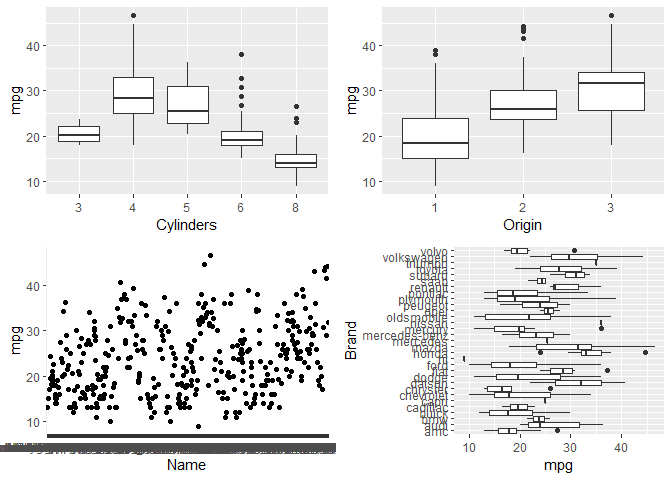

After exploring the data set, we found all variables except `name` are somehow related to `mpg` (miles per gallon).

Next, we will use linear and non-linear models to fit the data set.

```r
lm <- lm(mpg ~ as.factor(cylinders) + displacement + horsepower + weight + acceleration + year + as.factor(origin) + brand, data = Auto)

# Non-linear model: use polynomial regression
set.seed(30)

cv.errors <- rep(NA, 10)
for(i in 1:10){
  glm.fit <- glm(mpg ~ poly(acceleration, i), data = Auto)
  cv.errors[i] <- cv.glm(Auto, glm.fit, K = 10)$delta[1]
}
which.min(cv.errors)
```

```
## [1] 5
```

```r
ggplot(Auto, aes(x = acceleration, y = mpg)) + 
  geom_point() + 
  geom_smooth(method = "lm", formula = "y ~ poly(x, 5, raw = T)")
```

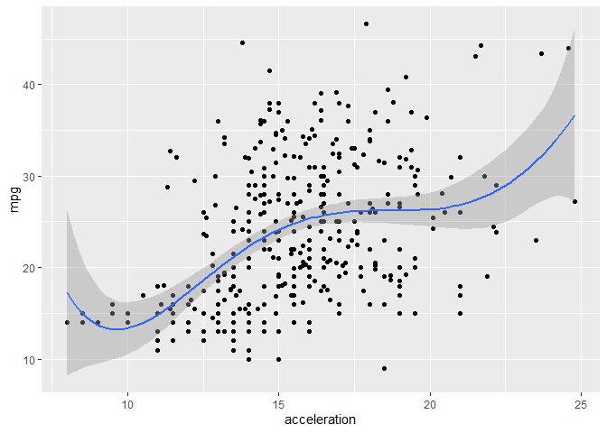

```r
non_lm <- lm(mpg ~ as.factor(cylinders) + displacement + horsepower + weight + poly(acceleration, 5) + year + as.factor(origin) + brand, data = Auto )

anova(lm, non_lm)
```

```
## Analysis of Variance Table
## 
## Model 1: mpg ~ as.factor(cylinders) + displacement + horsepower + weight + 
##     acceleration + year + as.factor(origin) + brand
## Model 2: mpg ~ as.factor(cylinders) + displacement + horsepower + weight + 
##     poly(acceleration, 5) + year + as.factor(origin) + brand
##   Res.Df    RSS Df Sum of Sq      F    Pr(>F)    
## 1    352 3281.1                                  
## 2    348 3103.2  4    177.91 4.9877 0.0006395 ***
## ---
## Signif. codes:  0 '***' 0.001 '**' 0.01 '*' 0.05 '.' 0.1 ' ' 1
```

```r
summary(lm)$adj.r.squared
```

```
## [1] 0.8469865
```

```r
summary(non_lm)$adj.r.squared
```

```
## [1] 0.8536197
```

Although the ANOVA test suggests that the non-linear model is better than the linear model, we notice that there is not much improvement after using non-linear model for the `Auto` data set.
The adjusted R2 of the linear model is approximately 0.847, and that of the non-linear model is about 0.854.  

### **Question 9**
This question uses the variable `dis` (the weighted mean of distances to five Boston employment centers) and `nox` (nitrogen oxides concentration in parts per 10 million) from the `Boston` data. We will treat `dis` as the predictor and `nox` as the response.

(a) Use the `poly()` function to fit a cubit polynomial regression to predict `nox` using `dis`. Report the regression output, and plot the resulting data and polynomial fits.

```r
m <- lm(nox ~ poly(dis, 3), data = Boston)
summary(m)
```

```
## 
## Call:
## lm(formula = nox ~ poly(dis, 3), data = Boston)
## 
## Residuals:
##       Min        1Q    Median        3Q       Max 
## -0.121130 -0.040619 -0.009738  0.023385  0.194904 
## 
## Coefficients:
##                Estimate Std. Error t value Pr(>|t|)    
## (Intercept)    0.554695   0.002759 201.021  < 2e-16 ***
## poly(dis, 3)1 -2.003096   0.062071 -32.271  < 2e-16 ***
## poly(dis, 3)2  0.856330   0.062071  13.796  < 2e-16 ***
## poly(dis, 3)3 -0.318049   0.062071  -5.124 4.27e-07 ***
## ---
## Signif. codes:  0 '***' 0.001 '**' 0.01 '*' 0.05 '.' 0.1 ' ' 1
## 
## Residual standard error: 0.06207 on 502 degrees of freedom
## Multiple R-squared:  0.7148,	Adjusted R-squared:  0.7131 
## F-statistic: 419.3 on 3 and 502 DF,  p-value: < 2.2e-16
```

```r
ggplot(Boston, aes(x = dis, y = nox)) +
  geom_point() +
  geom_smooth(method = "lm", formula = "y ~ poly(x, 3)") +
  labs(title = "Polynomial Regression: a cubic polynomial of dis")
```

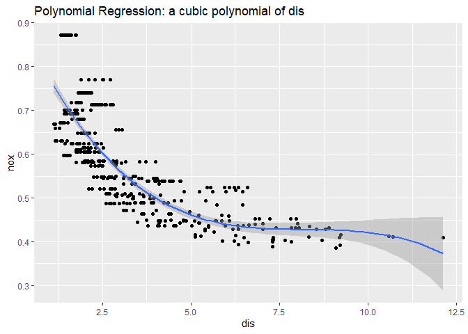

(b) Plot the polynomial fits for a range of different polynomial degrees (say, from 1 to 10), and report the associated residual sum of squares.

```r
g1 <- ggplot(Boston, aes(x = dis, y = nox)) +
  geom_point() +
  geom_smooth(method = "lm", formula = "y ~ poly(x, 1)") +
  labs(title = "a 1-degree polynomial of dis") +
  ylim(0.3, 0.9)

g2 <- ggplot(Boston, aes(x = dis, y = nox)) +
  geom_point() +
  geom_smooth(method = "lm", formula = "y ~ poly(x, 2)") +
  labs(title ="a 2-degree polynomial of dis")+
  ylim(0.3, 0.9)

g3 <- ggplot(Boston, aes(x = dis, y = nox)) +
  geom_point() +
  geom_smooth(method = "lm", formula = "y ~ poly(x, 3)") +
  labs(title = "a 3-degree polynomial of dis") +
  ylim(0.3, 0.9)

g4 <- ggplot(Boston, aes(x = dis, y = nox)) +
  geom_point() +
  geom_smooth(method = "lm", formula = "y ~ poly(x, 4)") +
  labs(title = "a 4-degree polynomial of dis") +
  ylim(0.3, 0.9)

g5 <- ggplot(Boston, aes(x = dis, y = nox)) +
  geom_point() +
  geom_smooth(method = "lm", formula = "y ~ poly(x, 5)") +
  labs(title = "a 5-degree polynomial of dis") +
  ylim(0.3, 0.9)

g6 <- ggplot(Boston, aes(x = dis, y = nox)) +
  geom_point() +
  geom_smooth(method = "lm", formula = "y ~ poly(x, 6)") +
  labs(title = "a 6-degree polynomial of dis") +
  ylim(0.3, 0.9)

g7 <- ggplot(Boston, aes(x = dis, y = nox)) +
  geom_point() +
  geom_smooth(method = "lm", formula = "y ~ poly(x, 7)") +
  labs(title = "a 7-degree polynomial of dis") +
  ylim(0.3, 0.9)

g8 <- ggplot(Boston, aes(x = dis, y = nox)) +
  geom_point() +
  geom_smooth(method = "lm", formula = "y ~ poly(x, 8)") +
  labs(title = "a 8-degree polynomial of dis") +
  ylim(0.3, 0.9)

g9 <- ggplot(Boston, aes(x = dis, y = nox)) +
  geom_point() +
  geom_smooth(method = "lm", formula = "y ~ poly(x, 9)") +
  labs(title = "a 9-degree polynomial of dis") +
  ylim(0.3, 0.9)

g10 <- ggplot(Boston, aes(x = dis, y = nox)) +
  geom_point() +
  geom_smooth(method = "lm", formula = "y ~ poly(x, 10)") +
  labs(title = "a 10-degree polynomial of dis") +
  ylim(0.3, 0.9)

ggarrange(g1, g2, g3, g4, g5, g6, g7, g8, g9, g10, ncol = 2)
```

```
## Warning: Removed 17 rows containing missing values (geom_smooth).
```

```
## $`1`
```

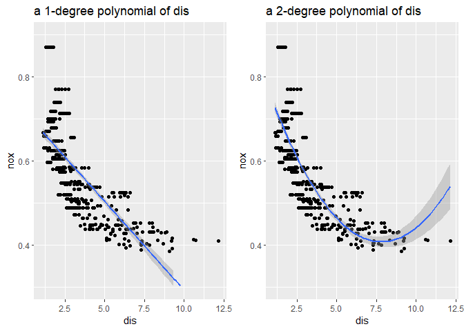

```
## 
## $`2`
```

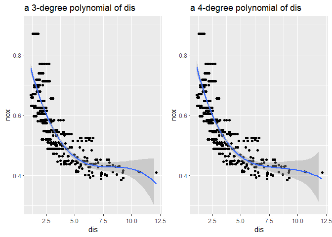

```
## 
## $`3`
```

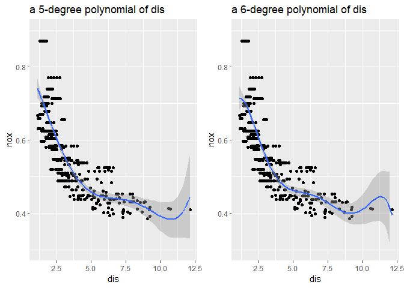

```
## 
## $`4`
```

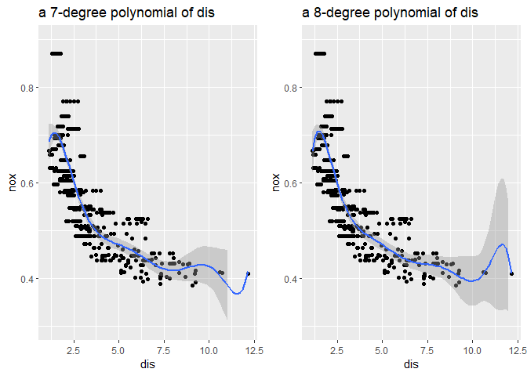

```
## 
## $`5`
```

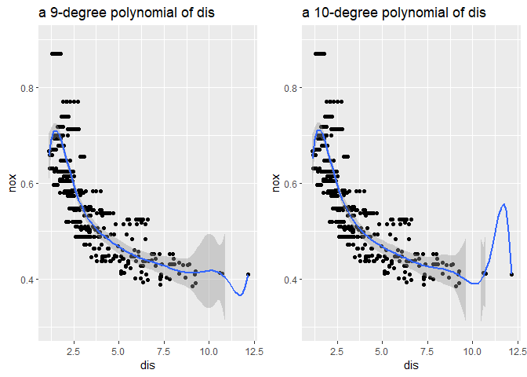

```
## 
## attr(,"class")
## [1] "list"      "ggarrange"
```

```r
train.rss <- rep(NA, 10)
for(i in 1:10){
  m <- lm(nox ~ poly(dis, i), data = Boston)
  train.rss[i] <- sum((m$residuals)^2)
}
train.rss
```

```
##  [1] 2.768563 2.035262 1.934107 1.932981 1.915290 1.878257 1.849484 1.835630
##  [9] 1.833331 1.832171
```

The minimum training RSS is for degree 10 since we can see training RSS monotonically decreases with degree of polynomial increases.

(c) Perform cross-validation or another approach to select the optimal degree for the polynomial, and explain your result.


```r
set.seed(500)
cv.errors <- rep(NA, 10)
for(i in 1:10){
  glm.fit <- glm(nox ~ poly(dis, i), data = Boston)
  cv.errors[i] <- cv.glm(Boston, glm.fit, K = 10)$delta[1]
}
which.min(cv.errors)
```

```
## [1] 3
```

```r
plot(1:10, cv.errors, pch = 19, type = "b", xlab = "Number of degrees", ylab = "CV estimated of the prediction error")
```

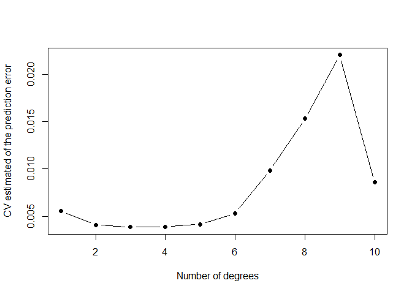

```r
cv.errors[3]
```

```
## [1] 0.003857552
```

Therefore, the optimal degree for the polynomial is 3.

(d) Use the `bs()` function to fit a regression spline to predict `nox` using `dis`. 

```r
m_spline <- lm(nox ~ bs(dis, df = 4), data = Boston)
summary(m_spline)
```

```
## 
## Call:
## lm(formula = nox ~ bs(dis, df = 4), data = Boston)
## 
## Residuals:
##       Min        1Q    Median        3Q       Max 
## -0.124622 -0.039259 -0.008514  0.020850  0.193891 
## 
## Coefficients:
##                  Estimate Std. Error t value Pr(>|t|)    
## (Intercept)       0.73447    0.01460  50.306  < 2e-16 ***
## bs(dis, df = 4)1 -0.05810    0.02186  -2.658  0.00812 ** 
## bs(dis, df = 4)2 -0.46356    0.02366 -19.596  < 2e-16 ***
## bs(dis, df = 4)3 -0.19979    0.04311  -4.634 4.58e-06 ***
## bs(dis, df = 4)4 -0.38881    0.04551  -8.544  < 2e-16 ***
## ---
## Signif. codes:  0 '***' 0.001 '**' 0.01 '*' 0.05 '.' 0.1 ' ' 1
## 
## Residual standard error: 0.06195 on 501 degrees of freedom
## Multiple R-squared:  0.7164,	Adjusted R-squared:  0.7142 
## F-statistic: 316.5 on 4 and 501 DF,  p-value: < 2.2e-16
```

```r
attr(bs(Boston$dis, df = 4), "knots")
```

```
##     50% 
## 3.20745
```

```r
ggplot(Boston, aes(x = dis, y = nox)) +
  geom_point() +
  geom_smooth(method = "lm", formula = "y ~ bs(x, df = 4)")
```

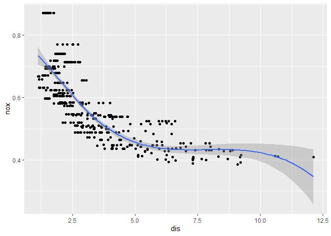

The `bs()` function use cubic splines by default. In general, a cubic spline with K knots uses a total of 3 + K degrees of freedom without an intercept. Here, I pick 1 knot, so the degree of freedom is 4. At this case, R chooses a knot at `dis`(weighted mean of distances to five Boston employment centers) 3.21 which correspond to the 50th percentiles of `dis`. 

(e) Now fit a regression spline for a range of degrees of freedom, and plot the resulting fits and report the resulting RSS.

```r
g1 <- ggplot(Boston, aes(x = dis, y = nox)) + 
  geom_point() + 
  geom_smooth(method = "lm", formula = "y ~ bs(x, df = 3)") + 
  ylim(0.3, 0.9) +
  labs(title = "0 knot")

g2 <- ggplot(Boston, aes(x = dis, y = nox)) + 
  geom_point() + 
  geom_smooth(method = "lm", formula = "y ~ bs(x, df = 4)") + 
  ylim(0.3, 0.9) +
  labs(title = "1 knot")

g3 <- ggplot(Boston, aes(x = dis, y = nox)) + 
  geom_point() + 
  geom_smooth(method = "lm", formula = "y ~ bs(x, df = 5)") + 
  ylim(0.3, 0.9) +
  labs(title = "2 knots")

g4 <- ggplot(Boston, aes(x = dis, y = nox)) + 
  geom_point() + 
  geom_smooth(method = "lm", formula = "y ~ bs(x, df = 10)") + 
  ylim(0.3, 0.9) +
  labs(title = "7 knot")

g5 <- ggplot(Boston, aes(x = dis, y = nox)) + 
  geom_point() + 
  geom_smooth(method = "lm", formula = "y ~ bs(x, df = 15)") + 
  ylim(0.3, 0.9) +
  labs(title = "12 knots")

g6 <- ggplot(Boston, aes(x = dis, y = nox)) + 
  geom_point() + 
  geom_smooth(method = "lm", formula = "y ~ bs(x, df = 20)") + 
  ylim(0.3, 0.9) +
  labs(title = "17 knots")

ggarrange(g1, g2, g3, g4, g5, g6, nrow = 2, ncol = 3)
```

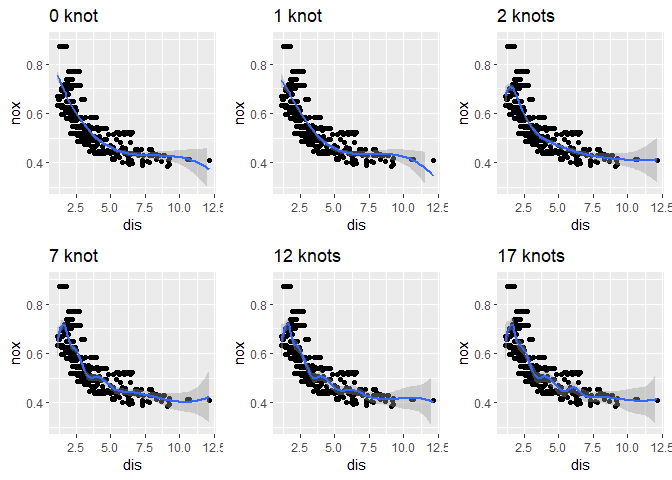

```r
m0 <- lm(nox ~ bs(dis, df = 3), data =  Boston)
RSS0 <- sum(m0$residuals^2)
RSS0
```

```
## [1] 1.934107
```

```r
m1 <- lm(nox ~ bs(dis, df = 4), data =  Boston)
RSS1 <- sum(m1$residuals^2)
RSS1
```

```
## [1] 1.922775
```

```r
m2 <- lm(nox ~ bs(dis, df = 5), data =  Boston)
RSS2 <- sum(m2$residuals^2)
RSS2
```

```
## [1] 1.840173
```

```r
m7 <- lm(nox ~ bs(dis, df = 10), data =  Boston)
RSS7 <- sum(m7$residuals^2)
RSS7
```

```
## [1] 1.792535
```

```r
m12 <- lm(nox ~ bs(dis, df = 15), data =  Boston)
RSS12 <- sum(m12$residuals^2)
RSS12
```

```
## [1] 1.782798
```

```r
m17 <- lm(nox ~ bs(dis, df = 20), data =  Boston)
RSS17 <- sum(m17$residuals^2)
RSS17
```

```
## [1] 1.776727
```

The RSS of the 20 degree of freedom without an intercept is the lowest. 

(f) Perform cross-validation or another approach in order to select the best degrees of freedom for a regression spline on this data.

```r
# reference from ISLR page 275 and  https://www.waxworksmath.com/Authors/G_M/James/Code/Chapter7/chap_7_prob_9.R
dof_choices = c(3,4,5,10,15,20)
n_dof_choices = length(dof_choices)
k = 5
folds = sample(1:k, nrow(Boston), replace = TRUE) 
cv.rss.test = matrix(NA, k, n_dof_choices )
cv.rss.train = matrix(NA, k, n_dof_choices )

for(di in 1:n_dof_choices ){
  for(fi in 1:k){ # for each fold 
    fit = lm(nox ~ bs(dis,df=dof_choices[di]), data=Boston[folds!=fi,]) # LOOCV

    y_hat = predict(fit, newdata=Boston[folds!=fi,] )
    cv.rss.train[fi,di] = sum((Boston[folds!=fi,]$nox - y_hat)^2) 

    y_hat = predict(fit, newdata=Boston[folds==fi,] )
    cv.rss.test[fi,di] = sum((Boston[folds==fi,]$nox - y_hat)^2)
  }
}
```

```
## Warning in bs(dis, degree = 3L, knots = numeric(0), Boundary.knots = c(1.1296, :
## some 'x' values beyond boundary knots may cause ill-conditioned bases
```

```
## Warning in bs(dis, degree = 3L, knots = numeric(0), Boundary.knots = c(1.137, :
## some 'x' values beyond boundary knots may cause ill-conditioned bases
```

```
## Warning in bs(dis, degree = 3L, knots = c(`50%` = 3.20745), Boundary.knots =
## c(1.1296, : some 'x' values beyond boundary knots may cause ill-conditioned
## bases
```

```
## Warning in bs(dis, degree = 3L, knots = c(`50%` = 3.2986), Boundary.knots =
## c(1.137, : some 'x' values beyond boundary knots may cause ill-conditioned bases
```

```
## Warning in bs(dis, degree = 3L, knots = c(`33.33333%` = 2.38403333333333, : some
## 'x' values beyond boundary knots may cause ill-conditioned bases
```

```
## Warning in bs(dis, degree = 3L, knots = c(`33.33333%` = 2.3887, `66.66667%` =
## 4.429: some 'x' values beyond boundary knots may cause ill-conditioned bases
```

```
## Warning in bs(dis, degree = 3L, knots = c(`12.5%` = 1.7459875, `25%` =
## 2.101425, : some 'x' values beyond boundary knots may cause ill-conditioned
## bases
```

```
## Warning in bs(dis, degree = 3L, knots = c(`12.5%` = 1.7550125, `25%` =
## 2.10915, : some 'x' values beyond boundary knots may cause ill-conditioned bases
```

```
## Warning in bs(dis, degree = 3L, knots = c(`7.692308%` = 1.58593846153846, : some
## 'x' values beyond boundary knots may cause ill-conditioned bases
```

```
## Warning in bs(dis, degree = 3L, knots = c(`7.692308%` = 1.56477692307692, : some
## 'x' values beyond boundary knots may cause ill-conditioned bases
```

```
## Warning in bs(dis, degree = 3L, knots = c(`5.555556%` = 1.51293333333333, : some
## 'x' values beyond boundary knots may cause ill-conditioned bases
```

```
## Warning in bs(dis, degree = 3L, knots = c(`5.555556%` = 1.495, `11.11111%` =
## 1.7028, : some 'x' values beyond boundary knots may cause ill-conditioned bases
```

```r
cv.rss.train.mean = apply(cv.rss.train,2,mean)
cv.rss.train.stderr = apply(cv.rss.train,2,sd)/sqrt(k)

cv.rss.test.mean = apply(cv.rss.test,2,mean)
cv.rss.test.stderr = apply(cv.rss.test,2,sd)/sqrt(k)

min_value = min(c(cv.rss.test.mean,cv.rss.train.mean))
max_value = max(c(cv.rss.test.mean,cv.rss.train.mean))


plot(dof_choices, cv.rss.train.mean, xlab='spline d.o.f.', ylab='RSS', col='orange', pch=19, type='b', ylim=c(min_value,max_value))
lines(dof_choices, cv.rss.test.mean, col='purple', pch=19, type='b')
grid()
legend("right", legend=c("train RSS","test RSS"), col=c("orange","purple"), lty=1, lwd=2 )
```

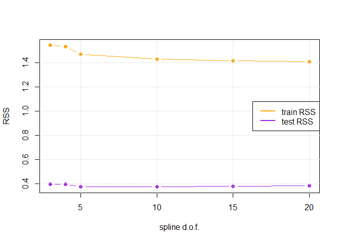

The best degrees of freedom without an intercept for a regression spline on this data is 5 by using CV method.

### **Question 10**
This question relates to the `College` data set.

(a) Split the data into a training set and a test set. Using out-of-state tuition as the response and the other variables as the predictors, perform forward stepwise selection on the training set in order to identify a satisfactory model that uses just a subset of predictors.

```r
set.seed(5)
train.I <- sample(c(TRUE, FALSE), nrow(College), rep = TRUE)
test.I <- !train.I
train <- College[train.I, ]
test <- College[test.I, ]

regfit.fwd <- regsubsets(Outstate ~ ., data = train, nvmax = ncol(College) - 1, method = "forward")
reg.summary_fwd <- summary(regfit.fwd)
reg.summary_fwd
```

```
## Subset selection object
## Call: regsubsets.formula(Outstate ~ ., data = train, nvmax = ncol(College) - 
##     1, method = "forward")
## 17 Variables  (and intercept)
##             Forced in Forced out
## PrivateYes      FALSE      FALSE
## Apps            FALSE      FALSE
## Accept          FALSE      FALSE
## Enroll          FALSE      FALSE
## Top10perc       FALSE      FALSE
## Top25perc       FALSE      FALSE
## F.Undergrad     FALSE      FALSE
## P.Undergrad     FALSE      FALSE
## Room.Board      FALSE      FALSE
## Books           FALSE      FALSE
## Personal        FALSE      FALSE
## PhD             FALSE      FALSE
## Terminal        FALSE      FALSE
## S.F.Ratio       FALSE      FALSE
## perc.alumni     FALSE      FALSE
## Expend          FALSE      FALSE
## Grad.Rate       FALSE      FALSE
## 1 subsets of each size up to 17
## Selection Algorithm: forward
##           PrivateYes Apps Accept Enroll Top10perc Top25perc F.Undergrad
## 1  ( 1 )  " "        " "  " "    " "    " "       " "       " "        
## 2  ( 1 )  " "        " "  " "    " "    " "       " "       " "        
## 3  ( 1 )  " "        " "  " "    " "    " "       " "       " "        
## 4  ( 1 )  "*"        " "  " "    " "    " "       " "       " "        
## 5  ( 1 )  "*"        " "  " "    " "    " "       " "       " "        
## 6  ( 1 )  "*"        " "  " "    " "    " "       " "       " "        
## 7  ( 1 )  "*"        " "  " "    " "    " "       " "       " "        
## 8  ( 1 )  "*"        " "  "*"    " "    " "       " "       " "        
## 9  ( 1 )  "*"        " "  "*"    "*"    " "       " "       " "        
## 10  ( 1 ) "*"        " "  "*"    "*"    "*"       " "       " "        
## 11  ( 1 ) "*"        " "  "*"    "*"    "*"       " "       " "        
## 12  ( 1 ) "*"        " "  "*"    "*"    "*"       " "       " "        
## 13  ( 1 ) "*"        " "  "*"    "*"    "*"       " "       " "        
## 14  ( 1 ) "*"        " "  "*"    "*"    "*"       " "       "*"        
## 15  ( 1 ) "*"        "*"  "*"    "*"    "*"       " "       "*"        
## 16  ( 1 ) "*"        "*"  "*"    "*"    "*"       "*"       "*"        
## 17  ( 1 ) "*"        "*"  "*"    "*"    "*"       "*"       "*"        
##           P.Undergrad Room.Board Books Personal PhD Terminal S.F.Ratio
## 1  ( 1 )  " "         "*"        " "   " "      " " " "      " "      
## 2  ( 1 )  " "         "*"        " "   " "      " " " "      " "      
## 3  ( 1 )  " "         "*"        " "   " "      " " " "      " "      
## 4  ( 1 )  " "         "*"        " "   " "      " " " "      " "      
## 5  ( 1 )  " "         "*"        " "   " "      "*" " "      " "      
## 6  ( 1 )  " "         "*"        " "   "*"      "*" " "      " "      
## 7  ( 1 )  " "         "*"        " "   "*"      "*" " "      " "      
## 8  ( 1 )  " "         "*"        " "   "*"      "*" " "      " "      
## 9  ( 1 )  " "         "*"        " "   "*"      "*" " "      " "      
## 10  ( 1 ) " "         "*"        " "   "*"      "*" " "      " "      
## 11  ( 1 ) " "         "*"        " "   "*"      "*" "*"      " "      
## 12  ( 1 ) " "         "*"        " "   "*"      "*" "*"      "*"      
## 13  ( 1 ) "*"         "*"        " "   "*"      "*" "*"      "*"      
## 14  ( 1 ) "*"         "*"        " "   "*"      "*" "*"      "*"      
## 15  ( 1 ) "*"         "*"        " "   "*"      "*" "*"      "*"      
## 16  ( 1 ) "*"         "*"        " "   "*"      "*" "*"      "*"      
## 17  ( 1 ) "*"         "*"        "*"   "*"      "*" "*"      "*"      
##           perc.alumni Expend Grad.Rate
## 1  ( 1 )  " "         " "    " "      
## 2  ( 1 )  " "         "*"    " "      
## 3  ( 1 )  "*"         "*"    " "      
## 4  ( 1 )  "*"         "*"    " "      
## 5  ( 1 )  "*"         "*"    " "      
## 6  ( 1 )  "*"         "*"    " "      
## 7  ( 1 )  "*"         "*"    "*"      
## 8  ( 1 )  "*"         "*"    "*"      
## 9  ( 1 )  "*"         "*"    "*"      
## 10  ( 1 ) "*"         "*"    "*"      
## 11  ( 1 ) "*"         "*"    "*"      
## 12  ( 1 ) "*"         "*"    "*"      
## 13  ( 1 ) "*"         "*"    "*"      
## 14  ( 1 ) "*"         "*"    "*"      
## 15  ( 1 ) "*"         "*"    "*"      
## 16  ( 1 ) "*"         "*"    "*"      
## 17  ( 1 ) "*"         "*"    "*"
```

```r
test.mat <- model.matrix(Outstate ~ ., data = test)
val.errors <- rep(NA, 17)
for(i in 1:17){
  coefi <- coef(regfit.fwd, id = i)
  pred <- test.mat[, names(coefi)]%*%coefi
  val.errors[i] <- mean((test$Outstate - pred)^2)
}
which.min(val.errors)
```

```
## [1] 8
```

```r
val.errors[8]
```

```
## [1] 4607738
```

```r
names(coef(regfit.fwd, 8))
```

```
## [1] "(Intercept)" "PrivateYes"  "Accept"      "Room.Board"  "Personal"   
## [6] "PhD"         "perc.alumni" "Expend"      "Grad.Rate"
```

```r
coef(regfit.fwd, 8)
```

```
##   (Intercept)    PrivateYes        Accept    Room.Board      Personal 
## -1886.1183618  2646.2464466     0.1045985     0.9997681    -0.5590644 
##           PhD   perc.alumni        Expend     Grad.Rate 
##    28.2352522    47.5448533     0.2222159    20.2362449
```

```r
par(mfrow = c(3,2))
plot(reg.summary_fwd$rss, xlab = "Number of variables", ylab = "RSS", type = 'b')
plot(reg.summary_fwd$cp, xlab = "Number of variables", ylab = "Cp", type = 'b')
plot(reg.summary_fwd$bic, xlab = "Number of variables", ylab = "BIC", type = 'b')
plot(reg.summary_fwd$adjr2, xlab = "Number of variables", ylab = "adjusted R2", type = 'b')
plot(val.errors, xlab = "Number of variables", ylab = "Validation Errors", type = 'b')
```

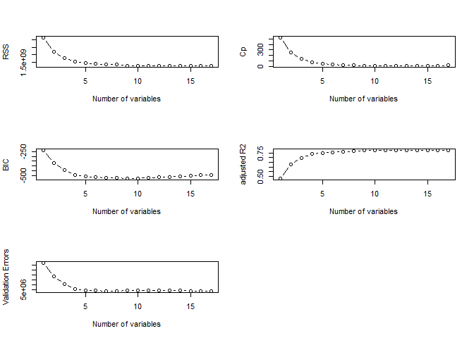

We pick 8 as the best subset size by using the cross-validation method. The variables we picked are shown above.

(b) Fit a GAM on the training data, using out-of-state tuition as the response and the features selected in the previous step as the predictors. Plot the results, and explain your findings.

```r
names(coef(regfit.fwd, 8)) # the features selected in the previous step as the predictors
```

```
## [1] "(Intercept)" "PrivateYes"  "Accept"      "Room.Board"  "Personal"   
## [6] "PhD"         "perc.alumni" "Expend"      "Grad.Rate"
```

```r
gam <- gam(Outstate ~ Private + s(Accept) + s(Room.Board) + s(Personal) + s(PhD) + s(perc.alumni) + s(Expend) + s(Grad.Rate), data = train)

par(mfrow = c(2,4))
plot(gam, se=TRUE, col="blue")
```

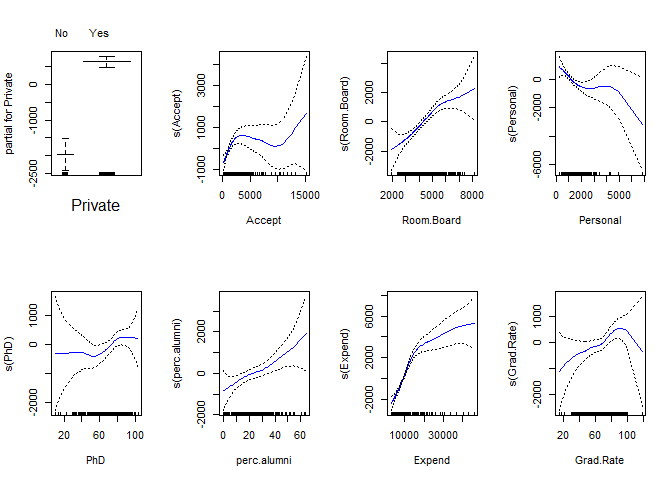

The top left panel indicated that holding other 7 features fixed, out-of-state tuition tends to higher if the school is private. The second bottom panel indicated that out-of-state tuition tends to increase as the percentage of alumni who donate increases. 

(c) Evaluate the model obtained on the test set, and explain the results obtained.

```r
y_hat = predict(gam, newdata = test)
MSE = mean((test$Outstate - y_hat )^2)
MSE
```

```
## [1] 3914152
```

The MSE of the GAM model is less than that of the forward stepwise selection linear model, so the GAM model performs better.

(d) For which variables, if any, is there eveidence of a non-linear relationship with the response?

```r
summary(gam)
```

```
## 
## Call: gam(formula = Outstate ~ Private + s(Accept) + s(Room.Board) + 
##     s(Personal) + s(PhD) + s(perc.alumni) + s(Expend) + s(Grad.Rate), 
##     data = train)
## Deviance Residuals:
##      Min       1Q   Median       3Q      Max 
## -5742.32 -1068.96    75.91  1203.71  4951.54 
## 
## (Dispersion Parameter for gaussian family taken to be 3087971)
## 
##     Null Deviance: 5959905735 on 385 degrees of freedom
## Residual Deviance: 1099316358 on 355.9995 degrees of freedom
## AIC: 6894.199 
## 
## Number of Local Scoring Iterations: NA 
## 
## Anova for Parametric Effects
##                 Df     Sum Sq    Mean Sq  F value    Pr(>F)    
## Private          1 1550669083 1550669083 502.1643 < 2.2e-16 ***
## s(Accept)        1  426473729  426473729 138.1081 < 2.2e-16 ***
## s(Room.Board)    1 1048792377 1048792377 339.6380 < 2.2e-16 ***
## s(Personal)      1  107234281  107234281  34.7264 8.802e-09 ***
## s(PhD)           1  262965388  262965388  85.1580 < 2.2e-16 ***
## s(perc.alumni)   1  193984608  193984608  62.8194 2.942e-14 ***
## s(Expend)        1  483177063  483177063 156.4707 < 2.2e-16 ***
## s(Grad.Rate)     1   23677144   23677144   7.6675  0.005917 ** 
## Residuals      356 1099316358    3087971                       
## ---
## Signif. codes:  0 '***' 0.001 '**' 0.01 '*' 0.05 '.' 0.1 ' ' 1
## 
## Anova for Nonparametric Effects
##                Npar Df  Npar F    Pr(F)    
## (Intercept)                                
## Private                                    
## s(Accept)            3  4.8962 0.002393 ** 
## s(Room.Board)        3  1.1636 0.323557    
## s(Personal)          3  2.1213 0.097184 .  
## s(PhD)               3  1.1414 0.332271    
## s(perc.alumni)       3  0.3558 0.784972    
## s(Expend)            3 14.6138 5.38e-09 ***
## s(Grad.Rate)         3  1.6190 0.184615    
## ---
## Signif. codes:  0 '***' 0.001 '**' 0.01 '*' 0.05 '.' 0.1 ' ' 1
```

From the ANOVA for nonparametric effects table, we notice that the p-values for `Accept` and `Expend` are smaller than 0.05. So, there is clear evidence that non-linear terms are required for  `Accept` and `Expend`.

### **Question 11**
GAMs are generally fit using a backfitting approach. The idea behind backfitting is actually quite simple. We will now explore backfitting in the context of multiple linear regression.

Suppose that we would like to perform multiple linear regression, but we do not have software to do so. Instead, we only have software to perform simple linear regression. Therefore, we take the following iterative approach: we repeatedly hold all but one coefficient estimate fixed at its current value, and update only that coefficient estimate using a simple linear regression. The process is continued until convergence - that is, until the coefficient estimates stop changing. 

We now try this out on a toy example.

(a) Generate a response Y and two predictors X1 and X2, with n = 100.

```r
set.seed(50)
n <- 100
X1 <- rnorm(n)
X2 <- rnorm(n)
beta_0 <- 10.0
beta_1 <- 5.0
beta_2 <- -0.5
Y <- beta_0 + beta_1 * X1 + beta_2 * X2 + rnorm(n)
```

(b) Initialize  to take on a value of your choice. It does not matter waht value you choose.

```r
beta_1_hat <- -2.0
```

(c) Keeping  fixed, fit the model    

```r
a <- Y - beta_1_hat * X1
beta_2_hat <- lm(a ~ X2 )$coef[2] 
```

(d) Keeping  fixed, fit the model  

```r
a <- Y - beta_2_hat * X2
beta_1_hat <- lm(a ~ X1 )$coef[2] 
```

(e&f) Write a for loop to repear (c) and (d) 1,000 times. Report the estimates of  at each iteration of the for loop. Create a plot in which each of these values is displaced, with  each shown in a different color.

```r
beta_1_hat <- -2.0
beta_0_est <- c()
beta_1_est <- c()
beta_2_est <- c()

for(i in 1:1000){
  a <- Y - beta_1_hat * X1
  beta_2_hat <- lm(a ~ X2 )$coef[2]
  
  a <- Y - beta_2_hat * X2
  beta_1_hat <- lm(a ~ X1)$coef[2]
  beta_0_hat <- lm(a ~ X1)$coef[1]
  
  beta_0_est <- c(beta_0_est, beta_0_hat)
  beta_1_est <- c(beta_1_est, beta_1_hat)
  beta_2_est <- c(beta_2_est, beta_2_hat)
}

m <- lm(Y ~ X1 + X2 )
summary(m)
```

```
## 
## Call:
## lm(formula = Y ~ X1 + X2)
## 
## Residuals:
##     Min      1Q  Median      3Q     Max 
## -2.7430 -0.6791  0.1147  0.7305  1.8195 
## 
## Coefficients:
##             Estimate Std. Error t value Pr(>|t|)    
## (Intercept)  10.1424     0.1011 100.322  < 2e-16 ***
## X1            4.8804     0.1012  48.235  < 2e-16 ***
## X2           -0.5673     0.1022  -5.553 2.45e-07 ***
## ---
## Signif. codes:  0 '***' 0.001 '**' 0.01 '*' 0.05 '.' 0.1 ' ' 1
## 
## Residual standard error: 0.9987 on 97 degrees of freedom
## Multiple R-squared:  0.9608,	Adjusted R-squared:   0.96 
## F-statistic:  1189 on 2 and 97 DF,  p-value: < 2.2e-16
```

```r
par(mfrow=c(1,3))
plot(1:1000, beta_0_est, main = 'beta_0', pch = 19, ylim = c(beta_0*0.999,max(beta_0_est)))
abline(h = beta_0, col = 'orange',lwd = 4)
abline(h = m$coefficients[1], col = 'gray',lwd = 4)
grid()

plot(1:1000, beta_1_est, main='beta_1', pch = 19, ylim = c(4.5, 5.1))
abline(h = beta_1,col = 'orange',lwd = 4)
abline(h = m$coefficients[2], col = 'gray',lwd = 4)
grid()

plot(1:1000, beta_2_est, main = 'beta_2', pch = 19, ylim = c(-0.9,-0.45))
abline(h = beta_2, col ='orange',lwd = 4)
abline(h = m$coefficients[3], col = 'gray',lwd = 4)
grid()
```

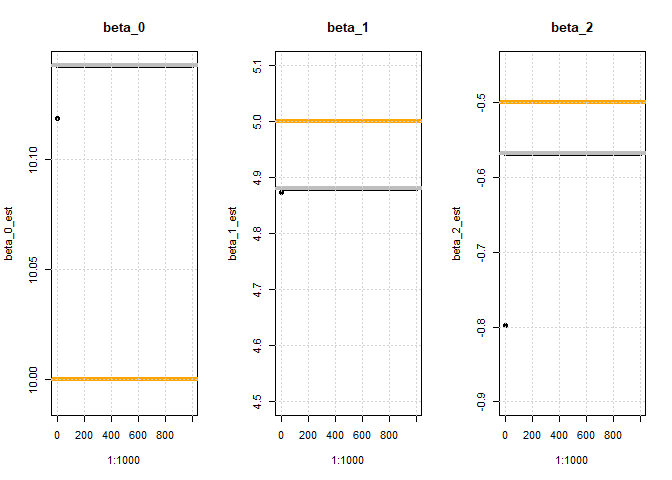

Compare the linear regression and backfitting, we notice that the result are the similar. 

(g) On this data set, how many backfitting iterations were required in order to obtain a “good” approximation to the multiple regression coefficient estimates?

Only **one iteration** can give us a “good” approximation to the multiple regression coefficient estimates.

### **Question 12**
This problem is a continuation of the previous exercise. In a toy example with p = 100, show that one can approximate the multiple linear regression coefficient estimates by repeatedly performing simple linear regression in a backfitting procedure. How many backfitting iterations are required in order to obtain a “good” approximation to the multiple regression coefficient estimates? Create a plot to justify your answer.

```r
# answer from https://www.waxworksmath.com/Authors/G_M/James/Code/Chapter7/chap_7_prob_12.R
set.seed(0)

p = 100
n = 1000

# Generate some regression coefficients beta_0, beta_1, ..., beta_p
beta_truth = rnorm( p+1 )

# Generate some data (append a column of ones):
Xs = c( rep(1,n), rnorm( n*p ) )
X = matrix( data=Xs, nrow=n, ncol=(p+1), byrow=FALSE )

# Produce the response: 
Y = X %*% beta_truth + 0.1 * rnorm(n)

# Get the true estimated coefficient estimates using lm:
#
m = lm( Y ~ X - 1 )
beta_lm = m$coeff 

# Estimate beta_i using backfitting: 
#
beta_hat = rnorm( p+1 ) # initial estimate of beta's is taken to be random 

n_iters = 10

beta_estimates = matrix( data=rep(NA,n_iters*(p+1)), nrow=n_iters, ncol=(p+1) )
beta_differences_with_truth = rep(NA,n_iters)
beta_differences_with_LS = rep(NA,n_iters)
for( ii in 1:n_iters ){
  for( pi in 0:p ){ # for beta_0, beta_1, ... beta_pi ... beta_p

    # Perform simple linear regression on the variable X_pi (assuming we know all other values of beta_pi): 
    # 
    a = Y - X[,-(pi+1)] %*% beta_hat[-(pi+1)] # remove all predictors except beta_0 

    if( pi==0 ){
      m = lm( a ~ 1 ) # estimate a constant 
      beta_hat[pi+1] = m$coef[1] 
    }else{
      m = lm( a ~ X[,pi+1] ) # estimate the slope on X_pi
      beta_hat[pi+1] = m$coef[2] 
    }

  }
  beta_estimates[ii,] = beta_hat
  beta_differences_with_truth[ii] = sqrt( sum( ( beta_hat - beta_truth )^2 ) )
  beta_differences_with_LS[ii] = sqrt( sum( ( beta_hat - beta_lm )^2 ) )
}


plot( 1:n_iters, beta_differences_with_LS, main='||beta_truth-beta_LS||_2', pch=19, type='b' )
grid()
```

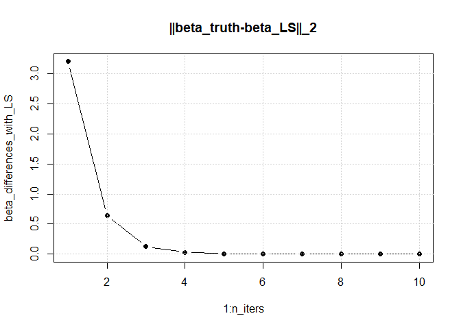


