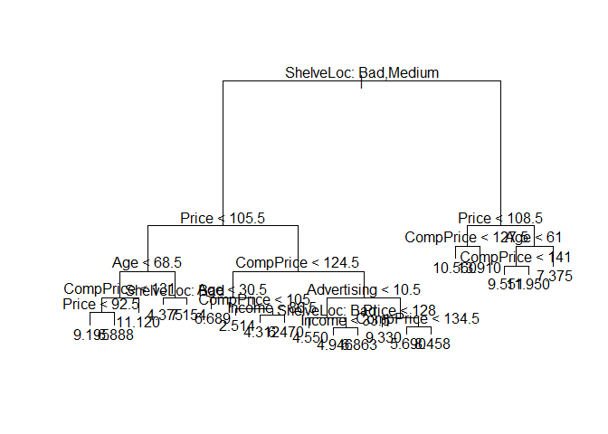

## Exercises 
#### Applied Q7 - Q11

### **Question 7**
In the lab, we applied random forests to the `Boston` data using `mtry = 6` and using `ntree = 25` and `ntree = 500`. Create a plot displaying the test error resulting from random forests on this data set for a more comprehensive range of values for `mtry` and `ntree`.

```r
set.seed(5)

n <- nrow(Boston)
p <- ncol(Boston) - 1

train.I <- sample(1:n, n/2)
test.I <- (1:n)[-train.I]

train <- Boston[train.I,]
test <- Boston[test.I,]

ntree <- seq(from = 1, to = 500, by = 10)

# For mtry (number of variables randomly sampled as candidates at each split) = p, and a number of trees 
mtry <- p # bagging is a special case of random forest with m = p.

MSE.bag <- rep(NA, length(ntree))
for(i in 1:length(ntree)){
  nt <- ntree[i]
  boston.bag <- randomForest(medv ~ ., data = train, mtry = p, ntree = nt, importance = TRUE)
  y_hat <- predict(boston.bag, newdata = test)
  MSE.bag[i] <- mean((test$medv - y_hat)^2)
}

# For mtry (number of variables randomly sampled as candidates at each split) = p/2, and a number of trees 
mtry <- p/2

MSE.p_over_2 <- rep(NA, length(ntree))
for(i in 1:length(ntree)){
  nt <- ntree[i]
  boston.rf <- randomForest(medv ~ ., data = train, mtry = p/2, ntree = nt, importance = TRUE)
  y_hat <- predict(boston.rf, newdata = test)
  MSE.p_over_2[i] <- mean((test$medv - y_hat)^2)
}

# For mtry (number of variables randomly sampled as candidates at each split) = sqrt(p), and a number of trees 
mtry <- sqrt(p)

MSE.sqrt_p <- rep(NA, length(ntree))
for(i in 1:length(ntree)){
  nt <- ntree[i]
  boston.rf <- randomForest(medv ~ ., data = train, mtry = sqrt(p), ntree = nt, importance = TRUE)
  y_hat <- predict(boston.rf, newdata = test)
  MSE.sqrt_p[i] <- mean((test$medv - y_hat)^2)
}

# plot 
plot(ntree, MSE.bag, xlab = "Number of Trees", ylab = "Test MSE", col = "orange", type = "l")
lines(ntree, MSE.p_over_2, xlab = "Number of Trees", ylab = "Test MSE", col = "blue", type = "l" )
lines(ntree, MSE.sqrt_p, xlab = "Number of Trees", ylab = "Test MSE", col = "red", type = "l" )
legend("topright", c("mtry = p", "mtry = p/2", "mtry = sqrt(p)"), col = c("orange", "blue", "red"), lty = c(1, 1, 1))
grid()
```

<!-- -->

The above figure is the results from random forests for the `Boston` data set with p = 13 predictors. `mtry` is the number of predictors available for splitting at each interior tree node. Random forests (mtry < p) lead to a slight improvement over bagging (mtry = p).

### **Question 8**
In the lab, a classification tree was applied to the `Carseats` data set after converting `Sales` into a qualitative response variable. Now we will seek to predict `Sales` using regression trees and related approaches, treating the response as a quantitative variable.

(a) Split the data set into a training set and a test set.

```r
n <- nrow(Carseats)
p <- ncol(Carseats) - 1

set.seed(5)
train.I <- sample(1:n, n/2)
test.I <- (1:n)[-train.I]

train <- Carseats[train.I,]
test <- Carseats[test.I,]
```

(b) Fit a regression tree to the training set. Plot the tree and interpret the results. What test MSE do you obtain?

```r
reg.tree <- tree(Sales ~ ., data = train)
summary(reg.tree)
```

```
## 
## Regression tree:
## tree(formula = Sales ~ ., data = train)
## Variables actually used in tree construction:
## [1] "ShelveLoc"   "Price"       "Age"         "CompPrice"   "Income"     
## [6] "Advertising"
## Number of terminal nodes:  20 
## Residual mean deviance:  2.184 = 393.1 / 180 
## Distribution of residuals:
##     Min.  1st Qu.   Median     Mean  3rd Qu.     Max. 
## -3.79500 -1.06000  0.08106  0.00000  0.91510  4.47500
```

```r
plot(reg.tree)
text(reg.tree, pretty = 0)
```

<!-- -->

```r
reg.tree # the split criterion (the number of obs in that branch, the deviance, the overall prediction for that branch)
```

```
## node), split, n, deviance, yval
##       * denotes terminal node
## 
##  1) root 200 1633.000  7.382  
##    2) ShelveLoc: Bad,Medium 152  913.500  6.556  
##      4) Price < 105.5 47  278.300  7.971  
##        8) Age < 68.5 36  158.400  8.684  
##         16) CompPrice < 131 30  107.600  8.196  
##           32) Price < 92.5 17   48.270  9.195 *
##           33) Price > 92.5 13   20.160  6.888 *
##         17) CompPrice > 131 6    7.888 11.120 *
##        9) Age > 68.5 11   41.740  5.638  
##         18) ShelveLoc: Bad 6   16.180  4.375 *
##         19) ShelveLoc: Medium 5    4.500  7.154 *
##      5) Price > 105.5 105  499.000  5.923  
##       10) CompPrice < 124.5 39  153.900  4.785  
##         20) Age < 30.5 7   11.410  6.689 *
##         21) Age > 30.5 32  111.600  4.368  
##           42) CompPrice < 105 5   22.180  2.514 *
##           43) CompPrice > 105 27   69.060  4.712  
##             86) Income < 86.5 22   32.580  4.312 *
##             87) Income > 86.5 5   17.510  6.470 *
##       11) CompPrice > 124.5 66  264.600  6.596  
##         22) Advertising < 10.5 46  141.200  5.976  
##           44) ShelveLoc: Bad 11   25.950  4.550 *
##           45) ShelveLoc: Medium 35   85.840  6.425  
##             90) Income < 33.5 8   10.190  4.946 *
##             91) Income > 33.5 27   52.990  6.863 *
##         23) Advertising > 10.5 20   65.220  8.020  
##           46) Price < 128 9    3.001  9.330 *
##           47) Price > 128 11   34.130  6.948  
##             94) CompPrice < 134.5 6    4.375  5.690 *
##             95) CompPrice > 134.5 5    8.863  8.458 *
##    3) ShelveLoc: Good 48  288.400  9.996  
##      6) Price < 108.5 14   53.120 11.760  
##       12) CompPrice < 127.5 9    6.683 10.560 *
##       13) CompPrice > 127.5 5   10.500 13.910 *
##      7) Price > 108.5 34  173.800  9.270  
##       14) Age < 61 23   74.570 10.180  
##         28) CompPrice < 141 17   44.110  9.551 *
##         29) CompPrice > 141 6    4.892 11.950 *
##       15) Age > 61 11   40.830  7.375 *
```

```r
y_hat <- predict(reg.tree, newdata = test)
MSE <- mean((test$Sales - y_hat)^2)
MSE
```

```
## [1] 5.041825
```

(c) Use cross-validation in order to determine the optimal level of tree complexity. Does pruning the tree improve the test MSE?

```r
set.seed(10)
cv <- cv.tree(reg.tree)
names(cv)
```

```
## [1] "size"   "dev"    "k"      "method"
```

```r
cv
```

```
## $size
##  [1] 20 19 18 17 16 15 14 13 12 11 10  9  8  7  6  5  4  3  2  1
## 
## $dev
##  [1] 1216.077 1228.867 1225.075 1229.374 1207.119 1227.072 1240.771 1242.756
##  [9] 1254.537 1263.510 1208.716 1199.652 1218.737 1251.195 1251.195 1266.822
## [17] 1248.536 1248.606 1281.396 1707.361
## 
## $k
##  [1]      -Inf  18.96802  20.37889  20.89588  21.06229  22.66376  25.56731
##  [8]  28.08164  29.41080  30.91787  35.93367  39.20154  42.90497  58.22055
## [15]  58.43934  61.39928  78.15803  80.37642 136.17907 431.62093
## 
## $method
## [1] "deviance"
## 
## attr(,"class")
## [1] "prune"         "tree.sequence"
```

```r
plot(cv$size, cv$dev, type = "b")
```

<!-- -->

```r
# It seems that the tree with 9 terminal nodes results in the lowest cross-validation error rate.

prune.tree <- prune.tree(reg.tree, best = 9)
plot(prune.tree)
text(prune.tree, pretty = 0)
```

<!-- -->

```r
y_hat <- predict(prune.tree, newdata = test)
MSE <- mean((test$Sales - y_hat)^2)
MSE
```

```
## [1] 4.774217
```

(d) Use the bagging approach in order to analyze this data. What test MSE do you obtain? Use the `importance()` function to determine which variables are most important.

```r
bagging <- randomForest(Sales ~ ., data = train, mtry = p, ntree = 500, importance = TRUE)
y_hat <- predict(bagging, newdata = test)
MSE.bag <- mean((test$Sales - y_hat)^2)
MSE.bag
```

```
## [1] 2.537689
```

```r
plot(bagging)
```

<!-- -->

```r
importance(bagging)
```

```
##                %IncMSE IncNodePurity
## CompPrice   26.9201992    202.390579
## Income       9.1703852    129.494023
## Advertising 14.5159654    114.036889
## Population  -0.4536482     53.554539
## Price       44.8266151    362.260792
## ShelveLoc   54.0739471    533.020121
## Age         15.5612321    137.060073
## Education    3.2577952     48.853057
## Urban        1.7902213      7.534937
## US           1.0791310      6.283089
```

```r
varImpPlot(bagging)
```

<!-- -->

The results indicate that `ShelveLoc` (the quality of the shelving location for the car seats at each site), and `Price` (Price company charges for car seats at each site) are the two most important variables.

(e) Use random forests to analyze the data. What test MSE do you obtain? Use the `importance()` function to determine which variables are most important.

```r
rf <- randomForest(Sales ~ ., data = train, mtry = p/3, ntree = 500, importance = TRUE)
y_hat <- predict(rf, newdata = test)
MSE.rf <- mean((test$Sales - y_hat)^2)
MSE.rf
```

```
## [1] 3.098854
```

```r
plot(rf)
```

<!-- -->

```r
importance(rf)
```

```
##               %IncMSE IncNodePurity
## CompPrice   14.819879     178.71266
## Income       6.576114     157.40858
## Advertising 10.616517     146.97037
## Population  -1.011865      91.17115
## Price       31.041450     300.12412
## ShelveLoc   40.213193     381.12559
## Age         11.796975     167.01943
## Education    1.979131      69.50552
## Urban        0.115094      15.01023
## US           4.657802      21.40898
```

```r
varImpPlot(rf)
```

<!-- -->

The results indicate that `ShelveLoc` (the quality of the shelving location for the car seats at each site), and `Price` (Price company charges for car seats at each site) are the two most important variables, as well.

The lowest MSE is the bagging method.

### **Question 9**
This problem involves the `OJ` data set which is part of the `ISLR` package. The data contains 1070 purchases where the customer either purchased Citrus Hill or Minute Maid Orange Juice. 

(a) Create a tree to the training data containing a random sample of 800 observations, and a test set containing the remaining observations.

```r
set.seed(5)
n <- nrow(OJ)
p <- ncol(OJ) - 1

train.I <- sample(1:n, 800)
test.I <- (1:n)[-train.I]

train <- OJ[train.I,]
test <- OJ[test.I,]
```

(b) Fit a tree to the training data, with `Purchase` as the response and the other variables as predictors. Use the `summary()` function to produce summary statistics about the tree, and describe the results obtained. What is the training error rate? How many terminal nodes does the tree have?

```r
tree.OJ <- tree(Purchase ~ ., data = train)

summary(tree.OJ)
```

```
## 
## Classification tree:
## tree(formula = Purchase ~ ., data = train)
## Variables actually used in tree construction:
## [1] "LoyalCH"       "PriceDiff"     "ListPriceDiff"
## Number of terminal nodes:  9 
## Residual mean deviance:  0.7347 = 581.1 / 791 
## Misclassification error rate: 0.1662 = 133 / 800
```

The training error rate is 16.62%. The number of terminal nodes is 9.  

(c) Type in the name of the tree object in order to get a detailed text output. Pick one of the terminal nodes, and interpret the information displayed.

```r
tree.OJ
```

```
## node), split, n, deviance, yval, (yprob)
##       * denotes terminal node
## 
##  1) root 800 1068.00 CH ( 0.61250 0.38750 )  
##    2) LoyalCH < 0.5036 346  412.40 MM ( 0.28324 0.71676 )  
##      4) LoyalCH < 0.280875 164  125.50 MM ( 0.12805 0.87195 )  
##        8) LoyalCH < 0.0356415 56   10.03 MM ( 0.01786 0.98214 ) *
##        9) LoyalCH > 0.0356415 108  103.50 MM ( 0.18519 0.81481 ) *
##      5) LoyalCH > 0.280875 182  248.00 MM ( 0.42308 0.57692 )  
##       10) PriceDiff < 0.05 71   67.60 MM ( 0.18310 0.81690 ) *
##       11) PriceDiff > 0.05 111  151.30 CH ( 0.57658 0.42342 ) *
##    3) LoyalCH > 0.5036 454  362.00 CH ( 0.86344 0.13656 )  
##      6) PriceDiff < -0.39 31   40.32 MM ( 0.35484 0.64516 )  
##       12) LoyalCH < 0.638841 10    0.00 MM ( 0.00000 1.00000 ) *
##       13) LoyalCH > 0.638841 21   29.06 CH ( 0.52381 0.47619 ) *
##      7) PriceDiff > -0.39 423  273.70 CH ( 0.90071 0.09929 )  
##       14) LoyalCH < 0.705326 135  143.00 CH ( 0.77778 0.22222 )  
##         28) ListPriceDiff < 0.255 67   89.49 CH ( 0.61194 0.38806 ) *
##         29) ListPriceDiff > 0.255 68   30.43 CH ( 0.94118 0.05882 ) *
##       15) LoyalCH > 0.705326 288   99.77 CH ( 0.95833 0.04167 ) *
```

We pick the terminal node labeled 8) here (`LoyalCH` < 0.0356415). The variable splitted at this node is `LoyalCH`. The number of the observations in this branch is 56. The deviance is 10.03. The overall prediction for this branch is MM (Minute Maid Orange Juice). And, 1.786% observations in this branch that take on CH and 98.214% observations in this branch that take on MM. 

(d) Create a plot of the tree, and interpret the result.

```r
plot(tree.OJ)
text(tree.OJ, pretty = 0)
```

<!-- -->

From the plot, we see that the most important indicator of `Purchase` appears to be `LoyalCH` (Customer brand loyalty for CH).

(e) Predict the response on the test data, and produce a confusion matrix comparing the test labels to the predicted test labels. What is the test error rate?

```r
y_hat <- predict(tree.OJ, newdata = test, type = "class")
table.OJ <- table(y_hat, test$Purchase)
table.OJ
```

```
##      
## y_hat  CH  MM
##    CH 148  32
##    MM  15  75
```

```r
test_error <- (table.OJ[1,2] + table.OJ[2,1]) / sum(table.OJ)
test_error
```

```
## [1] 0.1740741
```

The test error rate is 17.41%.

(f) Apply the `cv.tree()` function to the training set in order to determine the optimal tree size.

```r
set.seed(12)
cv <- cv.tree(tree.OJ, FUN = prune.misclass)
cv
```

```
## $size
## [1] 9 6 5 3 2 1
## 
## $dev
## [1] 146 147 147 173 172 310
## 
## $k
## [1]  -Inf   0.0   1.0   8.5   9.0 150.0
## 
## $method
## [1] "misclass"
## 
## attr(,"class")
## [1] "prune"         "tree.sequence"
```

The tree with 9 terminal nodes results in the lowest cross-validation error rate.

(g) Produce a plot with tree size on the x-axis and cross-validation classification error rate on the y-axis.

```r
plot(cv$size, cv$dev, type = "b", xlab = "Tree Size", ylab = "Deviance")
```

<!-- -->

(h) Which tree size corresponds to the lowest cross-validation classification error rate?

Answer: 9

(i) Produce a pruned tree corresponding to the optimal tree size obtaining using cross-validation. If cross-validation does not lead to selection of a pruned tree, then create a pruned tree with five terminal nodes.

```r
prune.tree <- prune.misclass(tree.OJ, best = 5)
plot(prune.tree)
text(prune.tree, pretty = 0)
```

<!-- -->

```r
y_hat <- predict(prune.tree, newdata = train, type = "class")
table.OJ <- table(y_hat, train$Purchase)
train_error <- (table.OJ[1,2] + table.OJ[2,1]) / sum(table.OJ)
train_error
```

```
## [1] 0.1675
```

```r
y_hat <- predict(prune.tree, newdata = test, type = "class")
table.OJ <- table(y_hat, test$Purchase)
test_error <- (table.OJ[1,2] + table.OJ[2,1]) / sum(table.OJ)
test_error
```

```
## [1] 0.1777778
```

(j) Compare the training error rates between the pruned and unpruned trees. Which one is higher?

The training error rate for the pruned tree is 16.75%.

The training error rate for the unpruned tree is 16.62%.

Therefore, the pruned tree's rate is higher.

(k) Compare the test error rates between the pruned and unpruned trees. Which one is higher?

The test error rate for the pruned tree is 17.78%.

The test error rate for the unpruned tree is 17.41%.

Therefore, the pruned tree's rate is higher.


### **Question 10**
We now use boosting to predict `Salary` in the `Hitters` data set. Major League Baseball Data from the 1986 and 1987 seasons.

(a) Remove the observations fro whom the salary information is unknown, and then log-transform the salaries.

```r
dim(Hitters)
```

```
## [1] 322  20
```

```r
Hitters <- na.omit(Hitters)
Hitters$Salary <- log(Hitters$Salary)
dim(Hitters)
```

```
## [1] 263  20
```

```r
n <- nrow(Hitters)
p <- ncol(Hitters) - 1
```

(b) Create a training set consisting of the first 200 observations, and a test set consisting of the remaining observations.

```r
train.I <- 1:200
test.I <- 201:n

train <- Hitters[train.I,]
test <- Hitters[test.I,]
```

(c) Perform boosting on the training set with 1,000 trees for a range of values of the shrinkage parameter lambda. Produce a plot with different shrinkage values on the x-axis and the corresponding training set MSE on the y-axis.

(d) Produce a plot with different shrinkage values on the x-axis and the corresponding test set MSE on the y-axis.

```r
set.seed(5)
lambda_range <- seq(1.e-3, 0.1, by = 0.01)
train_MSE <- rep(NA, length(lambda_range)) # The length is 10.
test_MSE <- rep(NA, length(lambda_range))
for(i in 1:length(lambda_range)){
  lambda <- lambda_range[i]
  boost.Hitters <- gbm(Salary ~ ., data = train, distribution = "gaussian", n.trees = 1000, interaction.depth = 4, shrinkage = lambda)
  
   y_hat <- predict(boost.Hitters, newdata = train, n.trees = 1000)
  train_MSE[i] <- mean((train$Salary - y_hat)^2)
    
  y_hat <- predict(boost.Hitters, newdata = test, n.trees = 1000)
  test_MSE[i] <- mean((test$Salary - y_hat)^2)
}
train_MSE[which.min(train_MSE)]
```

```
## [1] 0.001617557
```

```r
test_MSE[which.min(test_MSE)]
```

```
## [1] 0.2664714
```

```r
lambda_range[which.min(test_MSE)]
```

```
## [1] 0.031
```

```r
par(mfrow = c(1,2))
plot(lambda_range, train_MSE, type = "b", pch = 19, xlab = "Lambda Value", ylab = "Training set MSE" )
plot(lambda_range, test_MSE, type = "b", pch = 19, xlab = "Lambda Value", ylab = "Test set MSE" )
```

<!-- -->

(e) Compare the test MSE of boosting to the test MSE that results from applying two of the regression approaches seen in Chapters 3 and 6.

```r
# linear regression
m <- lm(Salary ~ ., data = train)
y_hat <- predict(m, newdata = test)
test_MSE <- mean((test$Salary - y_hat)^2)
test_MSE
```

```
## [1] 0.4917959
```

```r
# Lasso
MM <- model.matrix(Salary ~ ., data = train)
cv.out <- cv.glmnet(MM, train$Salary, alpha = 1)
bestlam <- cv.out$lambda.1se

lasso.m <- glmnet(MM, train$Salary, alpha = 1)

MM_test <- model.matrix(Salary ~ ., data = test)
y_hat <- predict(lasso.m, s = bestlam, newx = MM_test)
test_MSE <- mean((test$Salary - y_hat)^2)
test_MSE
```

```
## [1] 0.4406173
```

```r
# ridge regression
cv.out <- cv.glmnet(MM, train$Salary, alpha = 0)
bestlam <- cv.out$lambda.1se

ridge.m <- glmnet(MM, train$Salary, alpha = 0)

MM_test <- model.matrix(Salary ~ ., data = test)
y_hat <- predict(ridge.m, s = bestlam, newx = MM_test)
test_MSE <- mean((test$Salary - y_hat)^2)
test_MSE
```

```
## [1] 0.4479735
```

Compare the test MSE of boosting to the test MSE that results from linear regression, the Lasso, and ridge regression, we notice that the lowest test MSE is the boosting approach.

(f) Which variables appear to be the most important predictors in the boosted model?

```r
set.seed(12)
boost.Hitters_best <- gbm(Salary ~ ., data = train, distribution = "gaussian", n.trees = 1000, interaction.depth = 4, shrinkage = lambda_range[which.min(test_MSE)])
summary(boost.Hitters_best)
```

<!-- -->

```
##                 var     rel.inf
## CAtBat       CAtBat 41.81188345
## CHits         CHits 11.55222501
## CWalks       CWalks 11.54639482
## CRuns         CRuns  9.25818808
## CRBI           CRBI  8.95248639
## AtBat         AtBat  3.48046293
## Walks         Walks  2.88480741
## CHmRun       CHmRun  2.76022281
## Hits           Hits  1.89325410
## RBI             RBI  1.41763235
## Runs           Runs  1.29379768
## PutOuts     PutOuts  1.12781874
## Years         Years  0.97332052
## Assists     Assists  0.43139392
## HmRun         HmRun  0.25198693
## Errors       Errors  0.20927818
## Division   Division  0.08085154
## League       League  0.04493589
## NewLeague NewLeague  0.02905925
```

```r
plot(boost.Hitters_best, i = "AtBat", ylab = "Salary")
```

<!-- -->

```r
plot(boost.Hitters_best, i = "Hits", ylab = "Salary")
```

<!-- -->

```r
plot(boost.Hitters_best, i = "Walks", ylab = "Salary")
```

<!-- -->

We see that `AtBat`, `Hits` and `Walks` are the most important variables. In this case, salary are increasing with `AtBat`, `Hits` and `Walks`. 

(g) Now apply bagging to the training set. What is the test set MSE for this approach?

```r
# bagging
bagging.Hitters <- randomForest(Salary ~ ., data = train, mtry = p, ntree = 1000, importance = TRUE)
y_hat <- predict(bagging.Hitters, newdata = test)
test_MSE <- mean((test$Salary - y_hat)^2)
test_MSE
```

```
## [1] 0.2286285
```

```r
# random forests
rf.Hitters <- randomForest(Salary ~ ., data = train, mtry = p/3, ntree = 1000, importance = TRUE)
y_hat <- predict(rf.Hitters, newdata = test)
test_MSE <- mean((test$Salary - y_hat)^2)
test_MSE
```

```
## [1] 0.2171351
```

Now, we see that the test MSE of random forests are the lowest compare to other methods. 

### **Question 11**
This question uses the `Caravan` data set. The Insurance Company (TIC) Benchmark. The data contains 5822 real customer records. Each record consists of 86 variables.  

(a) Create a training set consisting of the first 1,000 observations, and a test set consisting of the remaining observations.

```r
dim(Caravan)
```

```
## [1] 5822   86
```

```r
Caravan <- na.omit(Caravan)
n <- nrow(Caravan)
p <- ncol(Caravan) - 1
dim(Caravan)
```

```
## [1] 5822   86
```

```r
train.I <- 1:1000
test.I <- 1001:n

Caravan$Purchase = ifelse(Caravan$Purchase == "Yes", 1, 0)
train <- Caravan[train.I,]
test <- Caravan[test.I,]
```

(b) Fit a boosting model to the training set with `Purchase` as the response and the ohter variables as predictors. Use 1,000 trees, and a shrinkage value of 0.01. Which predictors appear to be the most important?

```r
set.seed(0)
boost.caravan <- gbm(Purchase ~ ., data = train, distribution="bernoulli", n.trees=1000, interaction.depth=2, shrinkage = 0.01 )
```

```
## Warning in gbm.fit(x = x, y = y, offset = offset, distribution = distribution, :
## variable 50: PVRAAUT has no variation.
```

```
## Warning in gbm.fit(x = x, y = y, offset = offset, distribution = distribution, :
## variable 71: AVRAAUT has no variation.
```

```r
summary(boost.caravan)
```

<!-- -->

```
##               var    rel.inf
## PPERSAUT PPERSAUT 9.83047713
## MKOOPKLA MKOOPKLA 5.67101078
## MOPLHOOG MOPLHOOG 5.57015086
## PBRAND     PBRAND 5.53090647
## MGODGE     MGODGE 5.50146339
## MBERMIDD MBERMIDD 4.66053217
## MOSTYPE   MOSTYPE 3.71528842
## MINK3045 MINK3045 3.29167392
## MGODPR     MGODPR 3.15189659
## MAUT2       MAUT2 2.75860820
## MBERARBG MBERARBG 2.41585129
## ABRAND     ABRAND 2.34750399
## MSKC         MSKC 2.07742330
## MSKA         MSKA 2.03539655
## MAUT1       MAUT1 2.00290825
## MRELGE     MRELGE 1.91903070
## MSKB1       MSKB1 1.88713704
## PWAPART   PWAPART 1.88354710
## MFWEKIND MFWEKIND 1.86568208
## MGODOV     MGODOV 1.75362888
## MINK7512 MINK7512 1.68185238
## MFGEKIND MFGEKIND 1.62053883
## MBERHOOG MBERHOOG 1.47386158
## MBERARBO MBERARBO 1.45496977
## MINKM30   MINKM30 1.45332376
## MHKOOP     MHKOOP 1.44894919
## MGODRK     MGODRK 1.42859782
## MRELOV     MRELOV 1.35136073
## MINKGEM   MINKGEM 1.33514219
## MAUT0       MAUT0 1.20352717
## MZFONDS   MZFONDS 1.17292916
## MINK4575 MINK4575 1.16903944
## MOSHOOFD MOSHOOFD 1.13985697
## MHHUUR     MHHUUR 1.04951077
## MGEMLEEF MGEMLEEF 1.03005616
## APERSAUT APERSAUT 0.99864198
## MSKB2       MSKB2 0.97672510
## PBYSTAND PBYSTAND 0.87858256
## MOPLMIDD MOPLMIDD 0.87431940
## PMOTSCO   PMOTSCO 0.83289524
## MFALLEEN MFALLEEN 0.82850043
## MZPART     MZPART 0.82588303
## PLEVEN     PLEVEN 0.72568141
## MGEMOMV   MGEMOMV 0.70719044
## MSKD         MSKD 0.69605715
## MBERBOER MBERBOER 0.63402319
## MBERZELF MBERZELF 0.38036763
## MRELSA     MRELSA 0.32946406
## MINK123M MINK123M 0.21200829
## MOPLLAAG MOPLLAAG 0.19163868
## MAANTHUI MAANTHUI 0.02438834
## PWABEDR   PWABEDR 0.00000000
## PWALAND   PWALAND 0.00000000
## PBESAUT   PBESAUT 0.00000000
## PVRAAUT   PVRAAUT 0.00000000
## PAANHANG PAANHANG 0.00000000
## PTRACTOR PTRACTOR 0.00000000
## PWERKT     PWERKT 0.00000000
## PBROM       PBROM 0.00000000
## PPERSONG PPERSONG 0.00000000
## PGEZONG   PGEZONG 0.00000000
## PWAOREG   PWAOREG 0.00000000
## PZEILPL   PZEILPL 0.00000000
## PPLEZIER PPLEZIER 0.00000000
## PFIETS     PFIETS 0.00000000
## PINBOED   PINBOED 0.00000000
## AWAPART   AWAPART 0.00000000
## AWABEDR   AWABEDR 0.00000000
## AWALAND   AWALAND 0.00000000
## ABESAUT   ABESAUT 0.00000000
## AMOTSCO   AMOTSCO 0.00000000
## AVRAAUT   AVRAAUT 0.00000000
## AAANHANG AAANHANG 0.00000000
## ATRACTOR ATRACTOR 0.00000000
## AWERKT     AWERKT 0.00000000
## ABROM       ABROM 0.00000000
## ALEVEN     ALEVEN 0.00000000
## APERSONG APERSONG 0.00000000
## AGEZONG   AGEZONG 0.00000000
## AWAOREG   AWAOREG 0.00000000
## AZEILPL   AZEILPL 0.00000000
## APLEZIER APLEZIER 0.00000000
## AFIETS     AFIETS 0.00000000
## AINBOED   AINBOED 0.00000000
## ABYSTAND ABYSTAND 0.00000000
```

(c) Use the boosting model to predict the response on the test data. Predict that a person will make a purchase if the estimated probability of purchase is greater than 20%. Form a confusion matrix. What fraction of the people predicted to make a purchase do in fact make one? How does this compare with the results obtained from applying KNN or logistic regression to this data set?

```r
y_hat <- predict(boost.caravan, newdata = test, n.trees = 1000)
prob_hat <- exp(y_hat) / (1 + exp(y_hat)) # convert into probabilities 

will_purchase <- rep(0, 4822)
will_purchase[prob_hat > 0.2] <- 1

confusion_matrix <- table(will_purchase, test$Purchase)
confusion_matrix
```

```
##              
## will_purchase    0    1
##             0 4357  253
##             1  176   36
```

The fraction of the people predicted to make a purchase do in fact make one is 9%.


```r
# logistic regression
lr.m <- glm(Purchase ~ ., data = train, family = "binomial")
```

```
## Warning: glm.fit: fitted probabilities numerically 0 or 1 occurred
```

```r
y_hat <- predict(lr.m, newdata = test)
```

```
## Warning in predict.lm(object, newdata, se.fit, scale = 1, type = if (type == :
## prediction from a rank-deficient fit may be misleading
```

```r
prob_hat <- exp(y_hat) / (1 + exp(y_hat))

will_purchase <- rep(0, 4822)
will_purchase[prob_hat > 0.2] <- 1

confusion_matrix <- table(will_purchase, test$Purchase)
confusion_matrix
```

```
##              
## will_purchase    0    1
##             0 4183  231
##             1  350   58
```

The fraction of the people predicted to make a purchase do in fact make one is 20.07%.

The result is higher than boosting.


