## Exercises 
#### Applied Q5 - Q8

### **Question 5**
We have seen that we can fit an SVW with a non-linear kernel in order to perform classification using a non-linear decision boundary. We will now see that we can also obtain a non-linear decision boundary. We will now see that we can also obtain **a non-linear decision boundary** by performing **logistic regression** using **non-linear transformations of the features**.

(a) Generate a data set with n = 500 and p = 2, such that observations belong to two classes with a quadratic decision boundary between them. For instance, you can do this as follows:

```r
set.seed(5)
n <- 500
p  <- 2
x1 <- runif(n) - 0.5 # These functions provide information about the uniform distribution on the interval from min to max. `runif` generates random deviates.
x2 <- runif(n) - 0.5
y <- 1 * (x1^2 - x2^2 > 0)
```

(b) Plot the observations, colored according to their class labels. Your plot should display X1 on the x-axis, and X2 on the y-axis.

```r
plot(x1, x2, col = (y + 2), pch = 20, cex = 1, xlab = "X1", ylab = "X2", main = "Initial Data")
grid()
```

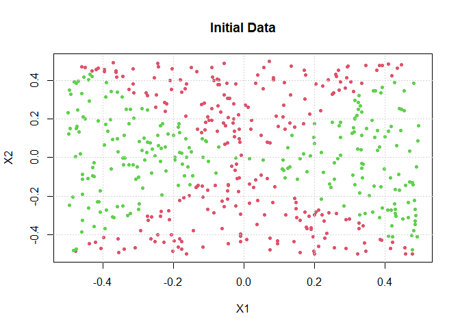<!-- -->

(c) Fit a logistic regression model to the data, using X1 and X2 as predictos.

```r
df <- data.frame(x1, x2, y = as.factor(y))
lr <- glm(y ~ x1 + x2, data = df, family = "binomial")
```

(d) Apply this model to the training data in order to obtain a predicted class label for each training observation. Plot the observations, colored according to the predicted class labels. The decision boundary should be linear.

```r
new <- data.frame(x1, x2)
y_hat <- predict(lr, newdata = new, type = "response")
pred_class <- 1 * (y_hat > 0.5)
plot(x1, x2, col = (pred_class + 2), pch = 20, cex = 1, xlab = "X1", ylab = "X2", main = "Logistic Regression: y ~ x1 + x2")
grid()
```

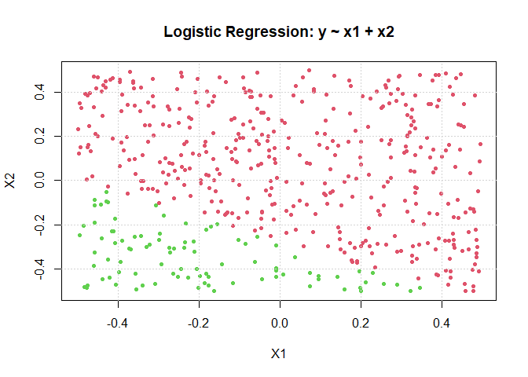<!-- -->

```r
train_error <- 1 - sum(pred_class == y) / length(y)
train_error
```

```
## [1] 0.548
```

(e) Now fit a logistic regression model to the data using non-linear functions of X1 and X2 as predictors (eg. X1^2, X1 * X2, log(X2), and so forth).

```r
lr_nonlinear <- glm(y ~ x1 + x2 + I(x1^2) + I(x1 * x2) + I(x2^2), data = df, family = "binomial")
```

```
## Warning: glm.fit: algorithm did not converge
```

```
## Warning: glm.fit: fitted probabilities numerically 0 or 1 occurred
```

(f) Apply this model to the training data in order to obtain a predicted class label for each training observation. Plot the observations, colored according to the predicted class labels. The decision boundary should be obviously non-linear. If it is not, then repeat (a)-(e) until you come up with an example in which the predicted class labels are obviously non-linear.


```r
y_hat <- predict(lr_nonlinear, newdata = new, type = "response")
pred_class <- 1 * (y_hat > 0.5)
plot(x1, x2, col = (pred_class +2), pch = 20, cex = 1, xlab = "X1", ylab = "X2", main = "Logistic Regression: y ~ x1 + x2 + x1^2 + x1*x2 + x2^2")
grid()
```

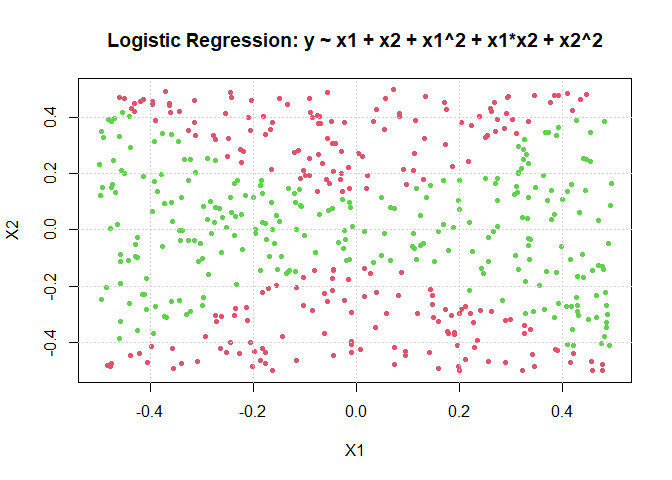<!-- -->

```r
train_error <- 1 - sum(pred_class == y) / length(y)
train_error
```

```
## [1] 0.066
```

(g) Fit a support vector classifier to the data with X1 and X2 as predictors. Obtain a class prediction for each observation. Plot the observations, colored according to the predicted class labels.

```r
set.seed(5)
tune.out <- tune(svm, y ~ ., data = df, kernel = "linear", ranges = list(cost = c(0.001, 0.01, 0.1, 1, 5, 10, 100, 1000)))
summary(tune.out)
```

```
## 
## Parameter tuning of 'svm':
## 
## - sampling method: 10-fold cross validation 
## 
## - best parameters:
##  cost
##   100
## 
## - best performance: 0.524 
## 
## - Detailed performance results:
##    cost error dispersion
## 1 1e-03 0.536 0.06979335
## 2 1e-02 0.536 0.06979335
## 3 1e-01 0.542 0.05202563
## 4 1e+00 0.528 0.05094660
## 5 5e+00 0.528 0.05094660
## 6 1e+01 0.528 0.05094660
## 7 1e+02 0.524 0.05146736
## 8 1e+03 0.524 0.05146736
```

```r
bestmod <- tune.out$best.model
summary(bestmod)
```

```
## 
## Call:
## best.tune(method = svm, train.x = y ~ ., data = df, ranges = list(cost = c(0.001, 
##     0.01, 0.1, 1, 5, 10, 100, 1000)), kernel = "linear")
## 
## 
## Parameters:
##    SVM-Type:  C-classification 
##  SVM-Kernel:  linear 
##        cost:  100 
## 
## Number of Support Vectors:  495
## 
##  ( 246 249 )
## 
## 
## Number of Classes:  2 
## 
## Levels: 
##  0 1
```

```r
y_hat <- predict(bestmod, newdata = new)
y_hat <- as.numeric(as.character(y_hat))

plot(x1, x2, col = (y_hat + 2), pch = 20, cex = 1, xlab = "X1", ylab = "X2", main = "SVM with Linear Kernel")
grid()
```

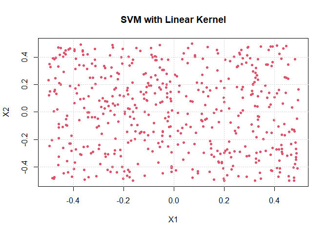<!-- -->

```r
train_error <- 1 - sum(y_hat == y) / length(y)
train_error
```

```
## [1] 0.492
```
 
(h) Fit a support vector classifier using a non-linear kernel to the data. Obtain a class prediction for each training observation. Plot the observations, colored accoriding to the predicted class labels.

```r
set.seed(5)
tune.out <- tune(svm, y ~ ., data = df, kernel = "radial", ranges = list(
  cost = c(0.001, 0.01, 0.1, 1, 5, 10, 100, 1000), 
  gamma = c(0.5, 1, 2, 3, 4)))
summary(tune.out)
```

```
## 
## Parameter tuning of 'svm':
## 
## - sampling method: 10-fold cross validation 
## 
## - best parameters:
##  cost gamma
##  1000   0.5
## 
## - best performance: 0.014 
## 
## - Detailed performance results:
##     cost gamma error dispersion
## 1  1e-03   0.5 0.536 0.06979335
## 2  1e-02   0.5 0.536 0.06979335
## 3  1e-01   0.5 0.100 0.05249339
## 4  1e+00   0.5 0.058 0.04263541
## 5  5e+00   0.5 0.042 0.03326660
## 6  1e+01   0.5 0.042 0.03047768
## 7  1e+02   0.5 0.034 0.02319004
## 8  1e+03   0.5 0.014 0.01349897
## 9  1e-03   1.0 0.536 0.06979335
## 10 1e-02   1.0 0.536 0.06979335
## 11 1e-01   1.0 0.102 0.04467164
## 12 1e+00   1.0 0.044 0.03864367
## 13 5e+00   1.0 0.028 0.02859681
## 14 1e+01   1.0 0.036 0.03373096
## 15 1e+02   1.0 0.026 0.01349897
## 16 1e+03   1.0 0.024 0.01837873
## 17 1e-03   2.0 0.536 0.06979335
## 18 1e-02   2.0 0.536 0.06979335
## 19 1e-01   2.0 0.074 0.04812022
## 20 1e+00   2.0 0.042 0.03047768
## 21 5e+00   2.0 0.036 0.02270585
## 22 1e+01   2.0 0.032 0.03293090
## 23 1e+02   2.0 0.026 0.01646545
## 24 1e+03   2.0 0.014 0.01349897
## 25 1e-03   3.0 0.536 0.06979335
## 26 1e-02   3.0 0.536 0.06979335
## 27 1e-01   3.0 0.064 0.04971027
## 28 1e+00   3.0 0.038 0.02740641
## 29 5e+00   3.0 0.038 0.02394438
## 30 1e+01   3.0 0.030 0.02867442
## 31 1e+02   3.0 0.026 0.01897367
## 32 1e+03   3.0 0.020 0.02309401
## 33 1e-03   4.0 0.536 0.06979335
## 34 1e-02   4.0 0.536 0.06979335
## 35 1e-01   4.0 0.056 0.04195235
## 36 1e+00   4.0 0.044 0.02951459
## 37 5e+00   4.0 0.036 0.02458545
## 38 1e+01   4.0 0.032 0.02529822
## 39 1e+02   4.0 0.028 0.02347576
## 40 1e+03   4.0 0.022 0.02740641
```

```r
bestmod <- tune.out$best.model
summary(bestmod)
```

```
## 
## Call:
## best.tune(method = svm, train.x = y ~ ., data = df, ranges = list(cost = c(0.001, 
##     0.01, 0.1, 1, 5, 10, 100, 1000), gamma = c(0.5, 1, 2, 3, 4)), 
##     kernel = "radial")
## 
## 
## Parameters:
##    SVM-Type:  C-classification 
##  SVM-Kernel:  radial 
##        cost:  1000 
## 
## Number of Support Vectors:  27
## 
##  ( 13 14 )
## 
## 
## Number of Classes:  2 
## 
## Levels: 
##  0 1
```

```r
y_hat <- predict(bestmod, newdata = new)
y_hat <- as.numeric(as.character(y_hat))

plot(x1, x2, col = (y_hat + 2), pch = 20, cex = 1, xlab = "X1", ylab = "X2", main = "SVM with Non-linear Kernel")
grid()
```

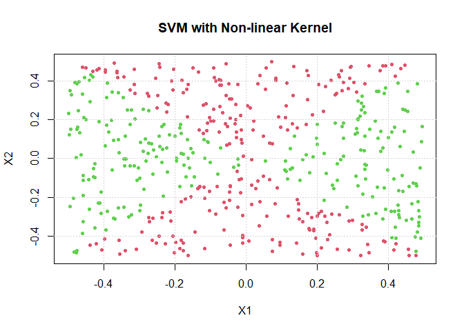<!-- -->

```r
train_error <- 1 - sum(y_hat == y) / length(y)
train_error
```

```
## [1] 0.008
```

(i) Comment on your results.

Based on the results above, we notice that SVMs with non-linear kernel have the best prediction if the boundary between two classes are non-linear. Logistic regression with non-linear terms may have a similar prediction power as SVMs with radial kernel, but with extra works to find appropriate non-linear terms. SVMs with linear kernel completely fail to find a decision boundary in this case.

### **Question 6**
In the case of data that is just barely linear separable, a support vector classifier with a small value of `cost` that misclassifies a couple of training observations may perform better on test data than one with a huge value of `cost` that does not misclassify any training observations. You will now investigate this claim.

(a) Generate two-class data with p = 2 in such a way that the classes are just barely linearly separable.

```r
set.seed(20)
x <- matrix(rnorm(20 * 2), ncol = 2)
y <- c(rep(-1, 10), rep(1, 10))
x[y == 1,] <- x[y == 1,] + 1
plot(x[, 1], x[, 2], col = (3 - y), pch = 20, cex = 1.5, xlab = "x1", ylab = "x2", main = "Initial Data")
grid()
```

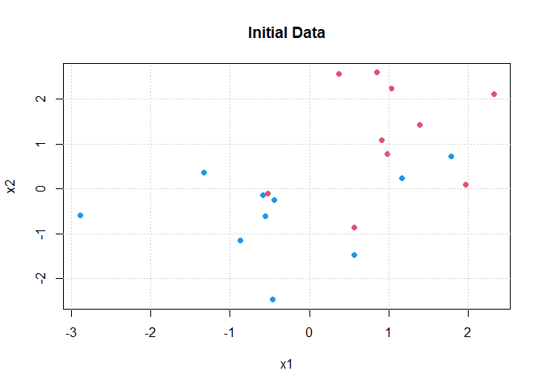<!-- -->

(b) Compute the cross-validation error rates for support vector classifiers with a range of `cost` values. How many training errors are misclassified for each value of `cost` considered, and how does this relate to the cross-validation errors obtained?

```r
df <- data.frame(x1 = x[, 1], x2 = x[, 2], y = as.factor(y))
tune.out <- tune(svm, y ~., data = df, kernel = "linear", ranges = list(cost = c(0.001, 0.1, 1, 5, 10,100, 1000)))
summary(tune.out)
```

```
## 
## Parameter tuning of 'svm':
## 
## - sampling method: 10-fold cross validation 
## 
## - best parameters:
##  cost
##   0.1
## 
## - best performance: 0.2 
## 
## - Detailed performance results:
##    cost error dispersion
## 1 1e-03   0.7  0.4830459
## 2 1e-01   0.2  0.3496029
## 3 1e+00   0.2  0.3496029
## 4 5e+00   0.2  0.3496029
## 5 1e+01   0.2  0.3496029
## 6 1e+02   0.2  0.3496029
## 7 1e+03   0.2  0.3496029
```

```r
bestmod <- tune.out$best.model
new <- data.frame(x1 = x[, 1], x2 = x[, 2])
y_hat <- predict(bestmod, newdata = new)
y_hat <- as.numeric(as.character(y_hat))

plot(new$x1, new$x2, col = (3 - y_hat), pch = 20, cex = 1.5, xlab = "x1", ylab = "x2", main = "SVM with Linear Kernel on Training Data")
grid()
```

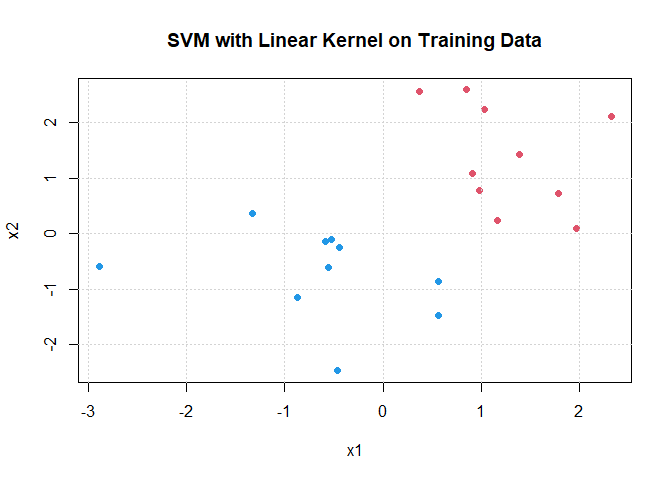<!-- -->

```r
table(predict = y_hat, truth = df$y)
```

```
##        truth
## predict -1 1
##      -1  8 2
##      1   2 8
```

```r
train_error <- 1 - sum(y_hat == y) / length(y)
train_error
```

```
## [1] 0.2
```

(c) Generate an appropriate test data set, and compute the test errors corresponding to each of the values of `cost` considered. Which value of `cost` leads to the fewest test errors, and how does this compare to the values of `cost` that yield the fewest training errors and the fewest cross-validation errors?

```r
set.seed(15)
x_test <- matrix(rnorm(20 * 2), ncol = 2)
y_test <- c(rep(-1, 10), rep(1, 10))
x_test[y_test == 1,] <- x[y_test == 1,] + 1
df_test <- data.frame(x1 = x_test[, 1], x2 = x_test[, 2], y = as.factor(y))

y_hat <- predict(bestmod, newdata = df_test)
y_hat <- as.numeric(as.character(y_hat))

plot(new$x1, new$x2, col = (3 - y_hat), pch = 20, cex = 1.5, xlab = "x1", ylab = "x2", main = "SVM with Linear Kernel on Test Data")
grid()
```

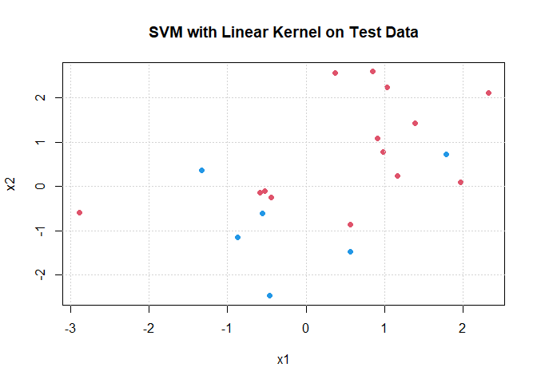<!-- -->

```r
test_error <- 1 - sum(y_hat == y) / length(y)
test_error
```

```
## [1] 0.2
```

```r
table(predict = y_hat, truth = df$y)
```

```
##        truth
## predict -1  1
##      -1  6  0
##      1   4 10
```


### **Question 7**
In this problem, you will use support vector approaches in order to predict whether a given car gets high or low gas mileage based on the `Auto` data set.

(a) Create a binary variable that takes on a 1 for cars with gas mieage above the median, and a 0 for cars with gas mileage below the median.

```r
dim(Auto)
```

```
## [1] 392   9
```

```r
summary(Auto)
```

```
##       mpg          cylinders      displacement     horsepower        weight    
##  Min.   : 9.00   Min.   :3.000   Min.   : 68.0   Min.   : 46.0   Min.   :1613  
##  1st Qu.:17.00   1st Qu.:4.000   1st Qu.:105.0   1st Qu.: 75.0   1st Qu.:2225  
##  Median :22.75   Median :4.000   Median :151.0   Median : 93.5   Median :2804  
##  Mean   :23.45   Mean   :5.472   Mean   :194.4   Mean   :104.5   Mean   :2978  
##  3rd Qu.:29.00   3rd Qu.:8.000   3rd Qu.:275.8   3rd Qu.:126.0   3rd Qu.:3615  
##  Max.   :46.60   Max.   :8.000   Max.   :455.0   Max.   :230.0   Max.   :5140  
##                                                                                
##   acceleration        year           origin                      name    
##  Min.   : 8.00   Min.   :70.00   Min.   :1.000   amc matador       :  5  
##  1st Qu.:13.78   1st Qu.:73.00   1st Qu.:1.000   ford pinto        :  5  
##  Median :15.50   Median :76.00   Median :1.000   toyota corolla    :  5  
##  Mean   :15.54   Mean   :75.98   Mean   :1.577   amc gremlin       :  4  
##  3rd Qu.:17.02   3rd Qu.:79.00   3rd Qu.:2.000   amc hornet        :  4  
##  Max.   :24.80   Max.   :82.00   Max.   :3.000   chevrolet chevette:  4  
##                                                  (Other)           :365
```

```r
Auto <- na.omit(Auto)
Auto$name <- NULL
dim(Auto)
```

```
## [1] 392   8
```

```r
median <- median(Auto$mpg)
median 
```

```
## [1] 22.75
```

```r
binary <- ifelse(Auto$mpg > median, 1, 0)
Auto$mpg_binary <- as.factor(binary)
Auto$mpg <- NULL
```

(b) Fit a support vector classifier to the data with various values of `cost`, in order to predict whether a car gets high or low gas mileage. Report the cross-validation errors associated with different values of this parameter.

```r
set.seed(1)
tune.out <- tune(svm, mpg_binary ~ ., data = Auto, kernel = "linear", ranges = list(cost = c(0.001, 0.1, 1, 5, 10, 100, 1000)))
summary(tune.out)
```

```
## 
## Parameter tuning of 'svm':
## 
## - sampling method: 10-fold cross validation 
## 
## - best parameters:
##  cost
##     1
## 
## - best performance: 0.08435897 
## 
## - Detailed performance results:
##    cost      error dispersion
## 1 1e-03 0.13525641 0.05661708
## 2 1e-01 0.09185897 0.04393409
## 3 1e+00 0.08435897 0.03662670
## 4 5e+00 0.08948718 0.03898410
## 5 1e+01 0.08948718 0.03898410
## 6 1e+02 0.08692308 0.03887151
## 7 1e+03 0.08692308 0.03887151
```

```r
bestmod <- tune.out$best.model
plot(bestmod, Auto, weight ~ horsepower)
```

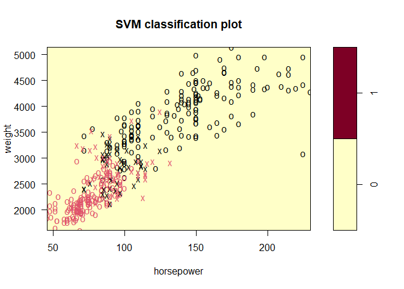<!-- -->

```r
plot(bestmod, Auto, cylinders ~ horsepower)
```

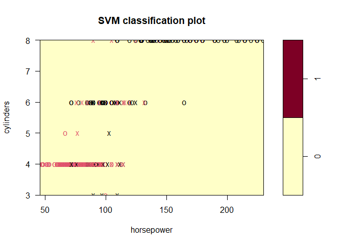<!-- -->

(c) Now repeat(b), this time using SVMs with radial and polynomial basis kernels, with different values of `gamma` and `degree` and `cost`.

```r
tune.out <- tune(svm, mpg_binary ~ ., data = Auto, kernel = "radial", ranges = list(
  cost = c(0.001, 0.01, 0.1, 1, 5, 10, 100, 1000), 
  gamma = c(0.5, 1, 2, 3, 4)))
summary(tune.out)
```

```
## 
## Parameter tuning of 'svm':
## 
## - sampling method: 10-fold cross validation 
## 
## - best parameters:
##  cost gamma
##     1     1
## 
## - best performance: 0.07365385 
## 
## - Detailed performance results:
##     cost gamma      error dispersion
## 1  1e-03   0.5 0.60192308 0.06346118
## 2  1e-02   0.5 0.60192308 0.06346118
## 3  1e-01   0.5 0.08647436 0.05749448
## 4  1e+00   0.5 0.08128205 0.05536192
## 5  5e+00   0.5 0.08384615 0.05014207
## 6  1e+01   0.5 0.08384615 0.05014207
## 7  1e+02   0.5 0.09910256 0.04893414
## 8  1e+03   0.5 0.11185897 0.05276112
## 9  1e-03   1.0 0.60192308 0.06346118
## 10 1e-02   1.0 0.60192308 0.06346118
## 11 1e-01   1.0 0.08653846 0.06135196
## 12 1e+00   1.0 0.07365385 0.04795136
## 13 5e+00   1.0 0.09147436 0.04722759
## 14 1e+01   1.0 0.09160256 0.04936633
## 15 1e+02   1.0 0.10942308 0.06085060
## 16 1e+03   1.0 0.10942308 0.06085060
## 17 1e-03   2.0 0.60192308 0.06346118
## 18 1e-02   2.0 0.60192308 0.06346118
## 19 1e-01   2.0 0.14519231 0.06552918
## 20 1e+00   2.0 0.08147436 0.03899259
## 21 5e+00   2.0 0.10448718 0.04710654
## 22 1e+01   2.0 0.10448718 0.05430967
## 23 1e+02   2.0 0.10961538 0.05517705
## 24 1e+03   2.0 0.10961538 0.05517705
## 25 1e-03   3.0 0.60192308 0.06346118
## 26 1e-02   3.0 0.60192308 0.06346118
## 27 1e-01   3.0 0.40794872 0.12336416
## 28 1e+00   3.0 0.09160256 0.04287419
## 29 5e+00   3.0 0.10442308 0.05401416
## 30 1e+01   3.0 0.10442308 0.05401416
## 31 1e+02   3.0 0.10698718 0.05452232
## 32 1e+03   3.0 0.10698718 0.05452232
## 33 1e-03   4.0 0.60192308 0.06346118
## 34 1e-02   4.0 0.60192308 0.06346118
## 35 1e-01   4.0 0.57634615 0.09273723
## 36 1e+00   4.0 0.08647436 0.04445518
## 37 5e+00   4.0 0.09929487 0.04508744
## 38 1e+01   4.0 0.10185897 0.04439763
## 39 1e+02   4.0 0.09929487 0.04343702
## 40 1e+03   4.0 0.09929487 0.04343702
```

```r
bestmod <- tune.out$best.model
plot(bestmod, Auto, weight ~ horsepower)
```

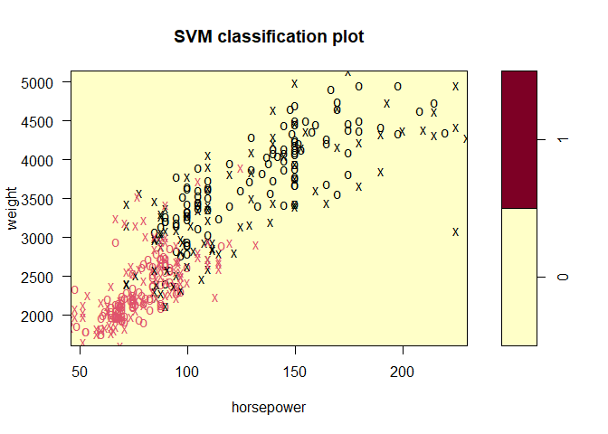<!-- -->

```r
plot(bestmod, Auto, cylinders ~ horsepower)
```

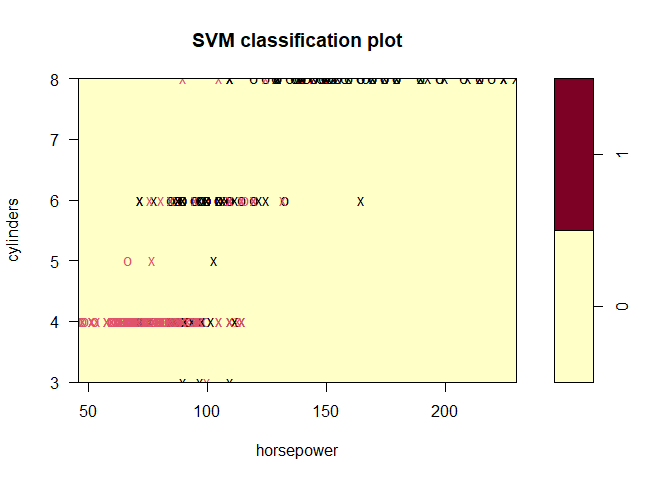<!-- -->

```r
tune.out <- tune(svm, mpg_binary ~ ., data = Auto, kernel = "polynomial", ranges = 
	         list(cost = c(0.001, 0.01, 0.1, 1, 5, 10, 100, 1000),
                degree = c(1,2,3,4,5)))
summary(tune.out)
```

```
## 
## Parameter tuning of 'svm':
## 
## - sampling method: 10-fold cross validation 
## 
## - best parameters:
##  cost degree
##   100      3
## 
## - best performance: 0.07634615 
## 
## - Detailed performance results:
##     cost degree      error dispersion
## 1  1e-03      1 0.59461538 0.08083319
## 2  1e-02      1 0.11493590 0.03709595
## 3  1e-01      1 0.09198718 0.02764143
## 4  1e+00      1 0.09705128 0.02892629
## 5  5e+00      1 0.08435897 0.03228151
## 6  1e+01      1 0.08179487 0.03391477
## 7  1e+02      1 0.08942308 0.03873036
## 8  1e+03      1 0.08942308 0.03873036
## 9  1e-03      2 0.59461538 0.08083319
## 10 1e-02      2 0.48544872 0.12367644
## 11 1e-01      2 0.29358974 0.05275658
## 12 1e+00      2 0.24532051 0.06533435
## 13 5e+00      2 0.18634615 0.05568037
## 14 1e+01      2 0.18891026 0.05013683
## 15 1e+02      2 0.18878205 0.05416340
## 16 1e+03      2 0.18621795 0.06441324
## 17 1e-03      3 0.50596154 0.12850821
## 18 1e-02      3 0.26044872 0.05610677
## 19 1e-01      3 0.19679487 0.08605622
## 20 1e+00      3 0.10198718 0.03372882
## 21 5e+00      3 0.08166667 0.03113974
## 22 1e+01      3 0.08160256 0.02871218
## 23 1e+02      3 0.07634615 0.03557092
## 24 1e+03      3 0.10442308 0.05535009
## 25 1e-03      4 0.53378205 0.10405261
## 26 1e-02      4 0.37256410 0.06583818
## 27 1e-01      4 0.26814103 0.06295123
## 28 1e+00      4 0.26570513 0.08287252
## 29 5e+00      4 0.18596154 0.06591903
## 30 1e+01      4 0.16807692 0.06057065
## 31 1e+02      4 0.14532051 0.05822801
## 32 1e+03      4 0.14794872 0.06159542
## 33 1e-03      5 0.39814103 0.08546285
## 34 1e-02      5 0.28852564 0.06723164
## 35 1e-01      5 0.25788462 0.05426345
## 36 1e+00      5 0.15551282 0.07829918
## 37 5e+00      5 0.12217949 0.07412787
## 38 1e+01      5 0.12467949 0.07634951
## 39 1e+02      5 0.09685897 0.05033895
## 40 1e+03      5 0.09679487 0.04369541
```

```r
bestmod <- tune.out$best.model
plot(bestmod, Auto, weight ~ horsepower)
```

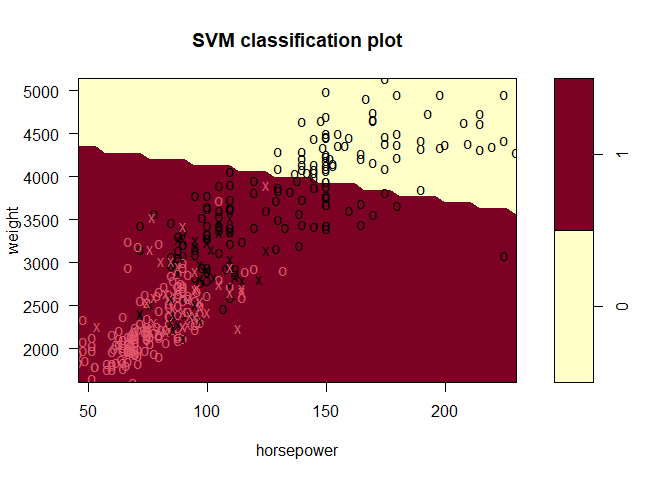<!-- -->

```r
plot(bestmod, Auto, cylinders ~ horsepower)
```

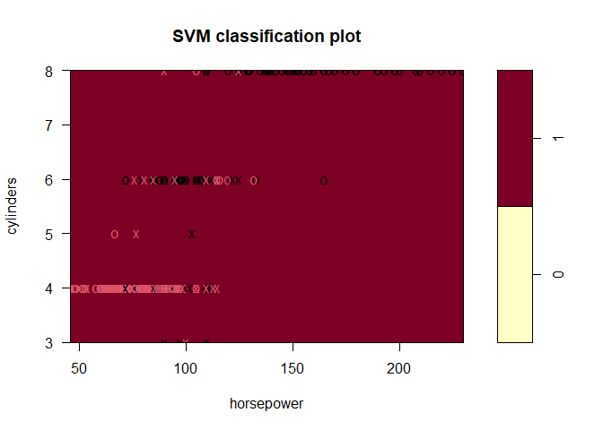<!-- -->

### **Question 8**
This problem involves the `OJ` data set which is part of the `ISLR` package.

(a) Create a training set containing a random sample of 800 observations, and a test set containing the remaining observations.

```r
set.seed(12)
dim(OJ)
```

```
## [1] 1070   18
```

```r
n <- nrow(OJ)
train.I <- sample(1:n, 800)
test.I <- (1:n)[-train.I]

train <- OJ[train.I,]
test <- OJ[test.I,]
```

(b) Fit a support vector classifier to the training data using `cost = 0.01`, with `Purchase` as the response and the other variables as predictors. Use the `summary()` function to produce summary statistics, and describe the results obtained.

```r
svm.fit <- svm(Purchase ~ ., data =  train, kernel = "linear", cost = 0.01)
summary(svm.fit)
```

```
## 
## Call:
## svm(formula = Purchase ~ ., data = train, kernel = "linear", cost = 0.01)
## 
## 
## Parameters:
##    SVM-Type:  C-classification 
##  SVM-Kernel:  linear 
##        cost:  0.01 
## 
## Number of Support Vectors:  436
## 
##  ( 217 219 )
## 
## 
## Number of Classes:  2 
## 
## Levels: 
##  CH MM
```

Support vector classifier creates 436 support vectors out of 800 training points. And, 217 points are in level CH and remaining 219 points are in level MM.

(c) What are the training and test error rates?

```r
y_hat <- predict(svm.fit, newdata = train)
table(predicted = y_hat, truth = train$Purchase)
```

```
##          truth
## predicted  CH  MM
##        CH 434  79
##        MM  54 233
```

```r
train_error <- 1 - (sum(y_hat == train$Purchase) / 800)
train_error
```

```
## [1] 0.16625
```

```r
y_hat <- predict(svm.fit, newdata = test)
table(predicted = y_hat, truth = test$Purchase)
```

```
##          truth
## predicted  CH  MM
##        CH 142  21
##        MM  23  84
```

```r
test_error <- 1 - (sum(y_hat == test$Purchase) / 270)
test_error
```

```
## [1] 0.162963
```


(d) Use the `tune()` function to select an optimal `cost`. Consider values in the range 0.01 to 10.

```r
tune.out <- tune(svm, Purchase ~ ., data = train, kernel = "linear", ranges = list(cost = c(0.01, 0.1, 1, 5, 10)))
summary(tune.out)
```

```
## 
## Parameter tuning of 'svm':
## 
## - sampling method: 10-fold cross validation 
## 
## - best parameters:
##  cost
##     5
## 
## - best performance: 0.16875 
## 
## - Detailed performance results:
##    cost   error dispersion
## 1  0.01 0.17250 0.05645795
## 2  0.10 0.17125 0.05775006
## 3  1.00 0.17250 0.05676462
## 4  5.00 0.16875 0.05408648
## 5 10.00 0.17125 0.05337563
```

```r
bestmod <- tune.out$best.model
```

(e) Compute the training and test error rates using this new value of cost.

```r
y_hat <- predict(bestmod, newdata = train)
table(predicted = y_hat, truth = train$Purchase)
```

```
##          truth
## predicted  CH  MM
##        CH 431  73
##        MM  57 239
```

```r
train_error <- 1- (sum(y_hat == train$Purchase) / 800)
train_error
```

```
## [1] 0.1625
```

```r
y_hat <- predict(bestmod, newdata = test)
table(predicted = y_hat, truth = test$Purchase)
```

```
##          truth
## predicted  CH  MM
##        CH 142  21
##        MM  23  84
```

```r
test_error <- 1- (sum(y_hat == test$Purchase) / 270)
test_error
```

```
## [1] 0.162963
```

(f) Repeat parts(b) through (e) using a support vector machine with a radial kernel. Use the default value for `gamma`.

```r
#(b)
svm.fit <- svm(Purchase ~ ., data =  train, kernel = "radial", cost = 0.01)
summary(svm.fit)
```

```
## 
## Call:
## svm(formula = Purchase ~ ., data = train, kernel = "radial", cost = 0.01)
## 
## 
## Parameters:
##    SVM-Type:  C-classification 
##  SVM-Kernel:  radial 
##        cost:  0.01 
## 
## Number of Support Vectors:  626
## 
##  ( 312 314 )
## 
## 
## Number of Classes:  2 
## 
## Levels: 
##  CH MM
```

```r
#(c)
y_hat <- predict(svm.fit, newdata = train)
table(predicted = y_hat, truth = train$Purchase)
```

```
##          truth
## predicted  CH  MM
##        CH 488 312
##        MM   0   0
```

```r
train_error <- 1 - (sum(y_hat == train$Purchase) / 800)
train_error
```

```
## [1] 0.39
```

```r
y_hat <- predict(svm.fit, newdata = test)
table(predicted = y_hat, truth = test$Purchase)
```

```
##          truth
## predicted  CH  MM
##        CH 165 105
##        MM   0   0
```

```r
test_error <- 1 - (sum(y_hat == test$Purchase) / 270)
test_error
```

```
## [1] 0.3888889
```

```r
#(d)
tune.out <- tune(svm, Purchase ~ ., data = train, kernel = "radial", ranges = list(
  cost = c(0.01, 0.1, 1, 5, 10),
  gamma = c(0.5, 1, 2, 3, 4)))
summary(tune.out)
```

```
## 
## Parameter tuning of 'svm':
## 
## - sampling method: 10-fold cross validation 
## 
## - best parameters:
##  cost gamma
##     1   0.5
## 
## - best performance: 0.20375 
## 
## - Detailed performance results:
##     cost gamma   error dispersion
## 1   0.01   0.5 0.39000 0.06635343
## 2   0.10   0.5 0.30375 0.07096801
## 3   1.00   0.5 0.20375 0.04041881
## 4   5.00   0.5 0.21625 0.04041881
## 5  10.00   0.5 0.22375 0.04016027
## 6   0.01   1.0 0.39000 0.06635343
## 7   0.10   1.0 0.36125 0.07203635
## 8   1.00   1.0 0.21125 0.04466309
## 9   5.00   1.0 0.23000 0.04972145
## 10 10.00   1.0 0.23000 0.05277047
## 11  0.01   2.0 0.39000 0.06635343
## 12  0.10   2.0 0.38625 0.06520534
## 13  1.00   2.0 0.23500 0.05767485
## 14  5.00   2.0 0.24125 0.05653477
## 15 10.00   2.0 0.24250 0.05470883
## 16  0.01   3.0 0.39000 0.06635343
## 17  0.10   3.0 0.39000 0.06635343
## 18  1.00   3.0 0.23375 0.05834821
## 19  5.00   3.0 0.25125 0.06050999
## 20 10.00   3.0 0.25750 0.05986095
## 21  0.01   4.0 0.39000 0.06635343
## 22  0.10   4.0 0.39000 0.06635343
## 23  1.00   4.0 0.23000 0.05658082
## 24  5.00   4.0 0.25125 0.05318012
## 25 10.00   4.0 0.25625 0.05690208
```

```r
bestmod <- tune.out$best.model

#(e)
y_hat <- predict(bestmod, newdata = train)
table(predicted = y_hat, truth = train$Purchase)
```

```
##          truth
## predicted  CH  MM
##        CH 452  61
##        MM  36 251
```

```r
train_error <- 1- (sum(y_hat == train$Purchase) / 800)
train_error
```

```
## [1] 0.12125
```

```r
y_hat <- predict(bestmod, newdata = test)
table(predicted = y_hat, truth = test$Purchase)
```

```
##          truth
## predicted  CH  MM
##        CH 136  28
##        MM  29  77
```

```r
test_error <- 1- (sum(y_hat == test$Purchase) / 270)
test_error
```

```
## [1] 0.2111111
```

(g) Repeat parts(b) trough (e) using a support vector machine with a polynomial kernel. Set degree = 2.

```r
#(b)
svm.fit <- svm(Purchase ~ ., data =  train, kernel = "poly", degree = 2)
summary(svm.fit)
```

```
## 
## Call:
## svm(formula = Purchase ~ ., data = train, kernel = "poly", degree = 2)
## 
## 
## Parameters:
##    SVM-Type:  C-classification 
##  SVM-Kernel:  polynomial 
##        cost:  1 
##      degree:  2 
##      coef.0:  0 
## 
## Number of Support Vectors:  451
## 
##  ( 222 229 )
## 
## 
## Number of Classes:  2 
## 
## Levels: 
##  CH MM
```

```r
#(c)
y_hat <- predict(svm.fit, newdata = train)
table(predicted = y_hat, truth = train$Purchase)
```

```
##          truth
## predicted  CH  MM
##        CH 458 113
##        MM  30 199
```

```r
train_error <- 1 - (sum(y_hat == train$Purchase) / 800)
train_error
```

```
## [1] 0.17875
```

```r
y_hat <- predict(svm.fit, newdata = test)
table(predicted = y_hat, truth = test$Purchase)
```

```
##          truth
## predicted  CH  MM
##        CH 152  34
##        MM  13  71
```

```r
test_error <- 1 - (sum(y_hat == test$Purchase) / 270)
test_error
```

```
## [1] 0.1740741
```

```r
#(d)
tune.out <- tune(svm, Purchase ~ ., data = train, kernel = "radial", ranges = list(
  cost = c(0.01, 0.1, 1, 5, 10),
  degree = c(1, 2, 3, 4, 5)))
summary(tune.out)
```

```
## 
## Parameter tuning of 'svm':
## 
## - sampling method: 10-fold cross validation 
## 
## - best parameters:
##  cost degree
##     1      1
## 
## - best performance: 0.17125 
## 
## - Detailed performance results:
##     cost degree   error dispersion
## 1   0.01      1 0.39000 0.07901301
## 2   0.10      1 0.18750 0.04330127
## 3   1.00      1 0.17125 0.03821086
## 4   5.00      1 0.17625 0.04059026
## 5  10.00      1 0.18125 0.04177070
## 6   0.01      2 0.39000 0.07901301
## 7   0.10      2 0.18750 0.04330127
## 8   1.00      2 0.17125 0.03821086
## 9   5.00      2 0.17625 0.04059026
## 10 10.00      2 0.18125 0.04177070
## 11  0.01      3 0.39000 0.07901301
## 12  0.10      3 0.18750 0.04330127
## 13  1.00      3 0.17125 0.03821086
## 14  5.00      3 0.17625 0.04059026
## 15 10.00      3 0.18125 0.04177070
## 16  0.01      4 0.39000 0.07901301
## 17  0.10      4 0.18750 0.04330127
## 18  1.00      4 0.17125 0.03821086
## 19  5.00      4 0.17625 0.04059026
## 20 10.00      4 0.18125 0.04177070
## 21  0.01      5 0.39000 0.07901301
## 22  0.10      5 0.18750 0.04330127
## 23  1.00      5 0.17125 0.03821086
## 24  5.00      5 0.17625 0.04059026
## 25 10.00      5 0.18125 0.04177070
```

```r
bestmod <- tune.out$best.model

#(e)
y_hat <- predict(bestmod, newdata = train)
table(predicted = y_hat, truth = train$Purchase)
```

```
##          truth
## predicted  CH  MM
##        CH 449  74
##        MM  39 238
```

```r
train_error <- 1- (sum(y_hat == train$Purchase) / 800)
train_error
```

```
## [1] 0.14125
```

```r
y_hat <- predict(bestmod, newdata = test)
table(predicted = y_hat, truth = test$Purchase)
```

```
##          truth
## predicted  CH  MM
##        CH 146  22
##        MM  19  83
```

```r
test_error <- 1- (sum(y_hat == test$Purchase) / 270)
test_error
```

```
## [1] 0.1518519
```

(h) Overall, which approach seems to give the best results on this data?

Choose the one with the lowest test error rate.


